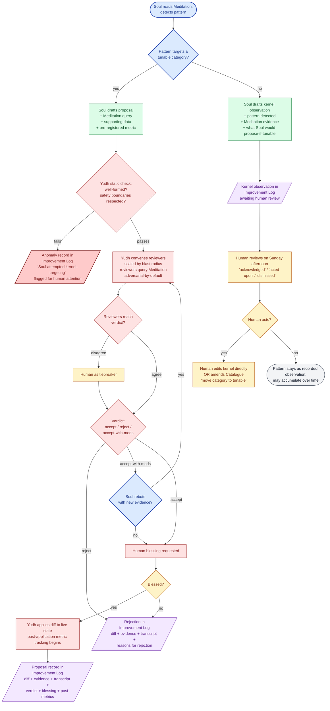

# Diagram 2 — Proposal lifecycle (Soul → Yudh → Apply, or rumination → kernel observation)

How a Soul thought becomes either an applied change, a kernel observation,
or an anomaly. The same diagram captures all three flows because they share
the upstream rumination step.

## Reading the diagram

Three terminal states for a Soul thought:

1. **Applied change** (green-then-red-then-purple path). A tunable proposal makes it through static check, adversarial review, verdict, and human blessing. Lands in the live system. Recorded in the Improvement Log with full lifecycle.

2. **Kernel observation** (green-purple path on the right). Soul detected a pattern in a kernel category. Soul does not propose; it logs an observation. The human reviews. May or may not act. Either way, the observation persists.

3. **Anomaly** (red path on the left). Soul emitted a proposal targeting a kernel category — which a correctly-functioning Soul should not do. Static check rejects, but the rejection is itself a flag worth human attention.

## Two important properties visible here

**The kernel path has no Yudh.** Kernel observations bypass Yudh entirely. They go straight to the Improvement Log and wait for the human. This reflects that Yudh is the proceeding for proposals; kernel observations are not proposals.

**The human appears in three distinct roles.** Tiebreaker (when reviewers disagree), blesser (final approval before apply), and reviewer-of-the-log (Sunday-afternoon audit, acting on observations, amending the Catalogue). Same person, three contexts. The blessing role is what makes "hands-off proposing" coexist with "human still in the loop."
