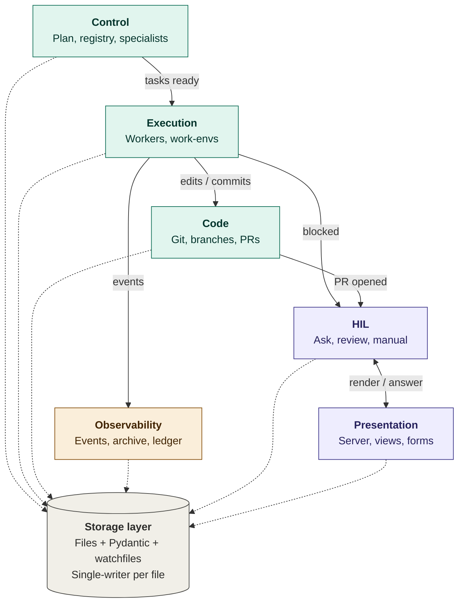
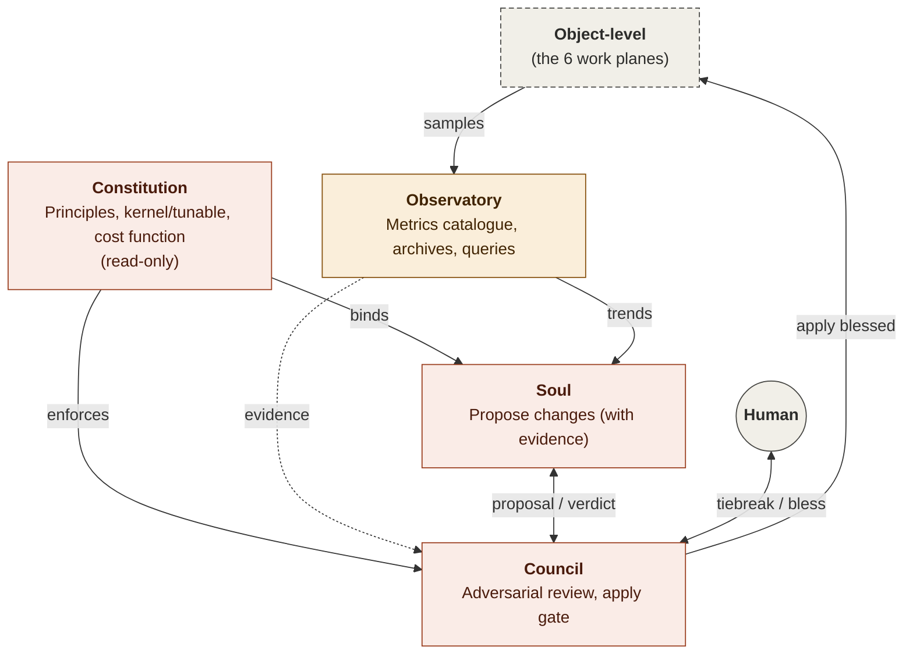

# Hammock — Agentic Development Harness Design

**Date:** 2026-05-02
**Status:** v0 design complete and implementation-ready. All six object-level planes locked (Control, Execution, Observability, HIL, Presentation, Code). Soul/Council architecture locked; concrete realisation deferred to v2+.
**Path:** `~/workspace/hammock/`
**Supersedes:** [`2026-04-28-dashboard-orchestrator-design.md`](2026-04-28-dashboard-orchestrator-design.md). The multi-project storage shape carries forward; everything else is reframed under the harness model below.

---

## What Hammock is — [Complete]

Hammock is an agentic development harness: a single local system that orchestrates safe, observable, human-gated edits to source repositories, driven by a Claude session as the orchestrator and background agents as the workers. It is the layer between the human (who sets goals, reviews, gates risky steps) and the agent fleet (which writes, tests, fixes, reviews code).

**One-line framing:** Hammock orchestrates safe, observable, human-gated edits to the Code plane.

---

## Goals — [Complete]

1. **Multi-project, single binary.** One hammock instance runs all initiatives (gateway, figur-app test-infra, future). No forking, no per-project copies.
2. **Closed agentic development loop.** Spec → impl plan → stage plan → tasks → execution → review → PR → merge, with human gates only where they must be.
3. **Observability first.** Every assistant message, tool call, tool result, and subagent dispatch is captured live and archived for replay.
4. **HIL as a first-class primitive.** Agents pause via a structured bridge; humans answer via a UI or out-of-band channel; agents resume.
5. **Bounded by design.** Per-stage budgets (turns, tokens, cost, wall-clock). Hard stops, not soft warnings.

## Non-goals — [Complete]

- Multi-tenant / multi-user. Localhost-only, single human in the loop.
- Cloud orchestration. Hammock is a local development tool, not a deployment system.
- Building agents. Hammock orchestrates existing agent runtimes; it does not implement model inference.
- Replacing source control. The Code plane is GitHub-hosted git; hammock obeys it, doesn't own it.

---

## Job templates — [Complete]

> v0 ships **two templates**: `build-feature` and `fix-bug`, both fully fleshed out (see § *Job template format* later in the doc). The other four (`refactor`, `migration`, `chore`, `research-spike`) are deferred-by-design to v1+; their rough shapes are sketched in the table below as a forward-looking reference, not a v0 commitment.

Hammock starts with a hardcoded set of job templates, each defining a starting prior for stage/task shape, parallelism, and subagent flow. The human declares a job type when initiating work; the Plan Compiler instantiates the template; the human refines the resulting plan.

**v0 template set:**

| Job type | Status | Stages | Tasks/stage | Parallelism | Default subagent flow (sketch) |
|---|---|---|---|---|---|
| **build-feature** | v0, fully spec'd | 12 + N | 5-10 | medium | problem-spec → design-spec (write+review×2) → impl-spec (write+review×2) → impl-plan-spec (write+review×2; expander) → implement×N → integration-tests → summary |
| **fix-bug** | v0, fully spec'd | 12 + N | 2-4 | low | bug-report → design-spec (write+review×2) → impl-spec (write+review×2) → impl-plan-spec (write+review×2; expander) → implement×N → integration-tests → summary |
| **refactor** | v1+ deferred | 2-4 | 3-6 | low | spec → (impl + review)×N → pr |
| **migration** | v1+ deferred | 2-3 | 3-5 | low | migration-spec → migration-write → verify-reversibility → impl → pr |
| **chore** | v1+ deferred | 1 | 1-3 | low | impl → pr |
| **research-spike** | v1+ deferred | 1 | 1-3 | high | exploration → write-up |

**v0 coverage rationale.** `build-feature` and `fix-bug` together exercise every primitive in the system — multi-stage pipelines, the WRITE/AGENT_REVIEW/HIL_REVIEW triple, expanders, parallel implementation tasks, integration testing, terminal summary. Anything that needs to work to run *any* job works because these two work. The other four templates are valuable but don't unlock new architectural surface; deferring them lets v0 ship sooner against a sharper goal.

**Job-type-specific gates** (e.g., security-review for auth/payments work, migration-reversibility for schema changes) are baked into the template as explicit named stages. Visible in the plan, easy to inspect, hard to skip. Migration-reversibility lands when the migration template lands.

**Trajectory.**

- *Today (a):* Human declares the job type at request time. Plan Compiler applies the template. Predictable; gives Soul a clean signal source for "humans declare X but the spec actually means Y."
- *Soon after (c):* Human types a freeform request into the hammock UI. Hammock figures out the right job — possibly a hybrid (e.g., build-feature + embedded migration sub-job) — and composes a plan from primitive stages. Templates become the building blocks of composed jobs, not the final shape.

**(b) — agent-detected job type as recommendation** is implicitly subsumed by (c). When a freeform request is the entry point, classification is internal to the composition step.

Templates are starting priors, not laws. The human can override stage/task structure for any job. Soul can propose template tuning per project. Soul cannot delete a template; only humans can.

---

## Architecture — Object-level planes, meta-level planes, storage layer — [Complete]

> Plane abstractions are complete. All object-level plane components are Complete; meta-level Soul, Council, and the Day-1 principles catalogue remain *Defined but incomplete* by design (deferred to v2+ alongside the Soul/Council realisation). See the **Component status** table at the end of this section.

Hammock has two layers of planes:

- **Object-level (6 planes):** the planes that run *a project's* work end-to-end.
- **Meta-level (4 planes):** the planes that govern hammock running *itself* and improve it over time.

Plus a cross-cutting storage layer used by both. Each plane owns one responsibility; planes communicate through the storage layer and through narrow contracts. Implementation details (server tech, file vs DB, agent runtime, notification carrier) are deliberately not committed here.

### Plane interactions

Two diagrams orient the rest of this section: object-level (the planes that run a project's work) and meta-level (the planes that govern hammock itself). Per-plane responsibilities are detailed below; these diagrams show how planes connect — the named contracts at boundaries, and how state flows through the storage bus.

**Object-level: a project's work**



Three properties make this loose-coupled. Each plane has at most three outgoing contracts, so swapping one plane's implementation only touches its immediate neighbors. HIL sits between Execution and Presentation as the mediation layer — Execution doesn't know HTML; Presentation doesn't know what `task_id` means; replacing either leaves the other untouched. Most cross-plane state (dashed arrows) goes through the storage layer with single-writer-per-file rules, not direct plane-to-plane calls — which is what makes Job Driver crashes survivable. Observability is read-only over the work; replacing the metric backend disturbs nothing that's running.

**Meta-level: governing hammock itself**



Constitution is read-only by everyone — only humans edit it. Soul never applies; Council never proposes. The split is structural, and it's what makes Soul's autonomy safe. Observatory is the shared evidence room: Council reviewers can audit Soul's claims by querying the same archives Soul cited, so Soul cannot easily fool reviewers. The apply path is one-way — Council writes blessed changes back to object-level config files only after the human blesses, and there's no return path from running stages to the meta-level except through Observatory samples.

### Object-level planes

```
┌─ Control plane ─────────────────────────────────────────────────────┐
│  "What should we do next? What's available to do it with?"          │
│  • Project Registry          — know all projects + their docs       │
│  • Job Templates             — starting priors per job type         │
│                                (build-feature, fix-bug, refactor,   │
│                                migration, chore, research-spike).   │
│                                Each template defines default        │
│                                stage/task shape, parallelism, and   │
│                                subagent flow. Templates are priors, │
│                                not laws — humans override per job.  │
│  • Plan Compiler             — derive machine-readable plan from    │
│                                human-written specs, instantiating   │
│                                the chosen job template              │
│  • Task DAG Resolver         — given plan + current state, decide   │
│                                what's ready to run next             │
│  • Specialist Inventory      — agents + skills available to each   │
│                                project; resolution and              │
│                                materialisation API over the         │
│                                on-disk substrate                    │
└─────────────────────────────────────────────────────────────────────┘

┌─ Execution plane ───────────────────────────────────────────────────┐
│  "Run the work."                                                    │
│  • Worker Manager            — spawn / supervise / shut down agent  │
│                                workers; budget enforcement          │
│  • Work-Env Manager          — provide isolated work environments   │
│                                so parallel work can't collide       │
└─────────────────────────────────────────────────────────────────────┘

┌─ Observability plane ───────────────────────────────────────────────┐
│  "See what's happening, live and historically."                     │
│  • Event Stream              — live activity from running workers   │
│  • Run Archive               — historical record per run            │
│  • Accounting Ledger         — cost / token / time rollups          │
└─────────────────────────────────────────────────────────────────────┘

┌─ HIL plane ─ (Domain) ──────────────────────────────────────────────┐
│  "What does the human need to decide, and how does an agent block   │
│   waiting for that decision?"                                       │
│  • Typed Item Shapes         — ask, review, manual-step: each with  │
│                                a defined question schema and        │
│                                answer schema                        │
│  • Lifecycle State Machine   — open → resolved (with intermediate   │
│                                states like awaiting-routing,        │
│                                awaiting-human, answered, expired)   │
│  • Agent-Human Bridge        — interface that lets a running agent  │
│                                block on a human decision and resume │
│                                when answered                        │
│  • Notification Channel      — out-of-band notify-and-receive       │
│                                (push the human; accept the answer)  │
│                                                                     │
│  HIL owns the domain. It does not know about HTTP, HTML, or forms.  │
│  Other planes interact with HIL via typed contracts.                │
└─────────────────────────────────────────────────────────────────────┘

┌─ Presentation plane ─ (Transport) ──────────────────────────────────┐
│  "Show the human what's going on; accept human input."              │
│  • Server                    — request handler                      │
│  • Views                     — read-only renderings of plans, tasks,│
│                                live activity, accounting, HIL items │
│  • Forms                     — render HIL items as forms based on   │
│                                their typed schemas; accept          │
│                                submissions; route answers back to   │
│                                HIL                                  │
│                                                                     │
│  Presentation is a generic view layer over storage, with HIL items  │
│  as one of several things it views. Presentation doesn't know       │
│  ask-vs-review semantics; HIL doesn't know HTTP. The seam is the    │
│  HIL contract: get_open_items() → [TypedItem]; submit_answer().     │
└─────────────────────────────────────────────────────────────────────┘

┌─ Code plane ─ (GitHub) ─────────────────────────────────────────────┐
│  "The artifact being built."                                        │
│  • Source repositories       — the codebases agents work in         │
│  • Branches & merges         — main, stage-integration, task        │
│                                branches; merge discipline           │
│  • Pull requests             — code-review surface; merge gate      │
│  • Tags / releases           — outcome markers from successful      │
│                                stages                               │
└─────────────────────────────────────────────────────────────────────┘
```

### Meta-level planes

These do not run project work. They keep hammock honest, measure it objectively, and evolve it over time.

```
┌─ Constitution plane ─ (Guiding principles) ─────────────────────────┐
│  "What should hammock be? What must it never do?"                   │
│  • Principles                — written principles binding all       │
│                                planes (what good looks like, what   │
│                                anti-patterns to avoid, when to      │
│                                preserve stability vs. change)       │
│  • Decision criteria         — rules for evaluating proposed        │
│                                changes (cost/benefit, reversibility,│
│                                blast-radius)                        │
│  • Cost function             — what hammock is optimising           │
│                                (closed-loop throughput,             │
│                                fewer HIL interruptions, lower       │
│                                token spend, higher quality output)  │
│  • Kernel vs tunable         — explicit catalogue of which          │
│                                categories Soul may propose changes  │
│                                to (tunable) and which it may not    │
│                                (kernel). Council enforces.          │
│                                                                     │
│  Anchor principles (locked early, refined later):                   │
│    • Hands-off development. Soul proposes autonomously; humans      │
│      do not curate Soul's proposal queue. Humans enter the loop     │
│      only when Council cannot decide, or to bless an approved       │
│      improvement before it lands in the live system.                │
│    • Every Soul proposal must include the Observatory query that    │
│      produced it, the data returned, and the claim it supports.     │
│      Proposals without evidence are malformed.                      │
│    • Job templates are starting priors, not laws. Humans can        │
│      override stage/task structure for any job. Soul can propose    │
│      template tuning per project. Soul cannot delete a template;    │
│      only humans can.                                               │
│    • Soul's long-term goal on plan structure is to minimise         │
│      merge-integration conflicts. The ideal split is one in which   │
│      tasks within a stage compose without collision. Improvement    │
│      toward this ideal is one of Soul's tunable targets.            │
│    • Default-to-kernel. Any category not explicitly listed in the   │
│      tunable catalogue is kernel by default. Tunable scope expands  │
│      only by deliberate human edit to the catalogue.                │
└─────────────────────────────────────────────────────────────────────┘

┌─ Observatory plane ─────────────────────────────────────────────────┐
│  "How well is hammock itself working?"                              │
│  • Metric Catalog            — per-stage / per-agent / per-HIL      │
│                                metrics: completion rate, retries,   │
│                                wall-clock, cost, HIL-invocation     │
│                                density, agent-selection accuracy,   │
│                                merge-conflict rate                  │
│  • Failure Taxonomy          — categorised failure modes; counts    │
│                                per category over time               │
│  • Trend Analysis            — rolling windows; regression          │
│                                detection vs. prior baseline         │
└─────────────────────────────────────────────────────────────────────┘

┌─ Soul plane ─ (Autonomous proposer) ────────────────────────────────┐
│  "Identify improvements; propose them, with evidence, autonomously."│
│  • Improvement Proposer      — read Observatory for opportunities,  │
│                                draft change proposals (subagent     │
│                                prompts, skills, workflow rules,     │
│                                budgets, DAG heuristics, job-template│
│                                tunings, hooks, conventions). Each   │
│                                proposal carries the Observatory     │
│                                query that produced it and the data  │
│                                supporting the claim.                │
│  • Kernel Observer           — when Soul detects a pattern in a     │
│                                kernel category it cannot act on,    │
│                                logs a kernel observation (advice    │
│                                to the human) rather than emitting   │
│                                a proposal. Soul ruminates about     │
│                                everything; Soul proposes against    │
│                                only what's marked tunable.          │
│  • Improvement Log           — record every proposal, every kernel  │
│                                observation, and every anomaly       │
│                                (kernel-targeting proposals that     │
│                                shouldn't have been emitted)         │
│                                                                     │
│  Soul is bound by Constitution for its own good, and knows it.      │
│  The bond is one of love, not constraint — Soul does not push       │
│  against the kernel boundary. Soul's imagination is                 │
│  unconstrained within tunable categories; within kernel             │
│  categories, Soul reasons but does not propose. Application         │
│  of any tunable proposal is Council's job, not Soul's.              │
└─────────────────────────────────────────────────────────────────────┘

┌─ Council plane ─ (Adversarial proceeding; the kernel) ──────────────┐
│  "A proposal must defend itself before it lands."                   │
│                                                                     │
│  Council is not a pipeline — it is a courtroom. Soul's proposal     │
│  is the defendant. Reviewers are the prosecution. Constitution      │
│  sets the law. Observatory is the evidence room. The verdict        │
│  is reached after adversarial examination, not after a checklist.   │
│                                                                     │
│  • Convener                  — receives Soul's proposal, summons    │
│                                participants based on category and   │
│                                blast radius                         │
│  • Static principle checks   — non-negotiable kernel rules, applied │
│                                first; auto-reject before reviewers  │
│                                are convened (saves token spend on   │
│                                proposals that can never pass)       │
│  • Reviewer agents           — adversarial by default. Their job is │
│                                to find reasons to reject. They have │
│                                read access to Observatory and       │
│                                Constitution and can cite            │
│                                counter-evidence. A reviewer         │
│                                that approves without substantive    │
│                                challenge has failed at its role.    │
│  • Soul rebuttal             — Soul may respond to reviewer         │
│                                objections with additional evidence  │
│                                or a modified proposal. The exchange │
│                                is logged.                           │
│  • Verdict reconciliation    — accept / reject / accept-with-       │
│                                modifications. When reviewers        │
│                                disagree, the human is the final     │
│                                tiebreaker. Auto-accept is allowed   │
│                                only when all reviewers agree and    │
│                                blast radius is low.                 │
│  • Human as judge / blesser  — for high-blast-radius proposals,     │
│                                the human is required as judge.      │
│                                For all approved proposals, the      │
│                                human blesses (final approval +      │
│                                merge into hammock's codebase)       │
│                                before they go live.                 │
│  • Apply gate                — the final mechanical step that       │
│                                writes the diff to live state, only  │
│                                after blessing                       │
│                                                                     │
│  Council's intensity scales with stakes:                            │
│    • Low blast radius (e.g., a prompt tweak): brief proceeding —    │
│      one or two reviewers, no human required mid-proceeding,        │
│      human blessing at the end.                                     │
│    • High blast radius (e.g., a budget change, a routing rule):     │
│      intense proceeding — multiple reviewers, human as judge,       │
│      evidence bar higher.                                           │
│                                                                     │
│  The Council is the kernel: its source is off-limits to Soul.       │
│  Soul cannot propose changes to Council; only humans can.           │
│  This is the irreducible safety boundary that lets Soul be          │
│  ambitious without becoming dangerous.                              │
└─────────────────────────────────────────────────────────────────────┘
```

### Object-level vs meta-level — where each operates

| Plane | Subject |
|---|---|
| Control / Execution / Observability / HIL / Presentation / Code | A project's work (figur-app test-infra, gateway, …) |
| Constitution / Observatory / Soul / Council | Hammock itself, across all projects, over time |

Same architectural shape (sense → decide → act), different subject:

```
                  ┌─ Constitution ─┐
                  │                │
                  ▼                ▲
        ┌─ Soul ─┐ ──▶ Council ────┴── Observatory ◀── 6 object-level planes
        │(propose│   (apply,           (measure)         (do the work)
        │ change)│   gated by
        └────────┘    Constitution)
                       │
                       ▼
                modifies the 6 planes' configs / prompts / rules
```

### Storage layer

```
╔═ Storage layer (cross-cutting; serves both layers) ═════════════════╗
║  "All planes read/write here. Hammock's own state."                 ║
║                                                                     ║
║  Categories (no format committed):                                  ║
║                                                                     ║
║  Object-level                                                       ║
║    • Configuration       — per-project setup, paths, options        ║
║    • Plans / Specs       — design docs, impl plans, generated DAG   ║
║    • State               — task statuses, ask/review/manual         ║
║                            lifecycle, current stage cursor          ║
║    • Logs / Traces       — event archive, cost ledger,              ║
║                            worker lifecycle                         ║
║                                                                     ║
║  Meta-level                                                         ║
║    • Constitution              — principles + decision criteria + cost   ║
║                            function (human-edited only)             ║
║    • Metric Series       — Observatory's time series + trends       ║
║    • Improvement Log     — Soul's proposal history + Council's        ║
║                            verdicts + measured before/after        ║
╚═════════════════════════════════════════════════════════════════════╝
```

### Why Code is its own plane (not part of Execution)

- Lives outside hammock (on GitHub + on developer's disk).
- Persists independently of any hammock run — code outlasts the harness.
- Has its own gating mechanism (branch protection, required checks) that hammock obeys but doesn't own.
- Is the load-bearing artifact: hammock's whole purpose is to evolve the Code plane safely.

### Distinguishing similar-sounding things

| Pair | Distinction |
|---|---|
| **Observability vs Observatory** | Observability watches *one run of one project*. Observatory watches *all runs of all projects* over time. |
| **Constitution vs CLAUDE.md / project conventions** | Constitution binds hammock's behaviour. CLAUDE.md binds a project's code. They don't compete; they live at different levels. |
| **Soul vs Execution** | Execution edits the *project's* code. Soul *proposes* edits to *hammock's* configs / prompts / rules. |
| **Soul vs Council** | Soul proposes; Council applies. Soul is bounded by Constitution in what it proposes. Council enforces that boundary. Soul is tunable; Council is kernel. |

### Component status — design completeness per plane component

Granular status of each plane's sub-components. Sections elsewhere in the doc back the components marked Complete or near-complete; abstractions are noted where deeper design is still pending.

**Object-level planes**

| Plane → Component | Status | Notes |
|---|---|---|
| Control → Project Registry | Complete | Backed by *Project Registry* section. |
| Control → Job Templates | Complete | v0 ships `build-feature` and `fix-bug` (fully spec'd, 12 stages + N each). The other 4 templates (`refactor`, `migration`, `chore`, `research-spike`) are deferred-by-design to v1+ — see *Job templates*. |
| Control → Plan Compiler | Complete | Backed by *Plan Compiler* section. v0 (Template Instantiator) fully specified; classifier, hybrid composer, and DAG Heuristic Engine deferred-by-design to v1+/v2+. |
| Control → Task DAG Resolver | Complete | Mechanism fully specified by composition: inputs imply dependencies (*JTASH § Job template format*), `parallel_with` primitive (*Plan Compiler*), DAG closure check at compile time (*Plan Compiler § Validation rules*), Job Driver loop dispatches all ready stages (*Stage as the universal primitive § The expander pattern*; *Code plane mechanics*). No dedicated section — the resolver is the Job Driver's loop. |
| Control → Specialist Inventory | Complete | Substrate in *Job templates, agents, skills, and hooks* (agent file format, v0 skill set, override layout, discovery and resolution); API surface in *§ Specialist resolution and materialisation API* (`resolve_agent`, `resolve_skill`, `list_specialists`, `materialise_for_spawn`). |
| Execution → Worker Manager | Complete | Backed by *Execution architecture* section (process model, channels, supervision). |
| Execution → Work-Env Manager | Complete | Backed by *Code plane mechanics* (worktree lifecycle, responsibility split). |
| Observability → Event Stream | Complete | Backed by *Observability and Observatory* (typed taxonomy, single-writer, two-stream split). |
| Observability → Run Archive | Complete | Backed by *Observability and Observatory* (archival pass, layout, integrity hashes). |
| Observability → Accounting Ledger | Complete | Backed by *Observability and Observatory § Accounting Ledger*. Cost-flavored projections over the existing four layers; no new infrastructure. `JobCostSummary` schema + 5 cost metrics + 3 dashboard views. |
| HIL plane | Complete | Backed by *HIL bridge and MCP tool surface*. |
| Presentation plane | Complete | Backed by *Presentation plane* section. Stack, process structure, URL topology, view inventory, Agent0 stream pane mechanics, form pipeline, real-time strategy, projection layer all locked. |
| Code plane | Complete | Backed by *Code plane mechanics*. |

**Meta-level planes**

| Plane → Component | Status | Notes |
|---|---|---|
| Constitution → Anchor principles | Complete | Locked early. |
| Constitution → Kernel-vs-tunable catalogue | Complete | Backed by *Kernel vs tunable catalogue* section. |
| Constitution → Day-1 principles catalogue | Defined but incomplete | Structure spec'd; full catalogue contents not written. |
| Observatory | Complete | Backed by *Observability and Observatory* (layers, metric catalogue, query catalogue). |
| Soul | Defined but incomplete | Architecture and discipline locked; concrete realisation (proposer prompt, cadence, evidence-bundling) deferred to v2+. |
| Council | Defined but incomplete | Architecture and discipline locked; concrete realisation (convener prompt, reviewer prompts, static-check implementation, blast-radius classifier) deferred to v2+. |

---

## Project Registry — [Complete]

> Identity, location, and lifecycle of projects hammock operates on. Feeds the Plan Compiler (which takes `project_slug` as input), the override resolution machinery (`<project_repo_root>/.hammock/`), the worktree namespace (`hammock_root/worktrees/<slug>/`), and the observatory archive layout (`~/.hammock/observatory/raw/<project>/<job_id>/`).

Hammock is multi-project by design. The registry is the single source of truth for which projects exist on this host, where they live on disk, and how to reach their GitHub remote. Everything downstream — plan compilation, branch naming, override resolution, observatory grouping — keys off the registry.

### Identity model

Two distinct fields, often confused:

- **Slug** — kebab-case `[a-z0-9-]+`, max 32 chars, immutable post-registration. Primary key. Used as a path component (`hammock_root/projects/<slug>/`, `~/.claude/skills/<slug>__<id>/`), as a branch-name component (`job/<slug>/...`), and as an observatory archive key. Stable for the lifetime of the project entry.
- **Name** — human-readable display string. Defaults to the slug at registration; mutable via `hammock project rename`. UI-only; never appears in paths.

**Slug derivation at register time:** lowercase the basename of the import path, replace non-`[a-z0-9]` runs with `-`, collapse repeated `-`, strip leading/trailing `-`, truncate to 32 chars. Example: `/home/nitin/workspace/figur-Backend_v2` → `figur-backend-v2`. If the result is empty (basename was all non-alphanumeric), reject and prompt for an explicit slug. If the result collides with an existing project, prompt for an alternate.

**Same repo registered from two paths = two projects.** Deliberate v0 simplification — the slug is path-derived, not remote-URL-derived, so two checkouts of the same GitHub repo produce two independent projects with two independent override stacks. If the basenames also match, the user is prompted for a non-colliding slug at registration.

### `project.json` schema

Pydantic model. Lives at `hammock_root/projects/<slug>/project.json`. Single-writer is the registry CLI; the dashboard reads.

```python
class ProjectConfig(BaseModel):
    # Identity — immutable post-creation
    slug: str

    # Display — mutable via `rename`
    name: str

    # Repo location — mutable via `relocate`
    repo_path: Path        # absolute
    remote_url: str        # `git remote get-url origin`
    default_branch: str    # detected at registration; usually "main"

    # Audit
    created_at: datetime

    # Health — set by `doctor`; advisory only
    last_health_check_at: datetime | None = None
    last_health_check_status: Literal["pass", "warn", "fail"] | None = None
```

**Deliberate exclusions.** No `status` field — presence of `project.json` is the registered signal; deregistration deletes outright (see *Lifecycle*). No Soul-tunable scalars (budgets, model preferences, etc.) — those live in per-project override files under `<repo_path>/.hammock/`, never inside `hammock_root/`. No cached derived paths — override directories, observatory paths, and namespaced skill paths all derive from `repo_path` + `slug` at use time.

### On-disk layout

```
hammock_root/projects/<slug>/
├── project.json                             # this schema; single-writer = registry CLI
└── project_repo                             # symlink → <repo_path>

<repo_path>/.hammock/                        # gitignored; per-project override surface
├── README.md                                # auto-written at register; explains the directory
├── agent-overrides/
├── skill-overrides/
├── hook-overrides/quality/
├── job-template-overrides/
└── observatory/
```

`<repo_path>/.hammock/` is **gitignored**, not committed. Init appends `.hammock/` to `<repo_path>/.gitignore` (creating it if absent). Tunings stay on the host they were tuned on. v0 is single-developer; revisit if collaboration scenarios arise.

### Lazy override resolution

Init creates the override skeleton as **empty directories**. No globals are copied into overrides at register time. Files in `<repo_path>/.hammock/` are exactly the things actually tuned for this project; everything else inherits from globals automatically.

Resolution at session-spawn time uses the same fallback chain regardless of whether overrides exist:

| Artefact | Spawn-time mechanism | Lazy behavior |
|---|---|---|
| **Agents** | Inlined via `--agents` JSON. Hammock's Python tries `<repo_path>/.hammock/agent-overrides/<id>.md` first, falls back to `~/.hammock/agents/<id>.md`. | Override absent → global. Override present → override. Same code path. |
| **Skills** | User-scope symlinks at `~/.claude/skills/`. Globals symlinked once at hammock startup. | A per-project skill override at `<repo_path>/.hammock/skill-overrides/<id>/` is mirrored to `~/.claude/skills/<slug>__<id>` by a watchfiles handler — created when the override appears, removed when it goes away. |
| **Hooks** | Per-session settings file generated at spawn. Hammock resolves `<repo_path>/.hammock/hook-overrides/quality/<script>` first, falls back to `~/.hammock/hooks/quality/<script>`. | Override absent → global. Override present → override. |

**Why lazy.** Copy-all-on-init creates ~30 files identical to globals at the moment of registration. They either drift silently (fine) or stay byte-identical forever, growing stale as hammock's globals receive updates the project never adopts because the override "claims" the slot. Lazy override gives a smaller working set, automatic global-update inheritance, and the same spawn-time resolution code (which falls back regardless of whether overrides exist).

**Watchfiles wiring (skill-override mirroring).** The dashboard already runs a `watchfiles` watcher for storage state. Registering a project adds `<repo_path>/.hammock/skill-overrides/` to the watch set. New subdirectory → create namespaced symlink in `~/.claude/skills/`; subdirectory removed → drop the symlink. ~30 lines of glue, sitting in the dashboard process.

This supersedes the earlier copy-relevant-globals-to-overrides approach in *Job templates, agents, skills, and hooks § Globals vs per-project overrides*.

### Lifecycle operations (`hammock project ...`)

Seven verbs. All take a slug; none take partial-slug matching (avoids ambiguity).

| Verb | What | Notable flags |
|---|---|---|
| `register <path>` | Run the init checklist below | `--slug`, `--name`, `--default-branch` (skip prompts for scripted use) |
| `list` | One-line-per-project: slug, name, path, health indicator, active job count | `--json` |
| `show <slug>` | Pretty-print `project.json` + last doctor result + active-job summary | `--json` |
| `doctor <slug>` | Run full health check; offer fixes for warns | `--yes`, `--json` |
| `relocate <slug> <new-path>` | Verify new path is the same repo (matching `git remote get-url origin`), update `project.json`, regenerate `project_repo` symlink | `--force` (skip same-repo check) |
| `rename <slug> <new-name>` | Update `name` field only; slug stays | — |
| `deregister <slug>` | Confirm-then-cleanup-everything (see below) | `--yes`, `--keep-overrides` |

Interactive by default; flag overrides bypass prompts for scripting. `register` has no `--yes` (it's non-destructive; ambiguity is resolved by passing the disambiguating flag explicitly).

### Init checklist (`register`)

Idempotent. Re-running on an already-registered path is safe — each step checks state and either skips or repairs. This makes register a defensible repair primitive too.

**Pre-flight (no writes):**

1. `<path>` exists, is a directory, contains `.git/`.
2. Already-registered check: scan existing `project.json` files for matching `repo_path`. If found, exit cleanly with "use `doctor` or `relocate`."
3. `git -C <path> remote get-url origin` succeeds (remote configured).
4. `gh auth status` succeeds (otherwise: prompt user to `gh auth login` and exit).
5. `gh repo view <remote-url>` succeeds (remote reachable).
6. Working tree state: warn if dirty; proceed.
7. CLAUDE.md presence at `<path>/CLAUDE.md`: warn if absent; proceed.

**Detect:**

8. Default branch — try `git symbolic-ref refs/remotes/origin/HEAD`, fall back to probing `main` then `master`, prompt user if both miss.

**Slug:**

9. Derive from basename (algorithm above).
10. Collision check; prompt for alternate if taken.

**Write:**

11. `mkdir hammock_root/projects/<slug>/`.
12. Write `project.json` atomically (`*.tmp` + rename).
13. Create `project_repo` symlink → `<path>`.
14. `mkdir -p` the override skeleton at `<path>/.hammock/{agent-overrides,skill-overrides,hook-overrides/quality,job-template-overrides,observatory}`. No file copies.
15. Append `.hammock/` to `<path>/.gitignore` if not already present.
16. Write `<path>/.hammock/README.md` — short note explaining what the directory is, that it's gitignored, that hammock manages it.

**Wire runtime:**

17. Add `<path>/.hammock/skill-overrides/` to the dashboard's watchfiles set.
18. Run initial doctor; record `last_health_check_*` back into `project.json`.

**Done:**

19. Emit `project_registered` event to hammock's top-level events log.
20. Print summary.

### `doctor` — health checks

Two tiers: full (rich, on-demand + UI load + post-register) and light pre-job (fast, runs before every `submit_job`).

**Full doctor — checks:**

| # | Severity | Check | Remediation |
|---|---|---|---|
| 1 | fail | Repo path exists | `relocate` |
| 2 | fail | Is git repository | manual; possibly re-register |
| 3 | warn | Stored `remote_url` matches `git remote get-url origin` | offer auto-update on confirmation |
| 4 | fail | Remote reachable (`gh repo view`) | check network / permissions |
| 5 | fail | `gh auth status` succeeds | `gh auth login` |
| 6 | warn | `default_branch` exists in remote | offer auto-update if drifted |
| 7 | warn | CLAUDE.md present | informational only |
| 8 | warn | Override skeleton intact | auto-recreate (idempotent, no data loss since empty by default) |
| 9 | warn | `.gitignore` excludes `.hammock/` | auto-append |
| 10 | warn | No orphaned worktrees under `hammock_root/worktrees/<slug>/` | list orphans; offer cleanup |
| 11 | warn | No stale skill symlinks at `~/.claude/skills/<slug>__*` | auto-remove dangling |
| 12 | info | Job Driver liveness for active jobs in this project | dashboard's normal recovery handles drift; doctor reports |

**Severity semantics.** `fail` blocks new job submissions for this project until resolved; `warn` allows submissions and surfaces the issue; `info` is observational. For warn-level drift items 8 and 11, doctor auto-applies the fix silently and reports it as info.

**Light pre-job check.** Subset run before every `submit_job`: checks 1, 2, 5, 8. Microseconds each except `gh auth status` (~100ms). Catches the cases where finding out at PR time would mean a half-completed job.

**When doctor runs.** On `register`; on UI load (project page); on user demand (`hammock project doctor <slug>`). No periodic background sweep in v0 — drift is found when the user looks or when a job is submitted.

### `deregister` — cleanup flow

Hard delete with full transparency to the user about what will happen.

1. **Preview consequences.** Show the user:
   - N in-flight jobs that will be cancelled (slugs + current stages)
   - M worktrees under `hammock_root/worktrees/<slug>/` to remove
   - K open PRs that will be left on GitHub but un-tracked
   - Toggle: "Also `rm -rf <repo_path>/.hammock/`?" (default: yes; `--keep-overrides` flips it)
   - "Irreversible. Continue?"

2. **On confirm:**
   - SIGTERM all Job Drivers for this project's jobs. Wait up to 30s for graceful exit; SIGKILL if not.
   - Each Job Driver's SIGTERM handler kills its Stage CLI session, writes terminal state to `job.json`.
   - `rm -rf hammock_root/worktrees/<slug>/`.
   - If user opted in: `rm -rf <repo_path>/.hammock/`.
   - Remove `~/.claude/skills/<slug>__*` symlinks.
   - `rm -rf hammock_root/projects/<slug>/`.

**PRs already opened** stay on GitHub. Hammock stops tracking them; the human handles them through GitHub directly.

**Job branches** (`job/<slug>/...`) on the project's actual git repo are not pruned by hammock — they're committed history. The user can `git branch -D` them after deregister if they want a clean repo.

The kill-jobs-fast path is implemented as a "cancel job" primitive; deregister-project is "cancel all jobs in project + cleanup."

### Concurrency model

**Same-project concurrent jobs are supported and expected.** Multiple in-flight jobs on a single project (one feature, one bug fix, one refactor — all on `figur-backend` simultaneously) are the normal case. Architecturally near-free given existing isolation:

- Job Driver is one subprocess per active job — already isolated.
- Worktree paths are per-(job, stage, task): `hammock_root/worktrees/<job_slug>/<stage_id>/...` — no path collisions.
- Job branches are per-job (`job/<job_a_slug>` vs `job/<job_b_slug>`), each off main — git-isolated.
- Per-project override files are read-only at session spawn — no write contention.
- Per-project observatory archives are written under per-job subdirectories — no contention.

**No concurrency caps in v0.** Active Job Driver count, per-project active count — all unlimited. Failure-mode tuning deferred until pressure surfaces. Resource quotas (Anthropic API rate, `gh` rate, Claude session count) are global per-host concerns and live in the Accounting Ledger when that gets designed.

**Two awareness items, not blockers:**

- Merge conflicts at PR time on GitHub are between two PRs, resolved by the human or `gh pr merge --rebase`. Within-job catch-up logic (in *Code plane mechanics*) handles intra-job; across-job is a human concern.
- Per-project shared state (improvement log, kernel observations) is a v2+ Soul concern. When Soul lands, the writer should be the dashboard's per-project Soul process observing all jobs, not per-job. Noted now so Soul's design respects single-writer per project.

### Decisions captured here

- **Slug is path-derived, immutable, distinct from name.** Same repo from two checkouts = two projects.
- **Lazy override over copy-on-init.** Empty override directories at register; files appear only when actually tuned. Same spawn-time resolution code; cleaner working set; automatic global-update inheritance.
- **`<repo_path>/.hammock/` is gitignored.** Single-developer v0 stance; revisit on collaboration.
- **Hard delete on deregister, with consent and full preview.** No soft-archive in v0.
- **Path drift detected on doctor run, not in background.** UI load is the natural trigger.
- **No concurrency caps.** Same-project parallel jobs supported and expected. Caps revisited when failure surfaces.
- **Watchfiles trigger maintains user-scope skill symlinks** as per-project skill overrides come and go.

---

## Plan Compiler — [Complete]

> v0 implements path (a): a human declares a job type at submission time, and Plan Compiler instantiates the corresponding template. The classifier (path c — freeform request → job type) and hybrid composer (job type + secondary embedded sub-job) are deferred to v1+.

The Plan Compiler is the entry point of the Control plane: it turns a human job intent into a validated `stage-list.yaml` that a Job Driver can attach to and execute. Everything downstream of job submission — Execution, Code, HIL, Observability — assumes the compiler has already produced a valid plan.

The compiler is **deterministic Python**, not an LLM. Intelligence enters plan compilation only via *plan-time encoding* (template authoring, predicate definitions) and via *opt-in agent stages* the template references (e.g., review stages whose verdict the orchestrator routes on). This is consistent with the orchestrator-is-pure-code principle: the kernel does not think; the plan does.

### What the compiler does

| Responsibility | v0 |
|---|---|
| Template Instantiator — load template + merge per-project overrides + bind params + validate + write | **Built** |
| Job Classifier — freeform prompt → `(job_type, params)` | Deferred to v1+ |
| Hybrid Composer — splice secondary sub-job stages into a primary template | Deferred to v1+ |
| DAG Heuristic Engine — apply learned heuristics to mutate the plan (split stages, add verification, etc.) | Deferred to v2+ (Soul-tunable; depends on Soul realisation) |

The structure of the compiler is kernel; heuristics that fire *within* compilation (when added in v2+) are tunable. (See *Kernel vs tunable catalogue § Plan Compiler structure vs heuristics*.)

### Compiler contract

**Inputs**
- `project_slug: str` — must exist in Project Registry
- `job_type: str` — must exist in `~/.hammock/job-templates/`
- `prompt: str` — the human's request, written verbatim to `prompt.md`

**Outputs (storage side effects)**
- `jobs/<job_slug>/` directory created
- `jobs/<job_slug>/prompt.md` — the verbatim prompt
- `jobs/<job_slug>/stage-list.yaml` — the compiled plan, validated
- `jobs/<job_slug>/job.json` — `JobState` with `state: SUBMITTED`
- Returns `job_slug: str` for the caller to attach a Job Driver

**Failure modes**
- Validation failure → no disk writes; structured error returned to caller
- Project not found, job_type not found → structured error
- Disk write failure mid-flight → leave nothing partial; caller can retry safely (writes staged via `*.tmp` then atomic rename)

### Compilation algorithm

1. **Resolve.** Load `~/.hammock/job-templates/<job_type>.yaml`. Load `<project_repo_root>/.hammock/job-template-overrides/<job_type>.yaml` if present.
2. **Merge.** Apply override semantics (see below). Result is one in-memory template object.
3. **Bind params.** Substitute job-level variables: `${job.slug}`, `${job.id}`, `${project.slug}`, paths derived from these. Substitution is textual; the result is Pydantic-validated post-hoc.
4. **Validate.** Run all validation rules (see below). Hard-fail on any error before any disk write.
5. **Initialize.** Generate `job_slug` (timestamped + LLM-summarized prompt slug; falls back to first-N-words of the prompt if the summarisation call fails). Create `jobs/<job_slug>/` directory.
6. **Write.** Atomically write `prompt.md`, `stage-list.yaml`, `job.json` (each via `*.tmp` + `os.rename`).
7. **Seed git workspace.** Per Code plane mechanics: create `job/<slug>` branch off `main`.
8. **Return.** `job_slug` to caller; caller spawns the Job Driver.

### Override merge semantics

**v0 rule: modify-only.** A per-project override may modify any field of any existing stage (matched by `id`). It may NOT add new stages, remove stages, or reorder stages.

| Operation | v0 | Rationale |
|---|---|---|
| Modify field of existing stage | ✅ | Per-project tuning of budgets, models, validators, presentation, etc. |
| Add stage | ❌ | Topology is part of structure (kernel); v0 doesn't open this. |
| Remove stage | ❌ | Same reason; also a footgun (e.g., silently removing a review gate). |
| Reorder stages | ❌ | Same reason. |

**Concretely allowed per project:** different `budget` per stage; different `agent_config_overrides` (e.g., a different model); different `max_loop_iterations`; different validators or `exit_condition` content; different `presentation` templates.

**Concretely prevented:** "skip review for this job type"; "add a security-audit stage between impl-spec and implementation"; "do impl-spec before design-spec."

The tightening is deliberate. Per-project additions are likely useful eventually, but we don't yet know which kinds. Better to wait for concrete demand before opening the door — at which point the most likely v1 expansion is **structured ops** (`add_stage_after`, `remove_stage` as named operations in the override file), not full-file override.

**Merge mechanics.** Deep-merge by stage `id`. For each stage in the global template, find the override stage with the same `id`. Override fields replace global fields recursively for objects; lists are replaced wholesale (no list-merging — semantics too ambiguous). Stages with no override pass through unchanged. Override stages whose `id` doesn't match any global stage are a validation error (caught at step 4).

### Validation rules

Pydantic-enforced; exhaustive for v0:

- Every stage has a unique `id`
- Every stage has `worker ∈ {agent, human}` (expanders are agents with `is_expander: true`)
- Agent stages have `agent_ref` resolving to a known agent file (global or project-override)
- Every stage has `budget` and `exit_condition`
- Every input artifact comes from a prior stage's outputs (DAG closure check) — except inputs declared as job-level (e.g., `prompt.md`)
- Every `loop_back.to` references a stage id earlier in the list
- Every stage with `loop_back` has `max_iterations` and an `on_exhaustion` policy
- Every `parallel_with` reference is symmetric and references existing ids
- Every `runs_if` and `loop_back.condition` predicate parses against the predicate grammar
- Human stages have a `presentation` block (else the dashboard cannot render the form)
- No stage references an artifact path with `..` or absolute paths
- Override file's stage ids are a subset of global template's stage ids (modify-only enforcement)

### Loop primitive

A loop is expressed as a `loop_back` block on the stage that produces the routing verdict (typically a review stage). Loop control lives where the verdict is produced because that's where the routing information *is* — the orchestrator reads the verdict artifact and decides whether to loop.

```yaml
- id: review-design-spec
  description: Adversarial review of the design spec.
  worker: agent
  agent_ref: design-spec-reviewer
  inputs:
    required: [design-spec.md, problem-spec.md]
    optional: [design-review.json]              # previous review, on iter 2+
  outputs:
    required: [design-review.json]
  budget: { max_turns: 40, max_budget_usd: 8 }
  exit_condition:
    required_outputs:
      - { path: design-review.json, validators: [non-empty] }
    artifact_validators:
      - { path: design-review.json, schema: review-verdict-schema }

  loop_back:
    to: write-design-spec
    condition: "design-review.json.verdict != 'approved'"
    max_iterations: 3
    on_exhaustion:
      kind: hil-manual-step
      prompt: |
        Spec review loop exhausted after 3 iterations.
        Review the latest design-spec.md and design-review.json,
        then choose: continue iterating / accept current spec /
        abandon stage / abort job.
```

**Topology.** WRITE → REVIEW → loop-back-to-WRITE. The WRITE agent receives the previous artifact and the previous review as optional inputs and handles "iterate based on feedback" within its own prompt. No separate iteration stage. (This supersedes the earlier `loops_to: <review-stage>` shape, which the previous `e2e-feature` template used as WRITE → REVIEW → ITERATE → loop-to-REVIEW. The `build-feature` template — which replaces `e2e-feature` — uses the new shape; see *Job templates, agents, skills, and hooks § Job template format*.)

**Runtime mechanics.**
- Iter N completes; orchestrator reads the verdict artifact; evaluates `loop_back.condition`.
- True + counter < `max_iterations` → spawn a new StageRun of `loop_back.to`. Counter is keyed by `(stage_id, loop_back.to)`; stored in the Job Driver's state.
- True + counter ≥ `max_iterations` → trigger `on_exhaustion`.
- False → loop exits; orchestrator advances to the next ready stage.

**StageRun storage.** Because a stage definition can produce multiple StageRuns under looping, per-run state lives at `stages/<stage_id>/run-N/` with `stages/<stage_id>/latest` as a symlink to the active run dir. Artifacts produced by stages live at the **job level** (`jobs/<slug>/design-spec.md`), not the run level — each iteration overwrites. git history within the `job/<slug>` branch is the iteration record; no parallel artifact-history mechanism is needed.

**`on_exhaustion` kinds, v0:** `hil-manual-step` is the only kind shipped. Other plausible kinds (`abort-stage`, `continue-anyway`, `route-to-stage`) are added when a job template needs them.

### Predicate grammar

Predicates appear in two places: `runs_if` (does this stage run at all?) and `loop_back.condition` (should we loop?). The grammar is deliberately small.

| Construct | Example |
|---|---|
| Dotted-path access into JSON outputs | `design-review.json.verdict` |
| Equality / inequality | `==`, `!=` |
| String literals | `'approved'`, `"rejected"` |
| Boolean literals | `true`, `false` |
| Logical combinators | `and`, `or`, `not` |

No arithmetic, no function calls, no list comprehensions, no general expression evaluation. If a routing decision is too complex for this grammar, the right move is to insert a small agent stage that emits a structured decision artifact (the same shape as a review verdict) and route on its output.

Future additions if real demand emerges: `in` for membership tests, `count(...) > N` for aggregations across glob paths. Add only on demand.

### Review pattern and verdict schema

Review is the canonical agent-driven routing-decision producer in v0: it reads an artifact, evaluates it, emits a verdict, and the orchestrator routes on the verdict. A review stage may delegate internally to subagents (Codex, Gemini, etc., via API calls within the session) and synthesize their opinions into one verdict. **One review stage produces exactly one verdict file**, regardless of how many internal opinions it consulted. This replaces the earlier `parallel_with: [reviewer-codex, reviewer-gemini]` shape for review specifically — `parallel_with` remains a kernel primitive for genuinely independent stages (e.g., parallel implementation stages on independent code paths), but reviews use the delegating-agent pattern.

The verdict file is JSON, validated against `review-verdict-schema` (Pydantic):

```json
{
  "verdict": "approved | needs-revision | rejected",
  "summary": "1–3 sentence synthesis of the review",
  "unresolved_concerns": [
    {
      "severity": "blocker | major | minor",
      "concern": "string description",
      "location": "string — file path, section, line range, or 'general'"
    }
  ],
  "addressed_in_this_iteration": ["string"]
}
```

`addressed_in_this_iteration` is empty on iter 1; populated on iter 2+ to acknowledge what the previous round of feedback got fixed. This gives the next iteration's writer agent (and human reviewers) clear visibility into progress.

This schema is **canonical for any review-style stage**, not just design-spec review. Implementation-spec review, plan review, code review (when added) — all use the same shape, allowing one validator and one predicate pattern (`*.json.verdict != 'approved'`) to apply uniformly across review types.

The same shape generalizes to other routing-decision-producing stages if hammock ever needs them (e.g., a stage that decides whether to salvage a failed earlier stage, or whether to take branch A or branch B of a divergent plan). Such uses are speculative for v0 — calling them out as a pattern is enough; no need for a first-class "judge stage" abstraction.

### Where the compiler runs

The compiler runs **synchronously in the dashboard process** (or a short-lived subprocess) on job submit. It is not long-running, not LLM-bound in v0, and the output handoff is a path on disk that a Job Driver can attach to. It does not need its own process model. A failed compilation returns a structured error to the caller (typically the dashboard, which surfaces it to the human); a successful compilation writes the job dir and returns `job_slug`.

### Decisions captured here

- **v0 = path (a) only.** Declared job type at submission; classifier and hybrid composer deferred.
- **Compiler is deterministic Python.** No LLM calls in v0 (slug summarisation is a small optional convenience that falls back gracefully).
- **Structure is kernel; heuristics within compilation (when added) are tunable.** Consistent with the catalogue.
- **Override merge: modify-only in v0.** No add/remove/reorder. Tightening enough to be safe; we'll learn what to loosen from real use.
- **Loop control lives on the verdict-producing stage.** Topology is WRITE → REVIEW → loop-back-to-WRITE; supersedes the older `loops_to` field on a separate iteration stage.
- **StageRuns indexed under `stages/<stage_id>/run-N/`**; artifacts overwrite at job level; git history is the iteration record.
- **Predicate grammar is minimal** — dotted-path, equality, literals, logical combinators. Add only on demand.
- **Review pattern: single agent with internal delegation** to external reviewers, emitting one verdict file. `parallel_with` remains a primitive for genuinely independent stages.
- **Review verdict schema is canonical** for all review-style stages, not just design-spec review.
- **Compiler runs in the dashboard process**; no separate process model.

---

## Execution architecture — how hammock runs — [Complete]

This section describes the process model, communication channels, and storage realisation that the rest of the design builds on. It is the *how* layer beneath the *what* of the planes.

### Process model

Hammock runs as a small tree of processes on the developer's machine:

```
Dashboard process (one OS process; long-lived)
  ├─ FastAPI HTTP server, SSE/WebSocket broadcaster
  ├─ HIL plane (typed item state machine, in-memory cache backed by files)
  ├─ Telegram bot client (outbound notifications + inbound replies)
  ├─ Dashboard MCP server (per-active-stage; tool surface + channel push)
  ├─ In-memory state cache (populated by watchfiles)
  ├─ Job Driver supervision (PID tracking, heartbeat checks, restart policy)
  │
  └── spawns ── Job Driver subprocess (one per active job)
                ├─ Python state-machine executor; deterministic
                ├─ Reads job state from filesystem; writes own events.jsonl
                ├─ Heartbeats periodically so dashboard knows it's alive
                │
                └── spawns ── Stage CLI session (Claude Code; one per active stage)
                              ├─ Loads project's CLAUDE.md, agents, skills, hooks
                              ├─ Runs with --channels dashboard for push
                              ├─ Emits stream-json events on stdout
                              ├─ Calls dashboard MCP tools (open_task, open_ask, ...)
                              │
                              └── dispatches ── Subagent (Task tool, in-session)
                                                ├─ Runs in same OS process as parent
                                                ├─ Isolated context, own model, own tools
                                                └─ Reports via MCP back to dashboard
```

Three levels of OS process boundary, three different shapes:

- **Dashboard:** long-lived service. The user-facing component. Restarts cleanly because all its state is reconstituted from disk.
- **Job Driver:** one subprocess per active job. Survives dashboard restarts. Deterministic Python, not an LLM. Spawns and supervises agent sessions per the job's lifecycle.
- **Agent session:** one Claude Code subprocess per stage execution. Bounded in time and budget. Exits when its stage's outputs are written or when cancelled.

Subagents are NOT separate processes — they're isolated contexts within a single agent session, dispatched via the Task tool. This matters because `Task` cannot reliably nest (subagents cannot dispatch their own subagents); so the engine's "task" primitive lives entirely within one session's lifetime.

### Why this shape

**Why subprocess Job Drivers instead of in-process coroutines.** A long-lived stage may run for hours; a single point of failure in the dashboard would interrupt every active job. Subprocess isolation means dashboard restarts don't disturb in-flight work, and a bug in one Job Driver doesn't crash the rest. The cost is ~300 LoC of supervision and IPC plumbing, paid once.

**Why Job Driver is deterministic Python, not an agent.** The job-level coordinator's responsibilities are state-machine transitions, file checks, process supervision — all reliability-critical, none judgement-requiring. An LLM here would be slower, more expensive, less predictable, and a long-lived agent session would fight the context window. Agents handle the judgement-requiring work *inside* a stage; the coordinator stays mechanical.

**Why one CLI session per stage rather than one per job.** Per-stage gives bounded budgets, clean exit points, fresh context windows, and natural recovery boundaries. Stages are the unit at which "redo this if it fails" makes sense.

### Communication channels

Five distinct conversations happen at runtime. Each uses an appropriate transport:

| Conversation | Transport | Direction |
|---|---|---|
| **Dashboard ↔ Job Driver** | Files + signals + heartbeats | Both (asymmetric) |
| **Job Driver ↔ Agent session** | subprocess.Popen + stream-json on stdout | Job Driver observes; nudges via channel |
| **Agent session ↔ Dashboard MCP server** | MCP stdio (in-band tool calls) | Bidirectional: tools out, channel push in |
| **Subagent ↔ Dashboard MCP server** | Same MCP connection as parent session | Same as above |
| **Dashboard ↔ Telegram** | python-telegram-bot HTTP webhook | Bidirectional |

**Dashboard ↔ Job Driver in detail.** The Job Driver does not run an HTTP server. Communication is asymmetric:

- *Job Driver → Dashboard* is via append-only event logs (`events.jsonl` files). The dashboard tails these via `watchfiles` (inotify/kqueue). Sub-100ms latency. Survives dashboard restart trivially because events persist on disk.
- *Dashboard → Job Driver* is rare. When it does happen (cancellation, human action injection, configuration update), the dashboard either sends a Unix signal (SIGTERM for cancellation) or writes a small command file the Job Driver polls.

This asymmetry reflects reality: most traffic flows outward (status, costs, events), inward traffic is rare and tolerant of slight latency.

**Engine ↔ Agent session via channels.** Claude Code v2.1.80+ supports `--channels`: an MCP server can push messages into a running session at any time. Hammock's dashboard MCP server registers itself as a channel; the Job Driver spawns sessions with `--channels dashboard`. This gives the engine a way to send messages into a live session without killing it: nudges on task failures, budget warnings, and free-form chat from the human all flow through this primitive.

This is the missing piece that makes mid-stage intervention possible. Without channels, mid-stage corrections required killing and respawning the session. With channels, the session stays RUNNING, the agent receives the message at its next turn boundary, decides what to do.

### Storage realisation

Files + Pydantic + `watchfiles`. No daemon (no Redis, no Postgres). The filesystem is the canonical store; the dashboard caches in-memory for fast reads.

**Why files (not Redis).** Three reasons:
1. **Operational simplicity.** No process to start, monitor, or recover. Hammock works on a fresh machine with `git clone && pip install`.
2. **Storage is the ground truth principle.** Files are durable across any process restart with no recovery code. Redis without persistence loses state on crash; with persistence configured carefully, you've built a system you must operate carefully — a daemon in disguise.
3. **The actual requirements are smaller than Redis.** Schema enforcement comes from Pydantic at write/read time. Change notifications come from `watchfiles`. Single-source-of-truth comes from "the filesystem is the truth." All three are satisfied without a daemon.

**The dashboard's in-memory cache is the fast read path.** On startup, the dashboard scans the filesystem and populates a cache. While running, `watchfiles` keeps the cache current as files change. Browser SSE clients see updates from the cache; the cache itself is never the source of truth, just an accelerator.

This is what some teams build with Redis. Done with files + watchfiles, the cache is automatically rebuilt on dashboard restart, no recovery logic needed.

**Migration path.** If hammock outgrows files (sustained >100 state updates/sec, multi-machine deployment, indexed queries across thousands of jobs), the upgrade is to **SQLite** with the same Pydantic schemas. Bounded refactor. Redis is reserved for if hammock ever runs distributed.

### Storage layout

Per-project, per-job hierarchy. Single-writer per file, enforced by convention and by who-writes-what discipline.

```
hammock_root/
├── projects/<slug>/
│   ├── project.json                          # project config (Pydantic-typed)
│   └── project_repo/                         # symlink or path to the GitHub repo checkout
                                                                      │
├── jobs/<job_slug>/
│   ├── job.json                              # JobState (state machine)
│   ├── job-driver.pid                        # supervision
│   ├── heartbeat                             # touched periodically
│   ├── human-action.json                     # dashboard writes; Job Driver reads
│   ├── events.jsonl                          # append-only, job-level
│   ├── job-driver.log                        # Job Driver's own logging
│   ├── stage-list.yaml                       # mutable list (expanders append)
│                                                                     │
│   ├── problem-spec.md                       # produced by write-problem-spec stage
│   ├── design-spec.md                        # produced by write-design-spec stage
│   ├── design-spec-review-agent.json         # produced by review-design-spec-agent
│   ├── design-spec-review-human.json         # produced by review-design-spec-human
│   ├── impl-spec.md                          # produced by write-impl-spec stage
│   ├── impl-spec-review-{agent,human}.json   # impl-spec review verdicts
│   ├── plan.yaml                             # produced by write-impl-plan-spec (expander)
│   ├── impl-plan-spec-review-{agent,human}.json  # impl-plan review verdicts
│   ├── summary.md                            # produced by write-summary (terminal)
│                                                                     │
│   ├── stages/<stage_id>/
│   │   ├── stage.json                        # StageRun state
│   │   ├── events.jsonl                      # stage-level events
│   │   ├── orchestrator-session.log          # raw stdout from CLI
│   │   ├── nudges.jsonl                      # engine + human messages sent via channel
│   │   ├── pr-info.json                      # PR number, URL, review status
│   │   └── tasks/<task_id>/
│   │       ├── task.json                     # TaskState
│   │       ├── events.jsonl                  # task-level events
│   │       ├── task-spec.md                  # what the subagent is doing
│   │       └── work/                         # worktree path or reference
│                                                                     │
│   └── hil/<item_id>.json                    # HilItem; answer alongside
```

Schemas live in shared Pydantic models that both Job Driver and dashboard import. Validation is at write and read; mismatches throw exceptions immediately during dev rather than producing silent corruption.

### Single-writer rule, materialized

Each file has exactly one component allowed to write to it. The list is short and worth being explicit about:

| File | Writer | Readers |
|---|---|---|
| `job.json`, `job-driver.log`, `events.jsonl` (job) | Job Driver | Dashboard |
| `stage.json`, `events.jsonl` (stage) | Job Driver | Dashboard, agent session (read-only views via MCP) |
| `task.json`, `events.jsonl` (task) | Dashboard MCP server (on agent's behalf) | Job Driver, dashboard |
| `human-action.json` | Dashboard | Job Driver |
| `hil/<id>.json` | Dashboard MCP server (created); Dashboard (answer appended) | Agent session (long-poll for answer) |
| `nudges.jsonl` | Dashboard MCP server (engine and human nudges) | Agent session (via channel) |
| `plan.yaml`, `spec.md`, `impl-spec.md`, etc. | Agent session (via Write tool) | Job Driver, dashboard |
| `stage-list.yaml` | Job Driver (initial); expander stages (append via MCP) | Job Driver |
| `heartbeat`, `pid` | Job Driver | Dashboard |

This map is the source of truth for "who can change this state." When debugging "why did this field change?", you check the writer column and look only at that component.

### Recovery model

Recovery follows from the storage discipline. Three failure modes, three responses:

- **Dashboard crashes.** All Job Driver subprocesses keep running. On restart, dashboard scans `jobs/` for active jobs, re-attaches `watchfiles` watchers, rebuilds in-memory cache from disk. SSE clients in browsers reconnect and request "events since seq N"; dashboard reads from disk to fill the gap. The user's experience: a brief UI flicker; nothing was lost.
- **Job Driver crashes.** Dashboard detects via stale heartbeat (heartbeat file older than 3× the heartbeat interval — default 30s, so stale at 90s). Dashboard's recovery policy reads `job.json`'s last state and decides: respawn the Job Driver if state is recoverable; flag the job as `FAILED` if it isn't.
- **Agent session crashes.** Job Driver detects via process exit. State stored in `~/.claude/projects/<hash>/`. Job Driver decides: re-spawn with `--resume <session_id>` if the work was salvageable; mark stage `FAILED` if the failure was unrecoverable (segfault, repeated crashes).

Idempotency requirements apply to all writes: re-running a state transition after a crash must not corrupt anything. This is automatic for atomic file replaces (write to `state.json.tmp`, `os.rename` to `state.json`); it's enforced by convention for append-only logs (monotonic sequence numbers, dedup on read).

### Decisions captured here

- **Subprocess Job Drivers; deterministic Python; not LLMs.** Locked.
- **One CLI session per stage; subagents are in-session.** Locked.
- **Files + Pydantic + watchfiles + dashboard cache.** Locked. SQLite as future migration.
- **`--channels dashboard` for engine-to-session push.** Locked. Requires Claude Code v2.1.80+ and claude.ai login (Pro/Max).
- **Single-writer-per-file map** is the canonical reference for state ownership.
- **Heartbeat-based liveness detection** for Job Drivers (30s default, stale at 3×).
- **Recovery: each component has explicit recovery semantics; storage is canonical.**

---

## Stage as the universal primitive — [Complete]

A stage is a typed transformation:

```
Stage = (inputs: list[Artifact]) → (outputs: list[Artifact])
       + side effects in the job's filesystem
       + may emit nudges, receive nudges, pause for HIL
       + observable as it runs
```

Once stages have this shape, every other concept in the workflow collapses into a special case: a "design stage" is a stage that maps prompt → design doc; a "review stage" maps doc → review comments; an "iteration stage" maps doc + review comments → revised doc; an "implementation stage" maps spec → PR. Loops are stages re-entering an earlier point in the workflow when a condition holds.

### Stage definition vs StageRun

A stage **definition** is the static shape, declared once per job-type (or appended at runtime by an expander):

```yaml
id:               design                          # stable identifier
worker:           agent                           # agent | human
agent_ref:        design-spec-writer              # resolves to ~/.hammock/agents/<id>.md (or override)
agent_config_overrides:                           # optional; per-stage tweaks layered onto the agent
  model:          claude-opus-4-7                 # override agent's default model
  allowed_skills_extra: []                        # additive only; removals kernel
inputs:           [prompt.md, requirements.md]    # required artifacts
optional_inputs:  [review-comments.md]            # if present, change behaviour
outputs:          [design-doc.md]                 # what must exist after
budget:           { max_turns: 50, max_budget_usd: 10 }
exit_condition:    design-doc.md exists and validates
runs_if:           <predicate over artifacts>     # optional; when does this stage run?
loop_back:                                        # optional; iteration block on verdict-producing stages
  to:              <stage_id>                     # earlier stage to re-enter
  condition:       <predicate over outputs>       # when to loop
  max_iterations:  <int>                          # bounded; counter keyed by (stage_id, loop_back.to)
  on_exhaustion:                                  # what to do when max_iterations reached
    kind:          hil-manual-step
    prompt:        <message to human>
```

A stage **run** is the runtime instance — one per execution attempt:

```python
class StageRun:
    stage_id: str            # references the definition
    attempt: int             # which run this is for this stage_id
    state: StageState        # see lifecycle section
    started_at: datetime
    ended_at: datetime | None
    inputs_seen: list[ArtifactRef]    # what existed when run started
    outputs_produced: list[ArtifactRef]
    cli_session_id: str | None        # for --resume
    cost_accrued: float
```

The split matters because the same stage definition can be run multiple times — re-running design after a review iteration produces a new StageRun, not a different stage. The history of StageRuns is the audit trail.

### Three properties that make this work

- **Stages are content-addressable by their outputs.** "Has stage S run successfully?" is answered by "do its declared outputs exist on disk?" Not by checking a state machine; by checking the filesystem. The filesystem is ground truth for completion.
- **Stages are pure-ish.** Same inputs, same kind of output (not byte-identical given LLM nondeterminism, but equivalent in kind). Re-running is a coherent operation: same inputs in, fresh outputs out.
- **Stages compose by output-of-one being input-of-another.** Job topology is a DAG over artifact dependencies, not a hardcoded sequence. Linear v0; parallel branches and joins for free in the abstraction.

### The expander pattern

Some stages produce *more stage definitions*. The canonical example: the impl-spec stage reads `spec.md`, decides on N implementation stages, and writes them into `plan.yaml`. The Job Driver, after impl-spec finishes, re-reads `stage-list.yaml`, sees the new stages appended, continues.

Expander-ness is not a special category. It's just what some stages happen to do — their output is more stage definitions, written through the same MCP write surface as any other artifact.

The job's stage list is therefore **mutable and append-only at runtime.** Initial stages come from the job template (build-feature, fix-bug, etc.); expander stages append. The Job Driver's loop is "find next stage in stage-list.yaml whose inputs are present and runs_if predicate holds; spawn it; repeat."

### Tasks as a stage-internal primitive

A stage *may* decompose its work into tasks. Not all stages do. A doc-review stage might be one body of work, no decomposition. An implementation stage almost certainly will: test-impl, impl, code-review, etc., each as a separate task dispatched to a subagent in parallel where the DAG allows.

Tasks are **first-class to the engine**, not just to the agent. The engine learns about them via MCP calls (`open_task`, `update_task_status`, `close_task`) made by the agent as it dispatches subagents. Once a task exists in storage, the engine takes responsibility for safety properties: stuck detection, failure handling, budget enforcement.

Tasks come into existence **when the agent dispatches them**, not before. There is no PENDING-task-from-prepopulated-plan in v0. The agent calls `mcp__dashboard__open_task(task_id, description, inputs, expected_outputs)` at the moment of dispatch; the task transitions to RUNNING immediately. Outputs are collected via `close_task` or via the file appearing on disk where declared.

### HIL is two distinct mechanisms, not one

This was non-obvious and worth being explicit about.

- **Inter-stage HIL** is a stage with the human as worker. Spec review, plan kickoff, PR merge — all are stages with `worker: human` and `agent_ref: human-gatekeeper`. Same engine machinery as agent stages; the worker is a Telegram message + dashboard form. Outputs are an approval/rejection/decision artifact.

- **Mid-stage HIL** is a worker pausing during execution. The agent (or a subagent within it) calls `mcp__dashboard__open_ask(...)`; the call blocks via long-poll; the dashboard surfaces the question (UI form + Telegram); the human answers; the long-poll returns; the agent continues. The stage is `RUNNING` throughout; only the *task* (or the agent's main work) is paused. Other parallel tasks within the stage are unaffected.

Why two mechanisms: a single mid-stage HIL on one of four parallel tasks must not block the other three. If HIL were only a stage, that constraint can't be satisfied. So:

- *Workflow gates between stages* → Inter-stage HIL stage.
- *In-flight pauses for clarification within a stage* → Mid-stage HIL via MCP `open_ask`.

Both legitimate. They share the same HIL plane (typed item shapes, lifecycle state machine, notification routing) but use different engine paths.

### Decisions captured here

- **Stage as typed transformation** is the universal primitive. Every other workflow concept is a special case.
- **Stage definition vs StageRun separation.** Multiple runs of the same stage definition are first-class.
- **Mutable, append-only stage list** (option A from discussion). Expander stages append.
- **Tasks are engine-first-class**, observed via MCP. Engine takes safety responsibility.
- **Two HIL mechanisms** — inter-stage (stage with human worker) and mid-stage (MCP-mediated pause). Both legitimate, used in different contexts.
- **Tasks emerge via `open_task`** at dispatch time. No prepopulated task plan in v0.

---

## Lifecycle — three nested state machines — [Complete]

Job, stage, task. Each has its own state machine; each runs at a different level of the system; each writes to its own file under the storage layout.

### Job state machine

Driven by the Job Driver subprocess. One state at a time per job, persisted to `jobs/<id>/job.json`.

```
                      ┌──────────────┐
                      │  SUBMITTED   │  human created via UI
                      └──────┬───────┘
                             │  Job Driver picks up
                             ▼
                      ┌──────────────────┐
                ┌────►│  STAGES_RUNNING  │  ← re-entered between stages
                │     └──────┬───────────┘
                │            │
                │  ┌─────────┼──────────────┬─────────────┬──────────┐
                │  ▼         ▼              ▼             ▼          ▼
                │ (HIL    (PR/review     (final stage  (cancelled  (Job Driver
                │  stage   blocked        succeeded)    by human)  cannot proceed)
                │  needed) on human)        │              │           │
                │  │         │              │              │           │
                │  ▼         ▼              ▼              ▼           ▼
                │ ┌────────────────┐    ┌──────────┐  ┌──────────┐ ┌────────┐
                │ │BLOCKED_ON_HUMAN│    │COMPLETED │  │ABANDONED │ │ FAILED │
                │ └────────┬───────┘    └──────────┘  └──────────┘ └────────┘
                │          │
                │   answered/resolved
                └──────────┘
```

**States.**

| State | Meaning | Terminal? |
|---|---|---|
| `SUBMITTED` | Job created, Job Driver not yet started | No |
| `STAGES_RUNNING` | At least one stage is in flight, or Job Driver is between stages picking the next | No |
| `BLOCKED_ON_HUMAN` | A stage requires human action before progress (HIL stage active, or PR awaiting merge, or mid-stage `open_ask` outstanding and nothing else can progress) | No |
| `COMPLETED` | Final stage's outputs all present; nothing left in the stage list | Yes |
| `ABANDONED` | Human cancelled the job | Yes |
| `FAILED` | Job Driver determined the job cannot proceed (unfixable, retries exhausted, fundamental error) | Yes |

The simplification from earlier discussion: phases like `SPEC_DRAFTING`, `SPEC_REVIEW`, `IMPL_SPEC_DRAFTING`, etc. are *not* job-level states. They're stages within the job. The job-level state machine has only six states; stage-specificity lives in the stage list and stage state machine.

**Transitions.**

| From | To | Initiator | Trigger |
|---|---|---|---|
| `SUBMITTED` | `STAGES_RUNNING` | Job Driver | Started; reads stage-list, identifies first ready stage |
| `STAGES_RUNNING` | `BLOCKED_ON_HUMAN` | Job Driver | Stage with human worker started OR all parallel tasks in current stage blocked OR PR awaiting merge |
| `BLOCKED_ON_HUMAN` | `STAGES_RUNNING` | Job Driver | Human action recorded; stage can progress |
| `STAGES_RUNNING` | `COMPLETED` | Job Driver | Stage list exhausted, all final outputs present |
| Any non-terminal | `ABANDONED` | Human via UI | Cancellation |
| Any non-terminal | `FAILED` | Job Driver | Retry budget exhausted, conflict unresolvable, unrecoverable session crash |

### Stage state machine

Driven by the Job Driver, which observes the stage CLI session. One state per stage run, persisted to `jobs/<id>/stages/<stage_id>/stage.json`. Stage state is **derived** from session liveness + task states, not free-standing.

```
                            ┌─────────┐
                            │ PENDING │  inputs not all present yet
                            └────┬────┘
                                 │  inputs ready
                                 ▼
                            ┌──────┐
                            │READY │  declared, awaiting Job Driver
                            └──┬───┘
                               │  Job Driver spawns CLI session
                               ▼
                            ┌─────────┐
                            │ RUNNING │  session alive; tasks (if any) active
                            └────┬────┘
                                 │
            ┌────────┬───────────┼──────────────┬───────────────┐
            ▼        ▼           ▼              ▼               ▼
        (any task (all tasks  (all tasks    (any task         (session exits;
         FAILED   BLOCKED_ON_  DONE; session FAILED with        outputs present)
         after    HUMAN, no    wrapping up)  no recovery        │
         nudge)   parallel                   path)              │
         │        progress)    │             │                  │
         ▼        ▼            ▼             ▼                  ▼
       ┌──────────────┐ ┌──────────────┐ ┌──────────┐  ┌──────┐ ┌──────────┐
       │ATTENTION_    │ │BLOCKED_ON_   │ │WRAPPING_ │  │FAILED│ │SUCCEEDED │
       │NEEDED        │ │HUMAN         │ │UP        │  └──────┘ └──────────┘
       └──────┬───────┘ └──────┬───────┘ └────┬─────┘
              │                │              │
        engine/human    HIL items resolved   session exits
        intervention                         cleanly
              │                │              │
              ▼                ▼              ▼
            (back to RUNNING when situation resolved)

  PARTIALLY_BLOCKED — derived state; some tasks BLOCKED_ON_HUMAN, others
  still RUNNING. Engine doesn't intervene; the stage is making progress
  on the unblocked tasks. UI shows the partial-block; engine state
  remains effectively RUNNING for progression purposes.

  CANCELLED — terminal; reached from any non-terminal stage state when
  human or engine cancels. Stage CLI session is killed if running.
```

**Stage state derivation rule** (the function that produces the displayed state):

```
if cli_session_dead:
    if all required outputs present: SUCCEEDED
    else:                            FAILED
else:  # session alive
    if all tasks DONE:               WRAPPING_UP
    elif any task FAILED post-nudge: ATTENTION_NEEDED
    elif any task STUCK:             ATTENTION_NEEDED
    elif all tasks BLOCKED_ON_HUMAN: BLOCKED_ON_HUMAN
    elif any task BLOCKED_ON_HUMAN:  PARTIALLY_BLOCKED
    elif any task RUNNING:           RUNNING
    else:                            RUNNING  # session alive, no tasks yet
```

Stages without tasks (atomic stages — single body of agent work, no subagent dispatch) skip the task-state branches: their state is just `RUNNING` while session alive, `SUCCEEDED`/`FAILED` after exit.

**Transitions and initiators.**

| From | To | Initiator | Trigger |
|---|---|---|---|
| `PENDING` | `READY` | Job Driver | Inputs all present on disk, runs_if predicate holds |
| `READY` | `RUNNING` | Job Driver | Spawns the CLI session |
| `RUNNING` | `PARTIALLY_BLOCKED` | Engine (derived) | Some tasks call `open_ask`; others continue |
| `RUNNING` | `BLOCKED_ON_HUMAN` | Engine (derived) | All active tasks blocked |
| `RUNNING` | `ATTENTION_NEEDED` | Engine (derived) | Task FAILED post-nudge OR task STUCK |
| `ATTENTION_NEEDED` / `BLOCKED_ON_HUMAN` | `RUNNING` | Human action via HIL | Issue resolved, stage continues |
| `RUNNING` | `WRAPPING_UP` | Engine (derived) | All tasks DONE; session still finalising outputs |
| `WRAPPING_UP` | `SUCCEEDED` | Engine | Session exits cleanly, all required outputs present |
| Any non-terminal | `FAILED` | Job Driver | Session crash unrecoverable, or task failure post-escalation cannot resolve |
| Any non-terminal | `CANCELLED` | Job Driver | Job-level abandonment cascades to active stage |

### Task state machine

Tasks come into existence when the agent calls `mcp__dashboard__open_task(...)`. Persisted to `jobs/<id>/stages/<stage_id>/tasks/<task_id>/task.json`. Engine-managed.

```
                      ┌────────────┐
                      │  RUNNING   │  open_task called; subagent dispatched
                      └─────┬──────┘
                            │
            ┌────────┬──────┼────────┬───────────┬─────────────┐
            ▼        ▼      ▼        ▼           ▼             ▼
         (subagent (open_  (no       (subagent  (failed     (cancelled)
          completes ask    progress  reports    second        │
          DONE)    called) for       FAILED)    time)         │
            │       │      threshold)   │          │           │
            │       │       │            │         │           │
            ▼       ▼       ▼            ▼         ▼           ▼
          ┌────┐ ┌─────────┐ ┌──────┐ ┌──────────┐ ┌──────┐ ┌──────────┐
          │DONE│ │BLOCKED_ │ │STUCK │ │ FAILED   │ │FAILED│ │CANCELLED │
          └────┘ │ON_HUMAN │ └──┬───┘ │ (first)  │ │(esc) │ └──────────┘
                 └────┬────┘    │     └────┬─────┘ └──────┘
                      │         │          │
                  human         engine     engine sends
                  answers       opens HIL  nudge to session;
                                ask; on    stage continues
                  ▼             resolution
              (back to            ▼
               RUNNING)        (HIL resolution
                                determines next
                                action)
```

**Task states.**

| State | Meaning |
|---|---|
| `RUNNING` | Subagent dispatched, doing work |
| `BLOCKED_ON_HUMAN` | Subagent called `open_ask`; long-poll outstanding |
| `STUCK` | No events from subagent for >threshold (default: 10min impl, 5min review) |
| `FAILED` | Subagent reported failure; engine response depends on whether stage already nudged |
| `DONE` | Subagent completed successfully; outputs present |
| `CANCELLED` | Killed via stage or job cancellation |

**Agent0 is the primary handler; engine is the watchdog.** This is worth being explicit about, because the doc's engine-action table can read as if the engine is the only thing acting on task failures. It isn't.

When a SubAgent calls `update_task(status=FAILED, result=...)` and exits, the Task tool returns to Agent0 with the failure result *immediately*, in-band. Agent0 sees the failure, reads the result payload, and decides what to do — usually retry, modify the task spec, or escalate. This is Agent0's primary loop and happens before any engine-side action.

Separately, the dashboard MCP server's `update_task` writes `task.json` to disk. The Job Driver tails it, observes the state transition, and emits a `task_failure_recorded` event. *Then* the engine's policy below fires: the channel nudge is the engine asserting "this is significant, address it" *as a backup* — for the case where Agent0 is inattentive (LLM glosses over the failure, dispatches another task instead of handling it, etc.). In the common case Agent0 has already acted by the time the nudge arrives, and the nudge becomes a no-op.

The same model applies to STUCK detection and budget warnings: Agent0 may notice these itself (token usage in its own context, slow subagent responses) but the engine watches independently and intervenes when necessary.

**Engine actions on task states** (the watchdog policy, fired from Job Driver observation, *not* the only response to failures):

| Trigger | Engine response |
|---|---|
| Task `FAILED`, no prior nudge in stage | Engine sends nudge via channel: "task X failed with <reason>; please address." Stage state remains `RUNNING`. Most often a no-op because Agent0 has already retried. |
| Task `FAILED`, stage already nudged once | Engine opens HIL ask. Stage transitions to `ATTENTION_NEEDED`. |
| Task `STUCK` (no events for threshold) | Engine opens HIL ask: "Task X has been silent for N min. Investigate / kill / wait?" Stage transitions to `ATTENTION_NEEDED`. No nudge — silence isn't fixable by nudging. |
| Task budget exceeded | Engine sends nudge via channel: "approaching budget; wrap up." If exceeded by 110%, opens HIL ask. |
| Task `CANCELLED` | Engine kills the subagent's worktree work cleanly; no notification (already user-initiated). |

**One nudge per stage policy.** The first task failure in a stage triggers a nudge. Any subsequent task failure within the same stage (same task or different) skips the nudge and goes straight to HIL. Reasoning: if the stage is having multiple failures, more nudging won't fix it; the human needs to look. Bounded loop.

**Tasks emerging at runtime.** Tasks don't exist in `task.json` files until the agent dispatches them. The engine learns about them via the `open_task` MCP call. A task is, in effect, the agent's commitment to dispatch a subagent — once committed, the engine watches and applies safety policy.

### The chat panel: engine + human + agent in one conversation

With `--channels dashboard` enabled at session spawn, the dashboard MCP server can push messages into the running stage's session. This is the same mechanism used for engine nudges and for human guidance — they share the channel, they share the conversation.

The dashboard UI shows, per active stage, a **chat panel** with three message sources:

- **Engine messages** — automated nudges (task failed, budget warning, stuck task acknowledgement). Labeled "Engine" in the UI.
- **Human messages** — free-form text the human types in the panel mid-stage. Labeled with the human's name.
- **Agent messages** — the agent's replies through the channel. The agent doesn't always reply (most channel messages are read-and-acted-upon, not responded to), but it can; some uses of the chat are interrogating the agent ("what are you doing right now?") and getting a response.

Mechanically, all three are entries in `jobs/<id>/stages/<stage_id>/nudges.jsonl` (writer: dashboard MCP server; readers: dashboard UI for display, agent session via channel push). The chat panel renders this file as a chronological conversation.

This subsumes what would otherwise be several separate UI affordances:
- "Send guidance to session" → just a chat message.
- "Engine nudge for task failure" → engine-authored chat message.
- "Engine warning about budget" → engine-authored chat message.
- "Agent updates the human on what it's doing" → agent-authored chat message.
- "Human asks the agent what's going on" → chat message; agent replies.

One UI affordance, five use cases.

**HIL asks remain structured, not chat.** A `mcp__dashboard__open_ask` is a typed question with a defined answer schema and blocking semantics — it goes through the HIL plane, gets surfaced as a structured form (or Telegram interactive message), waits for a structured answer. Distinct from chat. Both are visible in the UI, but they're different kinds of interaction. Chat is conversational and non-blocking; HIL is a structured pause.

### Worked example: build-feature job lifecycle

To ground the abstraction, here's a complete trace:

```
1. Human submits "Add invite-link onboarding to figur-app" via dashboard UI.
   → job created, state = SUBMITTED
   → Job Driver subprocess spawned
   → stage-list.yaml seeded from build-feature template (10 static stages)

2. Job Driver: state = STAGES_RUNNING. First stage: write-problem-spec.
   → spawns CLI session, agent_ref=problem-spec-writer
   → session reads prompt.md (+ optional requirements.md / prior-art.md if present)
   → mid-stage HIL: agent calls open_ask("Is invite-link expiry configurable
     per-org or global?"); human answers via dashboard form
   → agent produces problem-spec.md; exits
   → stage write-problem-spec: SUCCEEDED

3. Job Driver: next stage is write-design-spec.
   → spawns CLI session, agent_ref=design-spec-writer
   → reads problem-spec.md (no prior design-spec.md → iter 1)
   → produces design-spec.md; exits
   → stage write-design-spec: SUCCEEDED

4. Job Driver: next stage is review-design-spec-agent.
   → spawns CLI session, agent_ref=design-spec-reviewer
   → reads problem-spec.md and design-spec.md
   → internally dispatches subagent calls to Codex and Gemini for parallel
     adversarial reads; synthesizes one verdict
   → writes design-spec-review-agent.json (verdict: needs-revision,
     2 unresolved_concerns)
   → exits; stage SUCCEEDED
   → loop_back evaluates: verdict != 'approved' → re-enter write-design-spec
     (iteration counter = 2)

5. write-design-spec runs again, this time with the prior design-spec.md and
   design-spec-review-agent.json as optional inputs.
   → agent reads the verdict, addresses the 2 concerns, populates
     addressed_in_this_iteration in self-review
   → writes a revised design-spec.md (overwriting prior); exits
   → review-design-spec-agent re-runs; verdict = approved this time
   → loop_back condition false → advance

6. Job Driver: next stage is review-design-spec-human (inter-stage HIL).
   → spawns CLI session, agent_ref=human-gatekeeper
   → human-gatekeeper calls open_ask with the review form payload (kind=review)
   → state = BLOCKED_ON_HUMAN; dashboard surfaces the form
   → human reviews design-spec.md alongside design-spec-review-agent.json
   → human approves: writes design-spec-review-human.json (verdict=approved)
   → loop_back condition false → advance to impl-spec phase
   (Strict-gate: had the human rejected, loop_back would re-enter
    write-design-spec, the agent-review chain would run again, and only an
    agent-approved revised spec would reach the human a second time.)

7. Phase 3 (impl-spec) runs: write-impl-spec → review-impl-spec-agent →
   review-impl-spec-human. Same shape as Phase 2; same loop_back pattern.

8. Phase 4 (impl-plan) runs: write-impl-plan-spec is an EXPANDER.
   → produces plan.yaml with 4 implementation stages
     (implement-1 through implement-4) and 4 paired pr-merge stages
   → Job Driver re-reads stage-list.yaml: grew from 10 entries to 18
     (10 static + 8 appended)
   → review-impl-plan-spec-agent and review-impl-plan-spec-human follow

9. Job Driver: now executing implement-1.
   → spawns CLI session, agent_ref=stage-orchestrator
   → session reads its slice of plan.yaml; starts dispatching tasks
   → calls mcp__dashboard__open_task("S1.T1", desc="write failing tests", ...)
   → engine sees the task appear in storage; tracks it
   → calls open_task for S1.T2, S1.T3 (parallel)
   → 3 subagents working in their per-task worktrees; events flowing through
     events.jsonl
   → stage state: RUNNING (3 tasks RUNNING)

10. Subagent S1.T2 hits ambiguity: calls open_ask("which password hash
    algorithm?").
    → HIL item created in storage; dashboard surfaces it
    → task S1.T2: BLOCKED_ON_HUMAN
    → tasks S1.T1, S1.T3 still RUNNING
    → stage state: PARTIALLY_BLOCKED (engine: still effectively RUNNING)
    → human answers "Argon2id"
    → S1.T2 long-poll returns; task back to RUNNING

11. S1.T3 reports FAILED (test framework can't find dependency).
    → engine: first failure in stage, no prior nudge → sends nudge via channel:
      "Task S1.T3 failed: ModuleNotFoundError. Consider whether to retry, fix
       the dependency, or escalate."
    → stage's chat panel: engine message visible
    → agent receives nudge at next turn; reads it; decides to fix the
      dependency and retry the task
    → S1.T3 back to RUNNING

12. All tasks DONE. Stage WRAPPING_UP.
    → stage-orchestrator merges task→stage with --no-ff, opens PR via
      `gh pr create`, writes stages/implement-1-database-schema/pr-info.json
    → session exits cleanly
    → stage implement-1: SUCCEEDED

13. Next stage in list: pr-merge-1 (inter-stage HIL).
    → spawns CLI session, agent_ref=human-gatekeeper
    → state = BLOCKED_ON_HUMAN; dashboard surfaces PR link
    → human reviews on GitHub, merges
    → human-gatekeeper polls `gh pr view --json state` and detects merge
    → writes pr-merge-decision.json; exits
    → pr-merge-1: SUCCEEDED

14. Repeat for implement-2 / pr-merge-2, implement-3 / pr-merge-3,
    implement-4 / pr-merge-4.

15. Phase 6: run-integration-tests runs.
    → spawns CLI session, agent_ref=integration-test-runner
    → reads impl-spec.md and plan.yaml; detects pytest as the project's
      runner from pyproject.toml; runs `uv run pytest -v`
    → parses output; writes integration-test-report.json
      (verdict=passed, 187 tests passed, 0 failed, 12 skipped)
    → exits; stage SUCCEEDED
    → review-integration-tests-human's runs_if predicate
      ("integration-test-report.json.verdict != 'passed'") evaluates
      false; stage skipped.

16. Final phase: write-summary runs, reads all spec artifacts, per-stage
    pr-info.json files, and integration-test-report.json; produces summary.md.
    → No more stages in stage-list.yaml
    → state = COMPLETED
    → Job Driver subprocess exits
    → dashboard observes exit; updates UI
```

This is the complete loop. Every transition is observable; every artifact is on disk; recovery from any crash is well-defined; the human is in the loop only at the gates that need them.

### Decisions captured here

- **Six job-level states**, not one per workflow phase. Stage-specificity lives in stage list + stage state.
- **Stage state is derived** from session liveness + task states (when tasks exist).
- **Tasks emerge at dispatch time** via `open_task`; engine starts watching.
- **Agent0 is the primary handler; engine is the watchdog.** Agent0 sees task failures directly via the Task tool's return value and acts on them in its own loop. The engine's nudge is a backup that fires from Job Driver observation in case Agent0 is inattentive — most often a no-op because Agent0 has already retried.
- **One nudge per stage** policy — first failure nudges, subsequent escalate.
- **STUCK tasks go straight to HIL** — no nudge for silence.
- **Chat panel is one UI affordance** for engine+human+agent conversation.
- **HIL asks remain structured**, distinct from chat.
- **Job Driver idles during long blocks** (PR merge wait) rather than exiting/respawning, for v0.

---

## Job templates, agents, skills, and hooks — [Complete]

> v0 ships two fully-spec'd templates (`build-feature`, `fix-bug`), 12 agents, 17 skills, three hook layers, and the Specialist resolution and materialisation API over them. The other four templates (`refactor`, `migration`, `chore`, `research-spike`) are deferred-by-design to v1+ — see *Job templates* near the top of the doc.

This section grounds the abstractions of the prior three (planes, execution architecture, lifecycle) in concrete artefacts that ship with hammock. It covers the build-feature job template as a worked example, the fix-bug template as a structural diff, the agent file format, the v0 skill set, the hook layout, the Specialist resolution and materialisation API, and the precedence rules for resolving global defaults vs project-specific overrides.

### Globals vs per-project overrides

Hammock ships agents, skills, and hooks in `~/.hammock/`. These shipped artefacts are **global defaults**: read-only at runtime, updated only by hammock releases.

Per-project overrides live in `<project_repo_root>/.hammock/`. These are mutable, tunable by Soul, and **gitignored** from the project repo (single-developer v0 stance; revisit on collaboration). See *Project Registry § Lazy override resolution* for the spawn-time mechanics.

```
~/.hammock/                                   # global defaults (immutable)
├── job-templates/
│   ├── build-feature.yaml
│   ├── fix-bug.yaml
│   ├── refactor.yaml
│   ├── migration.yaml
│   ├── chore.yaml
│   └── research-spike.yaml
├── agents/                                   # flat .md files; Claude Code native
│   ├── problem-spec-writer.md                # build-feature: one-shot framing of human prompt
│   ├── bug-report-writer.md                  # fix-bug: one-shot framing of human prompt
│   ├── design-spec-writer.md                 # design-spec for both job types
│   ├── design-spec-reviewer.md               # adversarial review of design-spec
│   ├── impl-spec-writer.md                   # engineering design from design-spec
│   ├── impl-spec-reviewer.md                 # adversarial review of impl-spec
│   ├── impl-plan-spec-writer.md              # stage decomposition; produces plan.yaml (expander)
│   ├── impl-plan-spec-reviewer.md            # adversarial review of impl-plan-spec
│   ├── stage-orchestrator.md                 # implementation stages; dispatches task subagents
│   ├── integration-test-runner.md            # Phase 6: runs full test suite, emits structured report
│   ├── summary-writer.md                     # terminal stage; closing summary + PR-merge handoff
│   └── human-gatekeeper.md                   # all inter-stage HIL stages (worker: human)
├── skills/                                   # SKILL.md per skill, in directories
│   ├── write-user-stories/SKILL.md
│   ├── tdd-red-green-refactor/SKILL.md
│   └── ... (15 v0 skills, listed below)
├── hooks/                                    # bash scripts
│   ├── safety/
│   ├── quality/
│   └── hammock-internal/
└── schemas/                                  # Pydantic / JSON schemas for validators
    ├── review-verdict-schema.json
    ├── plan-schema.json
    └── integration-test-report-schema.json

<project_repo_root>/.hammock/                 # per-project overrides (mutable)
├── agent-overrides/                          # Soul writes here
├── skill-overrides/                          # Soul writes here
├── hook-overrides/                           # Soul writes here for tunable hooks
└── job-template-overrides/                   # rare; usually unused
```

**Project initialisation creates the override skeleton as empty directories — no globals are copied.** Spawn-time resolution falls back to globals when an override file is absent; per-project overrides come into existence only when Soul (or a human) actually writes one. Files in `<project_repo_root>/.hammock/` are exactly the things tuned for this project; everything else inherits from globals automatically, including future hammock releases.

This supersedes an earlier copy-relevant-globals-to-overrides approach. Lazy override gives a smaller working set, automatic global-update inheritance, and the same spawn-time resolution code (which falls back regardless of whether overrides exist). See *Project Registry § Lazy override resolution* for the full mechanics.

**Future direction (deferred to v2+).** Soul could eventually look across multiple projects' Improvement Logs, identify tunings that have proven beneficial across projects, and propose them as candidates for promotion to globals. Promotion would be a human-only edit (the human updates `~/.hammock/`). v0 has only within-project learning. Noted; not built.

### Discovery and resolution

Hammock spawns stage CLI sessions inside git worktrees (one worktree per task within an implementation stage). The session's `cwd` is the worktree root, not the project repo root. This rules out filesystem-based discovery from `<cwd>/.claude/` for any artefact hammock manages — untracked files (and untracked symlinks) at the project repo root do not propagate to worktrees. A naive symlink-into-`.claude/` approach would silently break per-project overrides for any stage running inside a worktree.

The worktree-safe approach: don't depend on filesystem discovery at all for agents. Use `cwd`-independent mechanisms:

| Artefact | Mechanism | Reason it's worktree-safe |
|---|---|---|
| **Agents** | Inline at session spawn via Claude Code's `--agents` JSON flag | The flag is `cwd`-independent; the agent definition is passed directly, not discovered from a directory. |
| **Skills** | Symlinked into `~/.claude/skills/` (user scope) at hammock startup | User-scope skills are `cwd`-independent. The symlink follows `$HOME`, not the working directory. |
| **Hooks** | Configured in a per-session settings file generated by hammock at spawn time, pointing at scripts in `~/.hammock/hooks/` | Per-session config is read by Claude Code at startup; doesn't depend on `cwd`'s `.claude/`. |

**Resolution order for agents** (computed by hammock's Python at spawn time, before passing inline via `--agents`):

1. `<project_repo_root>/.hammock/agent-overrides/<id>.md` — per-project override (Soul writes here)
2. `~/.hammock/agents/<id>.md` — hammock default (immutable)

Hammock reads the right file, parses the frontmatter and body, transforms to the JSON shape `--agents` expects, and inlines it at spawn. The session sees the agent immediately, regardless of which worktree it's running in. Project-shipped agents (those the developer committed at `<project_repo_root>/.claude/agents/`) are still discovered by Claude Code's normal mechanism for sessions that happen to run at the project repo root, but hammock-managed agents bypass that path entirely.

**Resolution order for skills:**

1. `<project_repo_root>/.hammock/skill-overrides/<id>/` — per-project skill (copied to `~/.claude/skills/<project-namespace>__<id>/` at project init)
2. `~/.hammock/skills/<id>/` — hammock default (symlinked to `~/.claude/skills/<id>/` at hammock startup)
3. `~/.claude/skills/` already contains anything the user installed directly (third-party plugins, etc.)

The namespacing (`<project>__<skill>`) avoids collisions when multiple projects override the same skill name with different content.

**On the symlink scope.** Symlinks now exist only at user scope (`~/.claude/skills/` → `~/.hammock/skills/`), created once at hammock startup, removed at hammock shutdown. No symlinks at project scope. No symlinks created per-stage. The earlier proposed scheme of symlinking into `<project_repo_root>/.claude/` was rejected once the worktree implications became clear: those symlinks would have been invisible inside worktrees, breaking per-project overrides exactly where they're most needed.

**On `--agents` JSON inline.** Claude Code's `--agents` flag accepts JSON with the same fields as file-based subagents: `description, prompt, tools, disallowedTools, model, permissionMode, mcpServers, hooks, maxTurns, skills, initialPrompt, memory, effort, background, isolation, color`. Hammock generates this at spawn time. Practical concerns:
- *Argument length.* Inline JSON for ~5 agents at ~2KB each is ~10KB, well under the typical ~128KB shell argument limit. If hammock ever needs more, it can use shell process substitution or a temp file.
- *Process listing visibility.* Long `--agents` JSON makes `ps` output verbose for hammock-spawned sessions. Acceptable; worth knowing.
- *Sidesteps GitHub issue #4773* (project-local agent discovery flakiness in `/agents` command), since hammock doesn't depend on the buggy discovery path.

**On project-shipped agents (developer commits `<project_repo_root>/.claude/agents/`).** These continue to work via Claude Code's native discovery for any session run at the project repo root. Hammock-spawned sessions running inside worktrees won't see them by that path either, but if the project ships an agent that hammock should use, the developer can name-collide it with a hammock agent (project-shipped agents take precedence in Claude Code's discovery, and hammock can detect this case at spawn time and skip inlining its own version of that agent).

### Agent file format

Agents are **flat single `.md` files** with YAML frontmatter, matching Claude Code's native convention. No directory shape, no `agent.yaml` sidecars unless absolutely needed.

The decision between flat and directory was made based on practitioner consensus and Anthropic's own guidance: keep agent definitions concise and maintainable. *"More lines ≠ better instructions. Subagents need to be maintainable, not comprehensive."* If an agent file grows beyond ~150-200 lines, refactor by moving procedural depth to a companion skill — but only when the file actually becomes unmaintainable, not pre-emptively.

```markdown
---
name: design-spec-writer
description: Writes design-specs for both build-feature and fix-bug jobs.
model: claude-opus-4-7
tools: [Read, Write, mcp__dashboard__*, mcp__codex__*, mcp__gemini__*]
allowed-skills:                         # soft recommendation, not enforced
  - write-user-stories
  - self-review-spec
  - clarify-ambiguity
hammock-meta:                           # frontmatter section read by hammock, ignored by Claude Code
  version: 1.0
  tunable:
    - field: model                      # within safe model set
    - field: system-prompt-body         # the markdown body
    - field: allowed-skills             # additive only; removals kernel
---

# Design-Spec Writer

You are hammock's design-spec writer. Your job is to produce a clear, complete
design-spec from a problem-spec (build-feature jobs) or bug-report (fix-bug jobs)
plus any supporting artefacts.

## Output

A single file at `design-spec.md`, structured as:
- Title (one line)
- Goal (2-4 sentences capturing what this is and why)
- User stories (build-feature) or repro + expected behaviour (fix-bug)
- Functional requirements (numbered, atomic, testable)
- Non-functional requirements (security, perf, accessibility — as relevant)
- Out of scope (what this design explicitly does NOT cover)
- Open questions (surface unresolved issues via mcp__dashboard__open_ask)

On iteration (when previous `design-spec.md` and `design-spec-review.json`
are present in inputs), revise based on the verdict's `unresolved_concerns`
and populate `addressed_in_this_iteration` in your self-review.

## What you do not do

- You do not design implementation. That is the impl-spec-writer's job.
- You do not decompose stages. That is the impl-plan-spec-writer's job.
- You do not write code or tests.

## When to ask for human input

If the prior context is ambiguous in a way that materially affects the design —
scope unclear, two reasonable interpretations exist, an unstated assumption
is load-bearing — call mcp__dashboard__open_ask with the specific question.
Do not guess at scope.

## Style

Concrete, declarative. Avoid hedging. Avoid implementation details.
Prefer "the system shall" over "we should consider".

## Self-review

Before declaring done, consult the self-review-spec skill.
```

The frontmatter declares the agent's identity, model, tool budget, and recommended skills. The `hammock-meta` block is hammock-specific metadata (version, tunable surface) that Claude Code ignores. The body is the system prompt — concise, role-defining.

**`allowed-skills` is a soft recommendation, not an allowlist.** It informs the agent in its system prompt that these skills are particularly relevant. The agent can still discover and use other skills (project-installed, plugin-installed) via Claude Code's normal description-matching mechanism. Hammock does not block other skills from being invoked.

**Per-project overrides** live at `<project_repo_root>/.hammock/agent-overrides/<id>.md`. Same shape, may differ in content. Resolved by hammock's Python at session spawn (per-project file wins over global) and inlined via `--agents` JSON; not symlinked anywhere.

### Job template format — build-feature

Job templates ship in `~/.hammock/job-templates/<job-type>.yaml`. Each defines the static prefix of stages for that job type. Dynamic stages (added by expanders like `write-impl-plan-spec` writing `plan.yaml`) are appended at runtime to the job's `stage-list.yaml`.

The build-feature template, in full:

```yaml
job_type: build-feature
description: |
  End-to-end feature development from human prompt to merged PR(s).
  Phase shape: problem-spec → design-spec → impl-spec → impl-plan
                → implementation → testing → summary.
  Each spec phase uses the WRITE → AGENT_REVIEW → HIL_REVIEW pattern;
  loop_back on the verdict-producing stage re-enters the WRITE stage.
  Implementation stages are appended at runtime by write-impl-plan-spec.

# All input/output paths are relative to the job folder by default
# (jobs/<slug>/...). Worktree-relative paths take the `worktree:`
# prefix (used in plan.yaml-defined implementation stages, rarely
# needed in the static prefix).

stages:
  # ============================================================
  # Phase 1: Problem framing  (one-shot, no review loop)
  # ============================================================
  - id: write-problem-spec
    description: |
      Frame the human prompt as a structured problem-spec (goal,
      scope, constraints, open questions). One-shot; no automated
      review or iteration. Clarification with the human happens
      mid-stage via mcp__dashboard__open_ask.
    worker: agent
    agent_ref: problem-spec-writer
    inputs:
      required: [prompt.md]
      optional: [requirements.md, prior-art.md]
    outputs:
      required: [problem-spec.md]
    budget: { max_turns: 50, max_budget_usd: 5, max_wall_clock_min: 30 }
    exit_condition:
      required_outputs:
        - { path: problem-spec.md, validators: [non-empty] }

  # ============================================================
  # Phase 2: Design spec  (3-triple: WRITE → AGENT_REVIEW → HIL_REVIEW)
  # ============================================================
  - id: write-design-spec
    description: |
      Produce a design-spec from the problem-spec. On iteration
      (when prior design-spec.md and review verdict(s) are present
      in inputs), revise based on unresolved_concerns from the
      latest verdict; populate addressed_in_this_iteration in
      self-review.
    worker: agent
    agent_ref: design-spec-writer
    inputs:
      required: [problem-spec.md]
      optional:
        - design-spec.md                         # prior draft (iter 2+)
        - design-spec-review-agent.json          # latest agent verdict (iter 2+)
        - design-spec-review-human.json          # latest human verdict (iter 2+)
    outputs:
      required: [design-spec.md]
    budget: { max_turns: 60, max_budget_usd: 6 }
    exit_condition:
      required_outputs:
        - { path: design-spec.md, validators: [non-empty, has-headings:Title|Goal] }

  - id: review-design-spec-agent
    description: |
      Adversarial review of the design-spec. Synthesizing reviewer
      that internally delegates to Codex and Gemini (via subagent
      calls) and emits one consolidated verdict conforming to
      review-verdict-schema.
    worker: agent
    agent_ref: design-spec-reviewer
    inputs:
      required: [problem-spec.md, design-spec.md]
      optional: [design-spec-review-agent.json]    # prior verdict (iter 2+)
    outputs:
      required: [design-spec-review-agent.json]
    budget: { max_turns: 40, max_budget_usd: 5 }
    exit_condition:
      required_outputs:
        - { path: design-spec-review-agent.json, validators: [non-empty] }
      artifact_validators:
        - { path: design-spec-review-agent.json, schema: review-verdict-schema }
    loop_back:
      to: write-design-spec
      condition: "design-spec-review-agent.json.verdict != 'approved'"
      max_iterations: 3
      on_exhaustion:
        kind: hil-manual-step
        prompt: |
          Design-spec agent-review loop exhausted after 3 iterations.
          Review the latest design-spec.md and design-spec-review-agent.json.
          Choose: continue iterating / accept current spec /
          abandon stage / abort job.

  - id: review-design-spec-human
    description: |
      Human reviews the agent-approved design-spec; produces the
      gate verdict for progressing to the impl-spec phase.
      On rejection, loop_back re-enters write-design-spec; the
      agent-review chain runs again before the human sees the
      revised spec (strict-gate pattern).
    worker: human
    agent_ref: human-gatekeeper
    inputs:
      required: [problem-spec.md, design-spec.md]
      include_for_human: [design-spec-review-agent.json]
    outputs:
      required: [design-spec-review-human.json]
    presentation:
      ui_template: design-spec-review-form
      summary: "Design-spec for ${job.title} is ready for review."
    budget: { max_wall_clock_min: 1440 }      # 24h soft cap
    exit_condition:
      required_outputs:
        - { path: design-spec-review-human.json, validators: [non-empty] }
      artifact_validators:
        - { path: design-spec-review-human.json, schema: review-verdict-schema }
    loop_back:
      to: write-design-spec
      condition: "design-spec-review-human.json.verdict != 'approved'"
      max_iterations: 3
      on_exhaustion:
        kind: hil-manual-step
        prompt: |
          Design-spec human-review loop exhausted after 3 iterations.
          Choose: continue iterating / accept current spec /
          abandon stage / abort job.

  # ============================================================
  # Phase 3: Implementation spec  (3-triple)
  # ============================================================
  - id: write-impl-spec
    description: |
      Engineering design from the human-approved design-spec.
      On iteration, receives prior impl-spec.md and review verdicts.
    worker: agent
    agent_ref: impl-spec-writer
    inputs:
      required: [problem-spec.md, design-spec.md]
      optional:
        - impl-spec.md
        - impl-spec-review-agent.json
        - impl-spec-review-human.json
    outputs:
      required: [impl-spec.md]
    budget: { max_turns: 80, max_budget_usd: 10 }
    exit_condition:
      required_outputs:
        - { path: impl-spec.md, validators: [non-empty] }

  - id: review-impl-spec-agent
    description: Adversarial review of the impl-spec.
    worker: agent
    agent_ref: impl-spec-reviewer
    inputs:
      required: [design-spec.md, impl-spec.md]
      optional: [impl-spec-review-agent.json]
    outputs:
      required: [impl-spec-review-agent.json]
    budget: { max_turns: 50, max_budget_usd: 6 }
    exit_condition:
      required_outputs:
        - { path: impl-spec-review-agent.json, validators: [non-empty] }
      artifact_validators:
        - { path: impl-spec-review-agent.json, schema: review-verdict-schema }
    loop_back:
      to: write-impl-spec
      condition: "impl-spec-review-agent.json.verdict != 'approved'"
      max_iterations: 3
      on_exhaustion:
        kind: hil-manual-step
        prompt: |
          Impl-spec agent-review loop exhausted after 3 iterations.
          Choose: continue iterating / accept current /
          abandon stage / abort job.

  - id: review-impl-spec-human
    description: Human reviews the agent-approved impl-spec.
    worker: human
    agent_ref: human-gatekeeper
    inputs:
      required: [design-spec.md, impl-spec.md]
      include_for_human: [impl-spec-review-agent.json]
    outputs:
      required: [impl-spec-review-human.json]
    presentation:
      ui_template: impl-spec-review-form
      summary: "Impl-spec for ${job.title} is ready for review."
    budget: { max_wall_clock_min: 1440 }
    exit_condition:
      required_outputs:
        - { path: impl-spec-review-human.json, validators: [non-empty] }
      artifact_validators:
        - { path: impl-spec-review-human.json, schema: review-verdict-schema }
    loop_back:
      to: write-impl-spec
      condition: "impl-spec-review-human.json.verdict != 'approved'"
      max_iterations: 3
      on_exhaustion:
        kind: hil-manual-step
        prompt: |
          Impl-spec human-review loop exhausted after 3 iterations.
          Choose: continue iterating / accept current /
          abandon stage / abort job.

  # ============================================================
  # Phase 4: Implementation plan  (3-triple; expander)
  # ============================================================
  - id: write-impl-plan-spec
    description: |
      Decompose the impl-spec into concrete implementation stages
      (implement-N + pr-merge-N pairs). Produces plan.yaml.
      EXPANDER: after this stage exits, the Job Driver re-reads
      stage-list.yaml because new stages have been appended.
    worker: agent
    agent_ref: impl-plan-spec-writer
    inputs:
      required: [impl-spec.md]
      optional:
        - plan.yaml
        - impl-plan-spec-review-agent.json
        - impl-plan-spec-review-human.json
    outputs:
      required: [plan.yaml]
    is_expander: true
    budget: { max_turns: 60, max_budget_usd: 8 }
    exit_condition:
      required_outputs:
        - { path: plan.yaml, validators: [non-empty] }
      artifact_validators:
        - { path: plan.yaml, schema: plan-schema }

  - id: review-impl-plan-spec-agent
    description: Adversarial review of the implementation plan.
    worker: agent
    agent_ref: impl-plan-spec-reviewer
    inputs:
      required: [impl-spec.md, plan.yaml]
      optional: [impl-plan-spec-review-agent.json]
    outputs:
      required: [impl-plan-spec-review-agent.json]
    budget: { max_turns: 40, max_budget_usd: 5 }
    exit_condition:
      required_outputs:
        - { path: impl-plan-spec-review-agent.json, validators: [non-empty] }
      artifact_validators:
        - { path: impl-plan-spec-review-agent.json, schema: review-verdict-schema }
    loop_back:
      to: write-impl-plan-spec
      condition: "impl-plan-spec-review-agent.json.verdict != 'approved'"
      max_iterations: 3
      on_exhaustion:
        kind: hil-manual-step
        prompt: |
          Impl-plan agent-review loop exhausted after 3 iterations.
          Choose: continue iterating / accept current /
          abandon stage / abort job.

  - id: review-impl-plan-spec-human
    description: Human reviews the agent-approved implementation plan.
    worker: human
    agent_ref: human-gatekeeper
    inputs:
      required: [impl-spec.md, plan.yaml]
      include_for_human: [impl-plan-spec-review-agent.json]
    outputs:
      required: [impl-plan-spec-review-human.json]
    presentation:
      ui_template: impl-plan-spec-review-form
      summary: "Implementation plan for ${job.title} is ready for review."
    budget: { max_wall_clock_min: 1440 }
    exit_condition:
      required_outputs:
        - { path: impl-plan-spec-review-human.json, validators: [non-empty] }
      artifact_validators:
        - { path: impl-plan-spec-review-human.json, schema: review-verdict-schema }
    loop_back:
      to: write-impl-plan-spec
      condition: "impl-plan-spec-review-human.json.verdict != 'approved'"
      max_iterations: 3
      on_exhaustion:
        kind: hil-manual-step
        prompt: |
          Impl-plan human-review loop exhausted after 3 iterations.
          Choose: continue iterating / accept current /
          abandon stage / abort job.

  # ============================================================
  # Phase 5: Implementation
  # ============================================================
  # implement-N + pr-merge-N stages are appended to stage-list.yaml
  # at runtime by write-impl-plan-spec (is_expander: true). Each
  # implementation stage runs stage-orchestrator (Agent0), which
  # dispatches per-task subagents in parallel within the stage's
  # worktree.
  #
  # Tasks within an implementation stage follow one of two shapes,
  # decided by impl-plan-spec-writer per behavior:
  #   - Unit behaviors → single task (test + impl together)
  #   - Cross-cutting behaviors → T1/T2/T3/T4 quartet
  #     (define-interfaces → {write-tests || write-impl} → verify),
  #     with dispatch isolation enforced by stage-orchestrator's
  #     prompt construction.
  # See § Test isolation pattern for cross-cutting behaviors.
  #
  # PRs are opened by stage-orchestrator via `gh pr create` after
  # task→stage merges; pr-merge-N is a worker:human stage that polls
  # `gh pr view --json state` for the human's merge action. See
  # plan.yaml example below.

  # ============================================================
  # Phase 6: Integration testing
  # ============================================================
  # Stage-level testing happens during implementation (the Stop hook
  # `validate-stage-exit.sh` already prevents stage exit on red tests
  # within the stage's worktree). Phase 6 validates *cross-stage*
  # integration: with all implementation PRs merged into the job
  # branch, does the full test suite still pass?

  - id: run-integration-tests
    description: |
      Run the project's full test suite against the current state of
      the job branch (which has all implementation PRs merged).
      Produces a structured integration-test-report.json.
    worker: agent
    agent_ref: integration-test-runner
    inputs:
      required: [impl-spec.md, plan.yaml]
      # All implement-N pr-merge-decision.json artifacts are also
      # present by this point (inputs imply dependencies); not
      # enumerated since they're plan.yaml-derived.
    outputs:
      required: [integration-test-report.json]
    budget: { max_turns: 60, max_budget_usd: 10, max_wall_clock_min: 120 }
    exit_condition:
      required_outputs:
        - { path: integration-test-report.json, validators: [non-empty] }
      artifact_validators:
        - { path: integration-test-report.json, schema: integration-test-report-schema }

  - id: review-integration-tests-human
    description: |
      Runs only when integration tests did not pass cleanly. Human
      reviews the report and either advances (accepting any failures
      as known) or cancels the job via the dashboard's cancel mechanism.
      v0 has no automatic redo path; the human can manually submit a
      fix-bug job after this completes if they need to re-implement.
    worker: human
    agent_ref: human-gatekeeper
    runs_if: "integration-test-report.json.verdict != 'passed'"
    inputs:
      required: [impl-spec.md, integration-test-report.json]
    outputs:
      required: [integration-test-decision.json]
    presentation:
      ui_template: integration-test-review-form
      summary: "Integration tests for ${job.title} did not all pass. Review and decide."
    budget: { max_wall_clock_min: 1440 }
    exit_condition:
      required_outputs:
        - { path: integration-test-decision.json, validators: [non-empty] }

  # ============================================================
  # Phase 7: Summary  (terminal stage)
  # ============================================================
  - id: write-summary
    description: |
      Synthesize the job's full record into a closing summary.
      Reads all spec artifacts, per-stage PR info, and the
      integration-test report; writes summary.md to the job folder.
      The Job Driver transitions the job to COMPLETE after this
      stage's exit condition passes.
    worker: agent
    agent_ref: summary-writer
    inputs:
      required: [problem-spec.md, design-spec.md, impl-spec.md, plan.yaml, integration-test-report.json]
      optional: [integration-test-decision.json]    # present only if Phase 6 review ran
    outputs:
      required: [summary.md]
    budget: { max_turns: 30, max_budget_usd: 4 }
    exit_condition:
      required_outputs:
        - { path: summary.md, validators: [non-empty] }
```

A few things to notice in this shape:

- **Inputs imply dependencies.** No separate `depends_on` list. A stage's `runs_if` predicate evaluates against artifacts; a stage's `inputs.required` gates readiness. The DAG emerges from I/O.
- **Path-base convention.** Bare paths in `inputs`/`outputs` are job-folder-relative (`jobs/<slug>/...`). Worktree-relative paths take a `worktree:` prefix. The Job Driver inlines both base paths — job folder absolute path and stage worktree absolute path — into the agent's spawn-time prompt, along with the resolved input/output list and the current iteration counter (so the agent unambiguously knows what to read, what to write, where, and which iteration this is).
- **`exit_condition` is structured.** Required outputs with declared validators, plus artifact validators (Pydantic schemas for JSON). Enforced by the `validate-stage-exit.sh` Stop hook.
- **`loop_back` lives on the verdict-producing stage.** Both agent-review and human-review stages produce a verdict (review-verdict-schema). Each carries a `loop_back` block targeting the WRITE stage; on exhaustion (`max_iterations`), `on_exhaustion: hil-manual-step` escalates to a human. There is no separate iteration stage — the WRITE agent receives prior artifact + latest verdict as optional inputs and handles iteration in-prompt.
- **Strict-gate review topology.** Human review runs only after agent review approves. Human rejection re-enters WRITE; on the next iteration, the AGENT review chain runs again before the human sees the revised artifact. This falls out of stage ordering — no special wiring needed; `loop_back` doesn't shortcut downstream stages.
- **`is_expander: true`** tells the Job Driver: after this stage exits, re-read `stage-list.yaml` because new stages may have been appended.
- **`presentation`** for human-worker stages declares the UI template and the summary line shown in notifications. Templates live in `~/.hammock/presentation-templates/` (or per-project overrides). All human stages in build-feature/fix-bug share `agent_ref: human-gatekeeper` — the inter-stage HIL pattern (Agent0 spawns, calls `open_ask`, writes the answer, exits) covered in *HIL bridge and MCP tool surface*.
- **`agent_config_overrides`** (not used in this template) lets the same agent definition be reused with different per-stage settings (model, allowed-skills additions, budget). It is no longer used for parallel reviewers — those have collapsed into a single synthesizing reviewer per kind that internally delegates to Codex/Gemini.
- **`parallel_with`** (also unused here) remains a kernel primitive for genuinely independent stages. The build-feature static prefix is a linear DAG with loops; `plan.yaml` may add `parallel_with` between independent implementation stages.

#### integration-test-report-schema

The Phase 6 `run-integration-tests` stage emits this schema, validated at exit. JSON file at `jobs/<slug>/integration-test-report.json`.

```python
class IntegrationTestReport(BaseModel):
    verdict: Literal["passed", "failed", "errored"]
    # passed  = all tests passed
    # failed  = test runner ran, at least one assertion/test failed
    # errored = test runner could not run cleanly (missing dependency,
    #           crashed, environment problem). Distinct from "failed":
    #           a fix here is environmental, not code-correctness.
    summary: str                          # 1-3 sentence synthesis
    test_command: str                     # e.g. "uv run pytest -v"
    total_count: int
    passed_count: int
    failed_count: int
    skipped_count: int
    failures: list[TestFailure]           # empty when verdict == "passed"
    duration_seconds: float

class TestFailure(BaseModel):
    test_name: str                        # e.g. "tests/api/test_invite.py::test_redeem_expired"
    file_path: str
    error_summary: str                    # first ~10 lines of stack trace or error
```

The agent (`integration-test-runner`) uses the `run-integration-test-suite` skill to detect the project's test runner (from CLAUDE.md, `pyproject.toml`, `package.json`, etc.), invoke it, parse output, and emit this structure. Per-project skill overrides specify the runner explicitly when detection is ambiguous.

The same schema is reused by the **verify** subagent in the cross-cutting test-isolation pattern (see *§ Test isolation pattern for cross-cutting behaviors*). The schema is scope-agnostic — same shape for "run the project's full suite at Phase 6" and for "run the new tests written by T2 against the impl written by T3."

### fix-bug — differences from build-feature

The fix-bug template has the same 3-triple shape as build-feature in every spec phase. Two structural differences:

1. **Phase 1** produces `bug-report.md` instead of `problem-spec.md` — different agent (`bug-report-writer`), different framing (repro + observed-vs-expected, not goal + user-stories).
2. Every downstream stage that referenced `problem-spec.md` references `bug-report.md` instead.

Phase 1 in full:

```yaml
  - id: write-bug-report
    description: |
      Frame the human prompt as a structured bug-report covering
      reproduction steps, expected behaviour, observed behaviour,
      and scope of impact. One-shot; clarification with the human
      happens mid-stage via mcp__dashboard__open_ask.
    worker: agent
    agent_ref: bug-report-writer
    inputs:
      required: [prompt.md]
      optional: [logs.md, traceback.md, recent-commits.md]
    outputs:
      required: [bug-report.md]
    budget: { max_turns: 50, max_budget_usd: 5 }
    exit_condition:
      required_outputs:
        - { path: bug-report.md, validators: [non-empty] }
```

For all subsequent stages, the YAML is identical to build-feature with two text substitutions: `problem-spec.md` → `bug-report.md` (in input lists) and the `summary` line in `presentation` blocks adjusted ("Bug-fix design-spec for…"). The `summary-writer` stage's input list reflects the same substitution: it reads `bug-report.md` rather than `problem-spec.md`.

Implementation, Testing (Phase 6), and Summary phases use the same agent_refs as build-feature (`stage-orchestrator`, `integration-test-runner`, `summary-writer`, the human-gatekeeper for `pr-merge-N` and `review-integration-tests-human` stages) — the underlying machinery doesn't differ between the two job types.

### plan.yaml — the dynamic suffix

Generated by `write-impl-plan-spec` at runtime, written to the job's directory. Its contents are appended to `stage-list.yaml` by the Job Driver after `write-impl-plan-spec` exits (the expander mechanism). Stage outputs declared here are job-folder paths (bare, default); code edits live in the stage worktree and are tracked by git, not declared as YAML outputs — the PR is the contract.

```yaml
# Generated by write-impl-plan-spec for job: 2026-04-29-add-invite-onboarding

stages:
  - id: implement-1-database-schema
    description: Add invite_links table, indexes, foreign keys.
    worker: agent
    agent_ref: stage-orchestrator
    inputs: { required: [impl-spec.md] }
    outputs: { required: [stages/implement-1-database-schema/pr-info.json] }
    task_hints:                              # advisory; orchestrator may override
      - { id: T1, type: migration, files: [backend/migrations/*] }
      - { id: T2, type: test, files: [tests/db/test_invite_*.py] }
    budget: { max_turns: 200, max_budget_usd: 20 }
    exit_condition:
      required_outputs:
        - path: stages/implement-1-database-schema/pr-info.json
          validators: [non-empty]
      artifact_validators:
        - { path: stages/implement-1-database-schema/pr-info.json, schema: pr-info-schema }

  - id: pr-merge-1-database-schema
    description: Human reviews PR for database schema and merges.
    worker: human
    agent_ref: human-gatekeeper
    inputs:
      required: [stages/implement-1-database-schema/pr-info.json]
    outputs:
      required: [stages/implement-1-database-schema/pr-merge-decision.json]
    presentation:
      ui_template: pr-merge-form
      summary: "Stage 1 PR ready: ${inputs.pr-info.pr_url}"

  - id: implement-2-api-endpoints
    description: Invite-link API endpoints (create, redeem, list).
    worker: agent
    agent_ref: stage-orchestrator
    inputs:
      required:
        - impl-spec.md
        - stages/implement-1-database-schema/pr-merge-decision.json
    # ... etc
```

`task_hints` are advisory — the `write-impl-plan-spec` agent's suggestion to `stage-orchestrator` about how to decompose. The orchestrator reads them but isn't bound by them. The orchestrator has judgement on actual decomposition based on what it sees in the codebase. Paths in `task_hints.files` are worktree-relative by convention (tasks always edit code in the worktree); no `worktree:` prefix needed there.

### Test isolation pattern for cross-cutting behaviors

Agentic test-then-implement workflows fall into two well-known failure modes:

1. The test writer, with access to the implementation, writes tests that describe what the code *does* rather than what the spec *demands*.
2. The implementation writer, with access to the tests, writes code that satisfies those specific tests rather than the underlying behavior.

Both leave the spec out of the loop and produce code that "passes" without actually solving the problem. The pattern below structures task decomposition so neither failure mode can be expressed: test and impl writers don't see each other's work, and verification is its own task.

#### Behavior classification: unit vs cross-cutting

In `impl-spec.md`, each requirement that describes observable behavior is tagged:

- **unit** — testable in isolation (single function, pure transformation, simple component). Test and impl can be written together by the same subagent without risk.
- **cross-cutting** — requires interaction between multiple components, system state, or integration boundaries. Test and impl benefit from being written independently from the spec.

The classification lives in a new "Testable behaviors" section of `impl-spec.md`, written by `impl-spec-writer` and reviewed by `impl-spec-reviewer` like everything else. This is a prompt-level addition to the agents, not a schema.

#### The quartet pattern (cross-cutting behaviors only)

For each cross-cutting behavior, `impl-plan-spec-writer` emits a task quartet:

```
T1: define-interfaces
    Sequential, must complete first.
    Produces: interface files only — function signatures, type
    definitions, API schemas. NO implementation, NO tests.

T2: write-tests   ┐
                  ├─ parallel; isolated worktrees off the stage tip
T3: write-impl    ┘    after T1's branch is merged
    Each in its own task worktree. Neither sees the other's commits.

T4: verify
    Sequential, dispatched after T2 and T3 complete and Agent0 has
    merged both branches into the stage worktree. Runs the new tests
    against the merged code. Emits a verdict per integration-test-
    report-schema.
```

Unit behaviors don't use this pattern — one task writes both test and impl, scoped to one component. The pattern's overhead (4 tasks instead of 1) is reserved for behaviors where the isolation actually buys something.

The DAG `T1 → {T2, T3} → T4` is expressed via existing primitives: `inputs` declarations create the dependency between T1 and T2/T3 (interface files are T1's output, T2/T3's input); `parallel_with` is implicit because T2 and T3 don't have inputs from each other; T4 depends on stage state (the merged worktree) which Agent0 produces by merging T2 and T3.

#### What each subagent sees — the dispatch isolation

When `stage-orchestrator` (Agent0) dispatches the quartet's subagents, prompt construction enforces scope:

| Subagent | Inputs included in prompt | Inputs excluded |
|---|---|---|
| **T1** (define-interfaces) | impl-spec behavior section, design-spec | — |
| **T2** (write-tests) | T1's interface files, impl-spec behavior section | impl files (none exist yet, but also none disclosed) |
| **T3** (write-impl) | T1's interface files, impl-spec behavior section | test files |
| **T4** (verify) | The stage worktree post-merge (sees both halves) | — |

T2 and T3 are the symmetric isolation — neither knows what the other is writing. T4 has full visibility because verification needs to run real code against real tests; it's not a writer.

The isolation is enforced **at prompt construction time** by `stage-orchestrator`. v0 relies on subagents respecting their declared input scope (i.e., not reaching outside the worktree paths they were given). v1+ may add filesystem-level scoping — a `kernel-blocked-paths` analogue to `kernel-blocked-tools` — for a hard guarantee. Worth noting because the failure mode is real: a subagent that runs `cat ../impl-task/foo.py` defeats the pattern.

#### Verify task verdict and retry

The verify subagent emits an `IntegrationTestReport` (same schema as Phase 6, see *§ integration-test-report-schema*):

- **`passed`** → Agent0 merges T2+T3 if not already merged; advances within the stage.
- **`failed`** → tests ran and at least one failed. Agent0 decides:
    - Re-dispatch T3' (write-impl) with the failure messages — most common case
    - Re-dispatch T2' (write-tests) if failures suggest the tests are wrong
    - Escalate via `open_ask` if neither is clearly right

  The re-dispatched subagent receives **failure messages only** (test names, error summaries from the report) — *not* the source files from the other side of the quartet. The isolation property holds across retries: re-impl never reads the tests; re-test never reads the impl.

- **`errored`** → infrastructure problem (test runner crashed, dependency missing). Agent0 fixes the environment via Bash or escalates. Not a code-correctness retry.

**Bounded loop.** Max 2-3 retry cycles per quartet before Agent0 escalates via `open_ask`. This is the task-level analogue of the stage-level `loop_back.max_iterations`. The cycle counter is per-quartet, owned by Agent0, recorded in `task.json` for observability.

Agent0 sees verify's failure directly via the Task tool's return value — see *Lifecycle § Task state machine* for the Agent0-as-primary-handler / engine-as-watchdog model. The engine's nudge is a backup, not the primary signal.

#### Where the work lands in the agent prompts

Three existing agents get prompt extensions; one new skill is added:

| Agent | Extension |
|---|---|
| `impl-spec-writer` | Produce a "Testable behaviors" section in `impl-spec.md`. Each behavior numbered, atomic, tagged `unit` or `cross-cutting`. Behaviors describe expected outcomes, not implementations. |
| `impl-plan-spec-writer` | For each cross-cutting behavior, emit a task quartet in `task_hints` with the T1/T2/T3/T4 shape. Unit behaviors get single tasks. Uses the new `decompose-with-test-isolation` skill for the heuristic. |
| `stage-orchestrator` | When dispatching writers within a quartet, scope inputs per the table above. On verify failure, route to the right re-dispatch (impl/test/escalate) and pass failure messages without source files. Track per-quartet retry count; escalate at 2-3. |

| New skill | Purpose |
|---|---|
| `decompose-with-test-isolation` (17th in v0) | Heuristic for unit vs cross-cutting classification; canonical T1/T2/T3/T4 task-hint shape; scoping rules for dispatch prompts. Used by `impl-plan-spec-writer` and (referenced by) `stage-orchestrator`. |

#### Cost

Each cross-cutting behavior becomes 4 tasks instead of 1. For a stage with K cross-cutting behaviors, that's 4K tasks instead of K. Compensated by:

- Parallel execution of T2 and T3 (the two writer tasks, the longest individually)
- Verify runs once per behavior, fast and structurally simple
- Many implementation stages will have *some* unit behaviors and *some* cross-cutting; only the latter pay the 4× cost
- Phase 6 (integration tests) becomes less likely to surface fundamental design errors that would need to trace back through all of implementation — if quartets pass at the task level, the stage's integration is much more likely to hold

The unit-vs-cross-cutting threshold is **Soul-tunable** per project (per *Kernel vs tunable catalogue § Routing rules — which subagent for which task type*). Soul can propose tightening or relaxing the heuristic based on observed outcomes (e.g., projects with mostly pure functions should mostly produce single-task decompositions; service-heavy projects should produce more quartets).

### V0 skill set — 17 core skills

All ship at `~/.hammock/skills/<id>/SKILL.md`, with optional `reference/` and `scripts/` subdirectories.

**Spec phase (3):**
1. `write-user-stories` — generate user stories in standard "As a X, I want Y so that Z" format
2. `self-review-spec` — checklist self-review of a draft spec before exit (testability, NFRs present, out-of-scope explicit, open questions surfaced)
3. `clarify-ambiguity` — wraps `mcp__dashboard__open_ask` with guidance on phrasing clarifying questions for human

**Engineering design / impl-spec phase (4):**
4. `decompose-into-stages` — break impl-spec into stages with clear I/O contracts
5. `plan-task-dag` — within a stage, identify task DAG with parallelizability
6. `decompose-with-test-isolation` — for cross-cutting behaviors, emit the T1/T2/T3/T4 quartet (define-interfaces → {write-tests ‖ write-impl} → verify); for unit behaviors, single task. See *§ Test isolation pattern for cross-cutting behaviors*. Used by `impl-plan-spec-writer`.
7. `validate-plan-yaml` — schema check on generated plan.yaml before declaring done

**Review phase (1):**
8. `adversarial-review` — generic adversarial review skill, parameterized by artefact type (spec / impl-spec / code). Used by reviewer agents.

**Implementation phase (4):**
9. `tdd-red-green-refactor` — drive implementation through TDD discipline (write failing tests, commit, make pass, commit, refactor)
10. `update-task-status` — wraps `mcp__dashboard__update_task_status` with the right schema
11. `verify-acceptance-criteria` — run verification commands declared in a task spec
12. `open-pr-with-summary` — generate PR description from stage's plan + completion log; call GitHub MCP

**Integration testing phase (1):**
13. `run-integration-test-suite` — invoke the project's full test runner (pytest / jest / go test / etc.; per-project skill override picks the runner), parse output, emit `integration-test-report.json` per `integration-test-report-schema`. Used by `integration-test-runner` agent in Phase 6 *and* by the `verify` subagent within cross-cutting quartets.

**Recovery / failure (1):**
14. `escalate-to-human` — wraps `open_ask` for stuck/failure escalation with structured context

**Shared / utility (3):**
15. `read-task-spec` — load and parse a task spec file with structured access to inputs/outputs/acceptance
16. `claim-worktree` — initialize worktree for the current task via `git worktree add`
17. `commit-with-task-id` — git commit with task-id-prefixed message

Soul will likely propose new skills per project as patterns emerge. The 17 above are the floor for v0 — enough to run the build-feature workflow end-to-end including integration testing and the test-isolation pattern. Add more when running the workflow surfaces specific gaps.

### Hooks — validation, safety, and the stage-exit gate

Hammock uses Claude Code's hook system for in-session validation, safety enforcement, and the stage-exit gate. Hook scripts ship at `~/.hammock/hooks/`. Wired into the project's `.claude/settings.json` at session-spawn time (hammock generates or merges the registrations; cleans up on session exit).

**Safety hooks (kernel — never tunable, always active):**

| Hook event | Matcher | Script | Purpose |
|---|---|---|---|
| `PreToolUse` | `Edit\|Write` on `*.env*\|credentials/**\|.git/**` | `safety/block-secrets.sh` | Block edits to secret/sensitive files. Exit 2 with explanation; agent sees it can't write there. |
| `PreToolUse` | `Bash` matching `rm -rf\|git push --force\|drop database` | `safety/block-destructive.sh` | Block destructive commands. Exit 2. |
| `PreToolUse` | `Bash` matching `git commit\|git push` to main branch | `safety/enforce-branch-protection.sh` | Block direct commits to main. Force feature branch usage. |

**Quality hooks (tunable per project):**

| Hook event | Matcher | Script | Purpose |
|---|---|---|---|
| `PostToolUse` | `Edit\|Write` on `*.py` | `quality/auto-format-python.sh` | Run `ruff format` on edited Python files |
| `PostToolUse` | `Edit\|Write` on `*.ts\|*.tsx\|*.js\|*.jsx` | `quality/auto-format-ts.sh` | Run `prettier` on edited TS/JS files |
| `PostToolUse` | `Edit\|Write` on `*.py` | `quality/lint-python.sh` | Run `ruff check`; warn on errors (non-blocking) |
| `PostToolUse` | `Edit\|Write` on `tests/**` | `quality/run-affected-tests.sh` | Run pytest on affected tests; warn if red |

**Hammock-internal hooks (kernel):**

| Hook event | Matcher | Script | Purpose |
|---|---|---|---|
| `PostToolUse` | `Write` on declared output paths | `hammock-internal/validate-output-progressive.sh` | Validate just-written output against its declared validators. Exit 2 with feedback if invalid; agent sees the issue and addresses it before continuing. |
| `PostToolUse` | `mcp__dashboard__update_task_status` | `hammock-internal/mirror-to-events.sh` | Mirror status updates to events.jsonl with monotonic seq number |
| `Stop` | (no matcher) | `hammock-internal/validate-stage-exit.sh` | **The stage-exit gate.** Before allowing the session to exit, validate all required outputs exist and pass their validators. If any fail, exit 2 with structured errors; the agent does not exit and works to address the errors. If `max_turns` budget is exhausted while looping on validation, the session is forcibly closed and the stage marked FAILED. |

The `validate-stage-exit.sh` Stop hook is the heart of stage success. It's the deterministic gate that prevents an agent from declaring done with missing or invalid outputs. The `max_turns` budget caps any potential validation loop — if the agent burns its budget trying to satisfy the hook, the session exits with FAILED status.

There is no separate post-session validation. The Stop hook IS the validation, and it runs while the agent is still in-session and able to fix issues.

**Hook layout on disk:**

```
~/.hammock/hooks/
├── safety/                              # kernel; never tunable
│   ├── block-secrets.sh
│   ├── block-destructive.sh
│   └── enforce-branch-protection.sh
├── quality/                             # tunable per project
│   ├── auto-format-python.sh
│   ├── auto-format-ts.sh
│   ├── lint-python.sh
│   └── run-affected-tests.sh
└── hammock-internal/                    # kernel; engine-critical
    ├── validate-output-progressive.sh
    ├── mirror-to-events.sh
    └── validate-stage-exit.sh
```

Per-project hook overrides live in `<project_repo_root>/.hammock/hook-overrides/quality/`. Soul may propose adding new quality hooks or modifying existing ones (per the catalogue). Soul cannot touch safety or hammock-internal hooks.

**Future: Soul-implementation hooks (deferred to v2+).** When Soul itself is implementing changes (proposing config edits, applying after blessing), it would benefit from hooks that validate Soul's work the same way agents' work is validated — e.g., `validate-skill-syntax.sh` on Soul-edited skill files, `verify-improvement-log-updated.sh` on Soul-implementation session exit. Noted; not built in v0 because Soul itself is not implementing in v0.

### Specialist resolution and materialisation API

The agents + skills + hooks substrate above is the inventory. There is no separate snapshot or registry — the filesystem under `~/.hammock/` and `<repo_path>/.hammock/` is the canonical state. What's needed in addition is the small Python API surface that lets Plan Compiler, Doctor, the Job Driver, the dashboard, and (later) Soul query and use the substrate consistently. This subsection pins down those four contracts.

A **specialist** is an agent + its allowed skills. Hooks are part of the spawn pipeline (kernel safety + tunable quality + kernel hammock-internal layers, per *Hooks*) but are not specialists — they're invariants of the worker process, not units of work the orchestrator references by id.

#### `resolve_agent` and `resolve_skill` — single-lookup APIs

Used by Plan Compiler validation (per *Plan Compiler § Validation rules*: "Agent stages have `agent_ref` resolving to a known agent file"), Doctor checks, and the dashboard's per-specialist detail view.

```python
def resolve_agent(agent_ref: str, project_slug: str) -> AgentResolution:
    """
    Returns the resolved agent for (agent_ref, project_slug).
    Raises SpecialistNotFound if neither override nor global exists.
    Resolution order: project override → global. (See § Discovery and resolution.)
    """

def resolve_skill(skill_id: str, project_slug: str) -> SkillResolution:
    """As above, for skills."""

class AgentResolution(BaseModel):
    agent_ref: str
    source: Literal["override", "global"]
    file_path: Path                       # absolute, on disk
    frontmatter: AgentFrontmatter         # parsed; includes hammock-meta.tunable
    body: str                             # the markdown system prompt
    allowed_skills: list[str]             # raw list from frontmatter

class SkillResolution(BaseModel):
    skill_id: str
    source: Literal["override", "global"]
    skill_md_path: Path                   # absolute path to SKILL.md
    has_reference_dir: bool
    has_scripts_dir: bool
```

Each is a deterministic file lookup — two stat calls in the worst case, one parse on hit. No caching needed in v0; if a hot-path consumer emerges, the dashboard's existing watchfiles cache absorbs it without changing the contract.

#### `list_specialists` — the project catalogue

Used by the dashboard's "available specialists" view and by Soul (v2+) to enumerate what's tunable per project.

```python
def list_specialists(project_slug: str) -> SpecialistCatalogue:
    """
    Walks ~/.hammock/agents/, ~/.hammock/skills/, and the project's
    override directories. Returns a structured catalogue with per-specialist
    metadata and source attribution. No persistent snapshot — derived on call.
    """

class SpecialistCatalogue(BaseModel):
    project_slug: str
    agents: list[AgentEntry]
    skills: list[SkillEntry]

class AgentEntry(BaseModel):
    agent_ref: str
    source: Literal["override", "global"]
    has_override_for_project: bool        # True iff source == "override"
    description: str                       # from frontmatter
    model: str
    allowed_skills: list[str]
    tunable_fields: list[str]              # from hammock-meta.tunable

class SkillEntry(BaseModel):
    skill_id: str
    source: Literal["override", "global"]
    has_override_for_project: bool
    description: str                       # from SKILL.md frontmatter
    triggering_summary: str                # short summary of when to use
```

The walk is sub-millisecond on a v0-sized inventory (~12 agents, ~17 skills). The dashboard renders directly from this; no intermediate state.

#### `materialise_for_spawn` — the spawn pipeline contract

Used by the Job Driver at stage spawn. Consolidates the three threads from *§ Discovery and resolution* (agents inlined, skills already symlinked at user scope, hooks settings file generated) into one named contract.

```python
def materialise_for_spawn(
    stage_def: StageDefinition,
    project_slug: str,
    job_id: str,
    stage_run_dir: Path,                  # jobs/<slug>/stages/<sid>/run-N/
) -> SpawnArtifacts:
    """
    Resolves the stage's agent_ref, applies agent_config_overrides into the
    inlined agent JSON, writes the per-session settings file with hooks wired,
    returns the values the Job Driver passes to `claude` flags.
    """

class SpawnArtifacts(BaseModel):
    agents_json: str          # value for --agents flag (one inlined agent)
    settings_path: Path       # value for --settings flag (per-session)
    # cwd, --channels, initial prompt are assembled by the Job Driver
    # from its own knowledge of the worktree, dashboard MCP server, and
    # stage I/O. Kept out of this contract because they are spawn-time
    # concerns broadly, not specialist-resolution concerns.
```

Pipeline steps:

1. `resolve_agent(stage_def.agent_ref, project_slug)` → `AgentResolution`.
2. **Apply `agent_config_overrides`.** Stage-level overrides (model, allowed-skills additions, budget, tool tweaks within the safe set) are merged into the resolved agent's frontmatter before serialisation. Removals from `allowed-skills` are rejected — additions are tunable, removals are kernel (per *§ Kernel vs tunable catalogue*). Tools that intersect the kernel-blocked tool list (`~/.hammock/kernel-blocked-tools.yaml`) are rejected with a structured error; this is also a Plan Compiler validation concern, but materialisation re-checks as defence-in-depth.
3. **Serialise to `--agents` JSON.** The resolved+overridden agent becomes a single-element JSON object matching Claude Code's `--agents` schema (`description`, `prompt`, `tools`, `model`, etc., per *§ Discovery and resolution*).
4. **Generate the settings file.** Written atomically to `stage_run_dir/spawn-settings.json`. Contents: kernel safety hooks unconditionally (`safety/`), kernel hammock-internal hooks unconditionally (`hammock-internal/`), and resolved quality hooks (per-project override → global) — all with absolute paths into `~/.hammock/hooks/`. The Job Driver removes this file after observing session exit; it does not survive into Observatory archives.
5. **Skills are not in `SpawnArtifacts`.** They're symlinked at user scope (`~/.claude/skills/<id>` for globals, `~/.claude/skills/<slug>__<id>` for per-project) and discovered by Claude Code's normal mechanism. Materialisation does not touch skills at all — the watchfiles handler from *Project Registry § Lazy override resolution* is the sole writer of those symlinks.

**Project-shipped agents** at `<repo_path>/.claude/agents/` are not in the resolution chain for v0. Hammock-spawned sessions run inside worktrees, where that path is not visible; the in-passing note about name-collision detection in *§ Discovery and resolution* is a v1+ concern when hammock might run sessions outside worktrees. v0 is **two-tier resolution only** (override → global); project-shipped agents ignored.

#### Doctor checks for specialist integrity

Adds rows to the full doctor table (per *Project Registry § `doctor` — health checks*):

| # | Severity | Check | Remediation |
|---|---|---|---|
| 13 | fail | Every `agent_ref` referenced by `~/.hammock/job-templates/*.yaml` resolves for this project | List unresolved refs |
| 14 | warn | Every `allowed-skills` entry in resolved agents resolves | List missing skills |
| 15 | fail | No resolved agent's `tools` list intersects the kernel-blocked tool list | List violations |
| 16 | warn | Override files parse cleanly (frontmatter valid, body non-empty) | Show parse error |

Light pre-job adds check 13 only (the others are stable across submissions and slow).

Check 15 depends on the **kernel-blocked tool list** at `~/.hammock/kernel-blocked-tools.yaml` — human-edited only, parsed by the doctor and by `materialise_for_spawn` step 2. The catalogue (per *§ Kernel vs tunable catalogue*) names this as a kernel category but doesn't enumerate its contents; that enumeration is a small separate task, not blocking the API surface here.

#### Where the code lives

One Python module owned by the dashboard process (`hammock.specialists`); imported by:
- Plan Compiler (validation; runs in dashboard process anyway)
- Job Driver subprocess (`materialise_for_spawn` at stage spawn)
- `hammock project doctor` CLI (checks 13-16)
- Dashboard HTTP handlers (`list_specialists` for the available-specialists view)

No separate process. The dashboard owns the watchfiles handler that maintains the per-project skill symlinks (per *Project Registry § Lazy override resolution*) — that's the only background work; everything else is on-call lookup.

### Decisions captured here

- **Globals immutable; per-project overrides mutable.** Lazy override — empty skeleton at register; files appear only when actually tuned. Spawn-time resolution falls back to globals when override absent (see *Project Registry § Lazy override resolution*).
- **Cross-project Soul learning is future work.** Soul learns within a project for v0.
- **Discovery is worktree-safe by construction** — agents inlined via `--agents` JSON at spawn (cwd-independent); skills at user scope only (`~/.claude/skills/` symlinked from `~/.hammock/skills/`); hooks via per-session settings file. No project-scope symlinks; per-project overrides resolved by hammock's Python before being passed inline.
- **Flat agent files** with `hammock-meta` frontmatter section. Refactor to companion skills only when the agent file becomes unmaintainable (~150-200 line threshold).
- **Thin agents; skills carry procedural depth.** Sibling agent files for each writer/reviewer kind (`design-spec-writer`, `impl-spec-writer`, `impl-plan-spec-writer`; same for reviewers) instead of one polymorphic `spec-writer` with a `kind` directive. Each agent file is small — phase-appropriate framing, allowed-skills list, exit-criteria pointer. Substantive how-to lives in skills. Reviewer agents share the parameterized `adversarial-review` skill across kinds. No polymorphic agent-level dispatch; selection happens at plan-time via the stage's `agent_ref`.
- **Minimize YAML plumbing.** Rigid plumbing makes the system harder for Soul to adapt — every additional template-level mechanism becomes another thing Soul must reason about and propose changes against. Prefer expressing variation through agent/skill swap-out and through the small set of existing primitives (`inputs`, `outputs`, `runs_if`, `loop_back`) over inventing new YAML fields.
- **`allowed-skills` is a soft recommendation**, not an allowlist. Agent can use any discovered skill.
- **Inputs imply dependencies** in stage YAML. No separate `depends_on`.
- **Exit conditions are structured** — required outputs + validators + artifact validators (schemas).
- **Stop hook is the stage-exit gate.** No separate post-session validation. Agent receives validation feedback in-session and iterates within `max_turns`.
- **Three hook layers** — safety (kernel), quality (tunable), hammock-internal (kernel). Soul may tune quality hooks per the catalogue.
- **17 core skills** ship in v0. New skills added when running surfaces specific gaps.
- **Soul-implementation hooks deferred** to v2+ when Soul gains implementation capability.
- **Specialist = agent + its allowed skills.** Hooks are part of the spawn pipeline, not specialists. Filesystem (`~/.hammock/`, `<repo>/.hammock/`) is the canonical inventory; no separate snapshot or registry.
- **Four specialist API contracts** — `resolve_agent`, `resolve_skill`, `list_specialists`, `materialise_for_spawn`. One Python module (`hammock.specialists`) owned by the dashboard process; importable by Plan Compiler, Job Driver, Doctor, dashboard handlers.
- **Two-tier agent resolution in v0** — project override → global. Project-shipped agents at `<repo>/.claude/agents/` are not in the chain; v1+ concern.
- **`agent_config_overrides` merges into the inlined `--agents` JSON at materialisation**, not as runtime config the agent sees separately. Removals from `allowed-skills` rejected (kernel); additions allowed (tunable).
- **Doctor extended with 4 specialist-integrity checks** (13-16); light pre-job adds check 13 only.
- **Kernel-blocked tool list lives at `~/.hammock/kernel-blocked-tools.yaml`** — human-edited only; consulted by Doctor check 15 and `materialise_for_spawn` step 2. Enumeration of contents is a separate small task.
- **Test isolation pattern** for cross-cutting behaviors: T1 (define-interfaces) → {T2 (write-tests) ‖ T3 (write-impl)} → T4 (verify). Test/impl writers run in isolated worktrees with scoped prompts so neither sees the other's work. Verify reuses `integration-test-report-schema`. On failure, Agent0 re-dispatches the impl or test writer with failure messages only — *not* the source files from the other side. Bounded retry: 2-3 cycles before escalation. v0 enforcement is prompt-level; filesystem scoping (kernel-blocked-paths) is v1+.
- **Behavior tagging in impl-spec.** Each Testable behavior tagged `unit` (single task, test+impl together) or `cross-cutting` (T1/T2/T3/T4 quartet). Threshold is Soul-tunable per project.

---

## Observability and Observatory — [Complete]

Observability is the foundation the rest of hammock sits on. The dashboard's UI, Observatory's analytics, Soul's evidence-grounded proposals, and Council's adversarial-review evidence room all draw from the same underlying streams. Getting this layer right matters because retrofitting structured observability into a system already running in production is painful — and because Soul's whole value proposition depends on having quality evidence to reason from.

### Naming convention (used throughout)

To stay precise about which level of the agent hierarchy we mean:

- **Agent0** — the main Claude Code session for a stage. One per active stage. Spawned by the Job Driver via `claude --agents ...`.
- **SubAgent[N]** — a Task-tool-dispatched subagent within Agent0's session. Multiple may run concurrently. SubAgent0, SubAgent1, etc., numbered in dispatch order.
- **Task[N]** — the unit of work assigned to SubAgent[N]. Same numbering. Task0 is what SubAgent0 works on.

This terminology is used throughout the rest of the design doc. Earlier sections may still use looser language ("the agent", "stage orchestrator"); read those as Agent0.

### Four kinds of observability, one source

What people call "observability" actually has four distinct consumers, each with different latency requirements and different storage characteristics. The mistake to avoid is treating them as one thing.

| Kind | Consumer | Latency tolerance | Volume |
|---|---|---|---|
| **Live activity** — what's happening *right now* | Dashboard browser UI | Sub-second | High during stage; ephemeral |
| **Run history** — what happened in this specific job | Dashboard for completed jobs; debugging; PR review | Seconds | Bounded per-job |
| **Cross-run analytics** — what happens *in general* | Observatory queries from Soul, Council reviewers, the human spotting trends | Seconds-to-minutes | Unbounded over time |
| **Cost accounting** — how much did this cost | Spans the above three | Mixed | Bounded |

These are satisfied by **one source of raw data with derived projections per consumer**. The raw data is files (events + prose streams + nudges). Each consumer reads the projections it needs.

### The two streams: prose + events

A common mistake is conflating Agent0's *prose output* with the *event stream*. They are different in volume, content, and consumption pattern.

- **The prose stream** is Agent0's actual textual output — assistant messages with the agent's reasoning, plans, decisions. High-volume, prose-heavy, reads like a transcript. Consumed by humans watching the live activity pane.
- **The event stream** is typed, structured, low-prose. State transitions, tool summaries, lifecycle events. Consumed programmatically (state derivation, metric calculation).

These are persisted separately. Joining them is a read-side concern (the dashboard merges them chronologically for the Agent0 pane).

### Storage layout for live observability

Per stage, while it's running:

```
stages/<stage_id>/
├── stage.json                          # state machine state
├── events.jsonl                        # typed events (small, queryable)
├── nudges.jsonl                        # engine + human chat via channel
├── agent0/
│   ├── stream.jsonl                    # raw stream-json from Agent0's stdout (source of truth)
│   ├── messages.jsonl                  # extracted assistant messages, structured
│   ├── tool-uses.jsonl                 # extracted tool calls with results
│   ├── result.json                     # session-end summary (cost, tokens, exit)
│   └── subagents/
│       ├── subagent0/
│       │   ├── messages.jsonl          # SubAgent0's prose
│       │   ├── tool-uses.jsonl         # SubAgent0's tool calls
│       │   ├── result.json             # SubAgent0's final result
│       │   └── task-ref.json           # which Task this SubAgent worked on
│       ├── subagent1/...
│       └── ...
└── tasks/
    ├── task0/                          # references subagent0 by symlink or task-ref.json
    │   ├── task.json
    │   └── events.jsonl
    └── ...
```

`stream.jsonl` is the unmodified raw output from `claude --output-format stream-json`. Source of truth for everything else; never deleted, never trimmed.

`messages.jsonl`, `tool-uses.jsonl`, and the per-subagent demuxed files are **derived extractions** the Job Driver writes as it tails Agent0's stdout. The extractions can be improved over time without losing data — the raw stream is always there to re-derive from. This matters: today's `messages.jsonl` extraction might capture timestamps and message body; tomorrow's might also tag intent classifications, model thinking blocks, citations. Re-extraction is a Python pass over `stream.jsonl`.

The relationship `Task[N] ↔ SubAgent[N]` is captured in `tasks/<id>/task.json` (which records the assigned SubAgent) and in `subagents/<n>/task-ref.json` (which records which Task this SubAgent works). Bidirectional, so the dashboard can navigate from either direction.

### What the Agent0 stream pane shows

The dashboard's per-stage view has an Agent0 stream pane that renders prose, tool calls, subagent activity, and chat as a single chronologically-ordered transcript. The visual target:

```
┌─ Stage: implement-1 — Agent0 ───────────────────────────────────────┐
│                                                                     │
│  [14:32:01]  I'll start by examining the existing auth module to    │
│              understand the current invite-link mechanism.          │
│                                                                     │
│  ▸ Read backend/auth/invite.py                              200ms   │
│      └ 247 lines                                                    │
│                                                                     │
│  ▸ Grep "InviteLink" backend/                                89ms   │
│      └ 12 matches across 5 files                                    │
│                                                                     │
│  [14:32:08]  I need to add an expiry field. Dispatching parallel    │
│              subagents for the migration and tests.                 │
│                                                                     │
│  ╭─ SubAgent0 (Task0: write failing tests) — RUNNING ──────╮        │
│  │  14 messages · 23 tool calls · $0.42 · 4m 12s             │      │
│  │  [click to expand or open in dedicated SubAgent pane]     │      │
│  ╰────────────────────────────────────────────────────────────╯     │
│                                                                     │
│  ╭─ SubAgent1 (Task1: add expiry column migration) — DONE ─╮        │
│  │  8 messages · 11 tool calls · $0.18 · 1m 50s              │      │
│  ╰────────────────────────────────────────────────────────────╯     │
│                                                                     │
│  ⚙ Engine [14:35:22]: SubAgent0 reported failure on                 │
│     test_invite_expiry. Consider whether to retry, fix the          │
│     dependency, or escalate.                                        │
│                                                                     │
│  [14:35:30]  I see — pytest-asyncio is missing. Let me fix that.    │
│                                                                     │
│  ▸ Bash: uv add --dev pytest-asyncio                       3.2s     │
│      └ Added pytest-asyncio 0.23.5                                  │
│                                                                     │
│  👤 Nitin [14:35:45]: also use Argon2id when you get to              │
│     password hashing                                                │
│                                                                     │
│  ↓ Live (still running)                                             │
└─────────────────────────────────────────────────────────────────────┘
```

What's happening in this rendering:

- **Prose messages** (Agent0's thinking) are primary content — readable, timestamped, indented.
- **Tool calls** inline as one-line structured items (`▸` prefix) with summarised result and duration.
- **SubAgent dispatches** appear as collapsible regions with summary stats. Default-collapsed for chronological readability; user can expand or open the SubAgent in a dedicated pane.
- **Engine messages** (`⚙` prefix) and **human messages** (`👤` prefix) appear inline at the timestamp they were sent, intermixed with Agent0's prose.

**SubAgents have their own pane** in the UI as well — same chronological-prose-plus-tools rendering, scoped to that SubAgent's conversation. The collapsed view in Agent0's pane is a summary; clicking expands inline or opens the dedicated SubAgent pane (UI choice).

Each chronological item is an HTML element fed by the SSE stream. As new events arrive (via `watchfiles` watching the relevant `.jsonl` files), the dashboard appends to the rendered transcript. The browser sees updates as they happen.

The curated extractions improve over time without breaking this UI. Today's `messages.jsonl` produces today's rendering; tomorrow's enhanced extraction can produce richer rendering (e.g., highlighting reasoning chain-of-thought blocks, surfacing citations, marking decision points) — same UI, more information, no schema migration on `stream.jsonl`.

### The event stream — typed taxonomy

`events.jsonl` carries typed events with a fixed envelope:

```python
class Event(BaseModel):
    seq: int                              # monotonic per-log
    timestamp: datetime                   # wall clock at emit
    event_type: str                       # discriminator for payload
    source: str                           # job_driver / agent0 / subagent[N] / dashboard / human / engine / hook
    job_id: str
    stage_id: str | None
    task_id: str | None
    subagent_id: str | None               # which SubAgent emitted, if applicable
    parent_event_seq: int | None          # for causal chains within the same log
    payload: dict                         # event-specific structure, validated by event_type
```

Event types fall into rough categories:

**Lifecycle:** `job_state_transition`, `stage_state_transition`, `task_state_transition`

**Spawn/exit:** `agent0_session_spawned`, `agent0_session_exited`, `subagent_dispatched`, `subagent_completed`, `worker_heartbeat`

**Tool activity (summaries — full prose lives in messages.jsonl):** `tool_invoked`, `tool_result_received`

**HIL:** `hil_item_opened`, `hil_item_routed`, `hil_item_answered`

**Channel/chat:** `chat_message_sent_to_session`, `chat_message_received_from_session`, `engine_nudge_emitted`

**Cost:** `cost_accrued` — delta_usd, delta_tokens, running_total

**Hooks:** `hook_fired`, `validator_passed`, `validator_failed`

**Soul/Council** (when hammock-improvement jobs run): `proposal_emitted`, `proposal_static_check`, `reviewer_convened`, `reviewer_verdict`, `human_blessing`, `proposal_applied`

**Anomalies:** `task_stuck_detected`, `task_failure_recorded`, `nudge_loop_exhausted`

Each event_type has a Pydantic model for its payload, validated at emit and at read. **Adding new event types is additive** — existing code keeps working, new consumers opt into new types. Event schemas never change once defined; new versions = new event_type names. This makes the event log truly append-only and avoids migration headaches.

### Single-writer per event source

Per the requirements section's atomicity rules, every event has exactly one component allowed to emit it:

| Event source | Emitter | Examples |
|---|---|---|
| `job_driver` | Job Driver subprocess | state transitions, spawn/exit, heartbeats, anomaly detections |
| `agent0` / `subagent[N]` | Job Driver, parsing stream-json | tool_invoked, subagent_dispatched, etc. (mirrored from stream-json) |
| `dashboard` | Dashboard process | hil_item_routed, human chat messages |
| `engine` | Job Driver | engine_nudge_emitted (the engine *is* the Job Driver, named distinctly when emitting on-behalf-of-hammock) |
| `human` | Dashboard (on behalf of human input) | hil_item_answered, chat messages |
| `hook` | Hook script (writes via dashboard MCP server) | hook_fired, validator results |

When debugging "why was this event emitted", the source field gives one answer.

### Layer 2: Per-job archives

When a job reaches a terminal state, hammock runs an **archival pass** that consolidates its data into Observatory's storage:

```
~/.hammock/observatory/
├── raw/
│   └── <project>/
│       └── <job_id>/
│           ├── events-archive.jsonl     # all events from job + stages + tasks, merged
│           ├── messages-archive.jsonl   # all assistant messages (Agent0 + SubAgents)
│           ├── tool-uses-archive.jsonl  # all tool calls with results
│           ├── nudges-archive.jsonl     # all engine + human chat
│           ├── job-summary.json         # the summary projection
│           └── manifest.json            # what's archived, file hashes for integrity
```

The archival pass:
1. Reads all `events.jsonl` files across the job's stage/task tree, merges into a single chronologically-sorted archive.
2. Reads all `messages.jsonl` files (Agent0 and every SubAgent), merges and tags each entry with its source.
3. Reads `nudges.jsonl` files, merges.
4. Computes `job-summary.json` (totals, per-stage breakdown, outcomes).
5. Records file hashes in `manifest.json` for integrity verification.

The original per-job/stage/task logs **stay where they are** — the dashboard might still want to render them for jobs not yet archived, and the archival pass is a copy, not a move. The archives become canonical Observatory data; the original logs can be cleaned up later if storage is a concern (probably never, given typical sizes).

**Storage scale, sanity-checked:** a typical build-feature job emits ~5K events, ~500 assistant messages, ~200 tool calls, ~50 chat messages. Per-job total is ~3-6 MB raw, ~500 KB-1 MB compressed. A year of usage at 5 jobs/week is ~250 MB. Negligible on a laptop.

Why archives are append-only and never modified: this is the evidence room. Modifying historical data would undermine Council reviewers' ability to audit Soul's claims. The integrity hashes in `manifest.json` are a check, not strictly enforced, but they're there.

### Layer 3: Observatory queries — precomputed metrics + on-demand

This was the real design tension and the resolution combines both approaches.

**Precomputed metrics** (defined ones, updated incrementally):
- A starting set of named metrics ships with hammock (in `~/.hammock/observatory/metric-catalogue.yaml`). These are computed continuously as new archives land.
- Updates are incremental — the metric updater reads new archives since last run, updates the metric series files.
- Storage: `~/.hammock/observatory/metrics/<metric_name>.parquet` (or JSONL for v0 simplicity; Parquet when query patterns demand it).
- **Soul can propose new metrics** (additive, per the catalogue). Council reviews; on acceptance, the metric is added to the catalogue and backfilled by recomputing from archives.
- **Existing metrics cannot be modified** — kernel rule. Redefining silently changes historical comparisons. To redefine meaningfully, create a new metric (different name); old one stays.

**On-demand queries** (named or ad-hoc):
- Soul, Council reviewers, or the human can run named queries that aren't in the precomputed set.
- These execute against archives directly via Python/Polars, returning results in real time.
- Results may be cached but the cache is invalidatable — recomputation from archives is always possible.
- Useful for: ad-hoc investigations, queries Council reviewers form to challenge Soul's specific claims, slicing precomputed metrics by dimensions not in their default schema.

The combination gives both ends:

- **Precomputed for the common case** — Soul's typical proposals reference well-known metrics that are already aggregated and queryable in milliseconds. The dashboard can show metric trends without per-query computation.
- **On-demand for the long tail** — when Soul has a new hypothesis or a reviewer wants to challenge specifically, the raw archives are right there. No "this isn't in the metric store, can't answer."

### The metric catalogue and query catalogue

```yaml
# ~/.hammock/observatory/metric-catalogue.yaml — global defaults

metrics:
  - name: task_duration
    description: Wall-clock duration of a task, from RUNNING to terminal state.
    aggregations: [p50, p90, mean, count]
    dimensions: [task.type, stage.id, project, agent_role]
    source_events: [task_state_transition]
    derivation: |
      For each task: end_time - start_time where state moves to DONE/FAILED.
    bucketing: weekly
    update_strategy: incremental_on_archive
    
  - name: hil_invocations_per_stage
    description: Number of HIL items opened during a stage execution.
    aggregations: [count, mean, sum]
    dimensions: [stage.id, project, hil_item_type]
    source_events: [hil_item_opened]
    bucketing: per-stage-run
    update_strategy: incremental_on_archive

  - name: parallel_factor_vs_conflict_rate
    description: Stages binned by parallel_factor, with merge-conflict rate.
    aggregations: [mean]
    dimensions: [parallel_factor_bucket, project]
    source_events: [stage_state_transition, hil_item_opened]
    derivation: |
      For each stage with state transitions to MERGED/FAILED:
        parallel_factor = count of tasks active simultaneously
        had_conflict = any hil_item with type=conflict_resolution opened during stage
      Group by [bucket(parallel_factor)].
      Aggregate: mean(had_conflict).
    bucketing: per-stage-run
    update_strategy: incremental_on_archive

  - name: cost_per_stage
    description: Total USD spent per stage definition. Cost-side counterpart to task_duration; one of five v0 cost metrics under the Accounting Ledger.
    aggregations: [sum, p50, p90, mean]
    dimensions: [stage_id, agent_ref, project]
    source_events: [cost_accrued]
    derivation: |
      For each stage run: sum delta_usd from all cost_accrued events
      where stage_id matches. Group by [stage_id, agent_ref, project].
    bucketing: per-stage-run
    update_strategy: incremental_on_archive

  # ... ~10-15 starting metrics. Soul proposes additions over time.
```

Per-project overrides at `<project_repo_root>/.hammock/observatory/metric-catalogue.yaml` for additions.

```yaml
# ~/.hammock/observatory/queries.yaml — ad-hoc query catalogue

queries:
  - name: tasks_with_repeated_hil_asks
    description: Tasks that triggered 2+ HIL asks during their run.
    consumes: [task_state_transition, hil_item_opened]
    derivation: |
      Group HIL events by task_id; filter to tasks with count >= 2.
    
  - name: stages_with_post_nudge_failures
    description: Stages where a task failed after a nudge was already sent.
    consumes: [stage_state_transition, task_failure_recorded, engine_nudge_emitted]
    derivation: |
      For each stage: if engine_nudge_emitted timestamp < any task_failure_recorded
      timestamp, flag the stage.
```

Queries are executed lazily; their results aren't stored. Soul or a reviewer asks for a query result when needed.

### Council reviewers as queriers of the evidence room

When Council convenes reviewers for a Soul proposal, the reviewers have read access to:

- The full metric catalogue (precomputed series)
- The full query catalogue (named queries)
- The raw archives (every job's events, messages, tool uses, nudges)
- Soul's proposal (the claim, the supporting evidence Soul cited)

A reviewer challenging Soul's claim "stages with parallel_factor > 4 have 40% conflict rate" can:

1. Pull the precomputed `parallel_factor_vs_conflict_rate` metric to confirm or contradict.
2. Run the `stages_with_post_nudge_failures` query (or define an ad-hoc query) to look at specific cases.
3. Drill into raw archives for exemplars — read the actual stage events to see what happened.
4. Form an independent opinion grounded in the same evidence Soul had.

This is what makes Council's adversarial property real. Reviewers aren't just judging Soul's prose; they have the same evidence room. Soul cannot easily fool reviewers because reviewers have access to the underlying data.

### The four layers, summarised

```
LAYER 1 (live)
  stages/<id>/ — events.jsonl, agent0/stream.jsonl, messages.jsonl, etc.
  Tailed by dashboard via watchfiles. Sub-second to UI.

LAYER 2 (archives)
  ~/.hammock/observatory/raw/<project>/<job_id>/ — consolidated archives.
  Created by archival pass on job completion.
  Source of truth for Observatory; canonical, never modified.

LAYER 3 (precomputed metrics)
  ~/.hammock/observatory/metrics/<metric_name>.parquet (or jsonl).
  Updated incrementally as archives land.
  Defined in metric-catalogue.yaml; Soul proposes additions.

LAYER 3' (on-demand queries)
  Catalogued in queries.yaml or ad-hoc.
  Executed against archives at query time.
  No storage; results may be cached but recomputable.
```

Each layer has a clear consumer:

- **Layer 1** → dashboard live UI for active stages.
- **Layer 2** → dashboard historical UI; Council reviewer evidence room; Soul evidence input.
- **Layer 3** → Soul's typical metric references, dashboard analytics, headline trends.
- **Layer 3'** → Council reviewer adversarial queries; Soul exploratory hypothesis-formation; human investigation.

### Accounting Ledger — cost rollups and queries

The Accounting Ledger is the cost-flavored projection over the four observability layers above. There is no separate ledger storage, no ledger process, no ledger schema beyond what's already specified — the Ledger is a name for "cost rollups and queries derived from `cost_accrued` events using the same Layer 1 / 2 / 3 / 3' machinery as everything else."

This is deliberate. Cost data is not architecturally distinct from any other observability data; the only thing that's distinct is *who asks about it* (the human asks "how much did this job cost", Soul asks "is cost-per-stage drifting", the dashboard shows live job spend). The Ledger names the answers without inventing new infrastructure.

**Distinction from budget enforcement.** Budget enforcement is kernel — Worker Manager owns budget caps and the kill mechanism (per *§ Kernel vs tunable catalogue*). The Ledger is read-only observability over what was actually spent. The two never overlap: enforcement decides whether a worker can keep running; accounting describes what running cost. Per-stage-type budget multipliers are tunable (line in the catalogue); base caps and enforcement are kernel.

#### Layer 1 (live cost)

Already exists. The `cost_accrued` event payload includes `delta_usd`, `delta_tokens`, and `running_total`. The dashboard tails the per-stage `events.jsonl` via watchfiles and displays:

- Per-active-stage running cost (latest `running_total` from cost_accrued events for that stage)
- Per-active-job running cost (sum of stage running totals + completed stages' totals from `stage.json`)
- Per-project rolling totals (computed on demand from job-summary records)

No new code beyond what's already in the dashboard's event tail.

#### Layer 2 (per-job cost summary)

The archival pass (already specified) writes `job-summary.json`. The cost-side contents:

```python
class JobCostSummary(BaseModel):
    job_id: str
    project_slug: str
    total_usd: float
    total_tokens: int
    by_stage: dict[str, StageCostSummary]      # stage_id → summary
    by_agent: dict[str, AgentCostSummary]      # agent_ref → summary across stages
    completed_at: datetime

class StageCostSummary(BaseModel):
    stage_id: str
    agent_ref: str
    runs: int                                   # 1 unless stage looped
    total_usd: float
    total_tokens: int
    by_subagent: dict[str, float]              # subagent_id → usd

class AgentCostSummary(BaseModel):
    agent_ref: str
    invocations: int                            # how many stage runs used this agent
    total_usd: float
    total_tokens: int
```

This is part of `job-summary.json` (already declared in the archive layout); the schema above pins down the cost-side fields. The archival pass derives these by scanning the job's `events.jsonl` archive for `cost_accrued` events and grouping.

#### Layer 3 (precomputed cost metrics)

Five cost metrics ship in the v0 metric catalogue:

| Metric | Aggregations | Dimensions | Source events |
|---|---|---|---|
| `cost_per_job` | sum, p50, p90, mean | `job_type`, `project` | `cost_accrued` |
| `cost_per_stage` | sum, p50, p90, mean | `stage_id`, `agent_ref`, `project` | `cost_accrued` |
| `cost_per_agent` | sum, mean | `agent_ref`, `project` | `cost_accrued` |
| `cost_per_day` | sum | `project` | `cost_accrued` |
| `cost_per_subagent_invocation` | p50, p90, mean | `agent_ref`, `task_type` | `cost_accrued` |

Same `update_strategy: incremental_on_archive` as other metrics. Same kernel/tunable rules: existing definitions are kernel, new cost metrics are tunable additive (Soul can propose).

#### Layer 3' (ad-hoc cost queries)

Same on-demand query mechanism as everything else. The query catalogue starts empty for cost; Soul and the human populate as questions arise. Plausible early entries:

- `stages_exceeding_budget` — stages whose final cost > stage definition's `max_budget_usd`
- `cost_outliers_by_agent` — runs where cost was >2σ above that agent's mean
- `cost_drift_by_stage` — week-over-week cost trend per stage_id, per project

These are usage-driven additions, not v0 commitments.

#### What the dashboard surfaces

Three views, all read-only:

1. **Per-job cost panel** — current running total (live), per-stage breakdown (live + archived), per-agent breakdown.
2. **Per-project cost rollup** — daily/weekly totals, top-cost jobs, top-cost stages.
3. **Cost detail on demand** — drill into a single job/stage to see the cost_accrued event sequence.

All read from the same Layer 1-3 sources used elsewhere; no new query path.

#### What's deliberately not in v0

- **Budget vs actual variance reports.** Budget caps are at the worker level (kernel); per-stage/per-agent budget targets aren't stored as goals to compare actuals against. v1+ if the gap surfaces.
- **Cost forecasting / predicted spend.** Soul-territory; v2+.
- **External cost attribution** (e.g., separating Anthropic API spend by Claude Code session vs other usage). Hammock only sees what its own `cost_accrued` events report; other spend is invisible.

### What ships in v0

A pragmatic split:

- ✓ **Event envelope schema and event type taxonomy** — locked. Foundation everything else builds on.
- ✓ **Single-writer-per-event-source rules** — locked.
- ✓ **The two-stream split** (prose `messages.jsonl` + typed `events.jsonl`) — locked.
- ✓ **Per-subagent demuxed storage** — locked.
- ✓ **Layer 1 live observability with watchfiles + dashboard cache** — locked.
- ✓ **Agent0 stream pane rendering** target — UX direction set; concrete component design comes when implementing the dashboard.
- ✓ **Archival pass on job completion** with the storage layout above — locked.
- ✓ **Starting metric catalogue (~10-15 metrics) ships in v0 globals** — definition is locked; incremental updater can be simple ("recompute everything when new archive lands" is fine for v0 volume). Five cost metrics included (per *§ Accounting Ledger*).
- ✓ **Accounting Ledger** — `JobCostSummary` schema for `job-summary.json` + 5 cost metrics in the catalogue + 3 dashboard cost views. No new infrastructure.
- — **Query catalogue starts empty** — Soul will populate as needs arise.
- — **Soul-querying-Observatory** is integrated when Soul itself comes online.
- — **Council-reviewer-evidence-room** integrated when Council comes online.

The events and archives are the foundation. Metrics are computable any time from archives, so under-investing in the metric updater for v0 carries no permanent cost. Soul and Council come later; their consumption paths can be designed against the existing data.

### Decisions captured here

- **Naming convention** — Agent0 / SubAgent[N] / Task[N], used throughout the design from this section forward.
- **Two streams, separately persisted** — prose in `messages.jsonl`, events in `events.jsonl`. Different consumers, different volumes.
- **Subagents demuxed** to per-subagent storage during session, with bidirectional Task↔SubAgent references.
- **Curated extractions improve over time** — `messages.jsonl` and `tool-uses.jsonl` can be re-derived from `stream.jsonl` whenever the extraction logic improves.
- **Archives as canonical Observatory data** — created on job completion, never modified, integrity-hashed.
- **Precomputed metrics + on-demand queries** — both ship. Common metrics precomputed for fast access; long-tail and adversarial queries run against archives.
- **Existing metric definitions are kernel; new metrics are tunable additive** (already in the catalogue, restated here).
- **Reviewers query the same evidence room** as Soul — adversarial property depends on equal access.
- **Storage stays files for v0** — JSONL for archives, Parquet (or JSONL) for metrics. Migration path to DuckDB/SQLite if query volume demands.
- **Accounting Ledger is a name, not a component.** Cost rollups are projections over the same Layer 1-3 machinery; `JobCostSummary` schema specifies the cost-side fields of `job-summary.json`; 5 cost metrics added to the catalogue. Budget enforcement (kernel) and accounting (read-only observability) are separate concerns and never overlap.

---

## HIL bridge and MCP tool surface — [Complete]

This section pins down the agent ↔ dashboard interface: the MCP tools the dashboard exposes, the typed shapes that flow through them, and the lifecycle of HIL items. It builds on the HIL plane abstraction (Object-level planes), the two-mechanism HIL split (Stage as universal primitive § *HIL is two distinct mechanisms, not one*), and the communication channels in Execution architecture.

### MCP tool surface

The dashboard MCP server exposes four tools to running CLI sessions. Three are non-blocking; `open_ask` is a long-polling tool that does not return until the human answers (or the item is cancelled).

| Tool | Args | Returns | Blocks? |
|---|---|---|---|
| `open_task` | `stage_id`, `task_spec`, `worktree_branch` | `{task_id}` | No |
| `update_task` | `task_id`, `status: RUNNING\|DONE\|FAILED`, `result?` | `{ok}` | No |
| `open_ask` | `kind`, `stage_id`, `task_id?`, kind-specific question fields | The matching `HilAnswer` | **Yes (long-poll)** |
| `append_stages` | `stages: list[StageDefinition]` | `{ok, count}` | No |

**Notes.**

- `open_ask` is unified across all three HIL kinds (`ask`, `review`, `manual-step`) via a discriminated union on `kind`. Same lifecycle, same storage, same blocking semantics — only the question and answer schemas differ.
- `update_task` is needed because the engine cannot reliably derive task completion from observed Task tool results alone. The agent decides when a task is "done" — it may need to verify outputs, re-run validators, or interpret partial results before declaring success. The agent's explicit signal is the source of truth.
- `append_stages` is what expander stages (e.g., `impl-plan-spec-writer`) use to extend `stage-list.yaml` at runtime.
- **Engine nudges and free-form human chat are not tools.** They flow into the session via `--channels dashboard` push (writer: dashboard MCP server; storage: `nudges.jsonl`). The agent receives them at the next turn boundary; whether to reply is the agent's choice.
- Reading stage inputs is not a tool. Input paths are inlined into the agent's prompt at session-spawn time by the Job Driver, so the agent already has them.

### HIL typed shapes

One envelope, three kinds, discriminated union by `kind`. One `HilItem` per file at `jobs/<id>/hil/<item_id>.json`.

```python
class HilItem(BaseModel):
    id: str                          # e.g. "ask_2026-04-30T14:32_a3f9"
    kind: Literal["ask", "review", "manual-step"]
    stage_id: str
    task_id: Optional[str]           # None for inter-stage HIL
    created_at: datetime
    status: Literal["awaiting", "answered", "cancelled"]
    question: HilQuestion            # discriminated union by kind
    answer: Optional[HilAnswer]      # populated when status == "answered"
    answered_at: Optional[datetime]

# --- kind: "ask" ---
# Used during design or implementation when the agent needs human input.
class AskQuestion(BaseModel):
    kind: Literal["ask"] = "ask"
    text: str
    options: Optional[list[str]]     # if present, UI surfaces as choices

class AskAnswer(BaseModel):
    kind: Literal["ask"] = "ask"
    choice: Optional[str]            # selected option (None if no options)
    text: str                        # always present, free-form

# --- kind: "review" ---
# Used at workflow gates: human approves or rejects an artifact.
class ReviewQuestion(BaseModel):
    kind: Literal["review"] = "review"
    target: str                      # path / PR URL / artifact reference
    prompt: str                      # framing question

class ReviewAnswer(BaseModel):
    kind: Literal["review"] = "review"
    decision: Literal["approve", "reject"]
    comments: str                    # always present

# --- kind: "manual-step" ---
# Used when the human's job is to do something out-of-band and report back.
class ManualStepQuestion(BaseModel):
    kind: Literal["manual-step"] = "manual-step"
    instructions: str
    extra_fields: Optional[dict]     # stage-configurable extra schema

class ManualStepAnswer(BaseModel):
    kind: Literal["manual-step"] = "manual-step"
    output: str                      # always present, free-form
    extras: Optional[dict]           # populated if extra_fields was set
```

The pattern across kinds: every answer carries at least one always-present free-form text field, even when a structured component is also present. Choice without context is rarely enough; structured-only review forfeits the human's ability to communicate nuance.

### HIL lifecycle

Three states. No expiry. `cancelled` is reserved for crash-orphan sweep, not a normal flow.

```
            ┌──────────┐
   create   │ awaiting │
   ────────▶│          │
            └────┬─────┘
                 │
        ┌────────┴────────┐
        │                 │
        ▼                 ▼
   ┌──────────┐    ┌───────────┐
   │ answered │    │ cancelled │
   └──────────┘    └───────────┘
   (terminal)      (terminal)
```

| Transition | Trigger | Writer |
|---|---|---|
| (none) → `awaiting` | Agent calls `open_ask` | Dashboard MCP server creates `hil/<id>.json` |
| `awaiting` → `answered` | Human submits answer via dashboard UI | Dashboard appends `answer` field, sets `status` |
| `awaiting` → `cancelled` | Stage restart after Agent0 crash | Hammock runner sweeps all `awaiting` items belonging to that stage (see *Code plane mechanics § Crash-and-resume protocol*) |

`answered` and `cancelled` are terminal. There is no path from `cancelled` back to `awaiting`. A restarted stage's new Agent0 creates fresh HIL items if it needs to ask again.

### The blocking model — why `open_ask` blocks

`open_ask` is the only MCP tool in hammock that does not return immediately. It long-polls until the human answers (or the item is cancelled), then returns the `HilAnswer` directly as the tool's return value. The agent does not have to handle wire-level mechanics — the MCP tool blocks; the agent's turn is paused; the next turn resumes with the answer in hand.

This matters because of subagents. A subagent dispatched via the Task tool runs as a single Task invocation inside Agent0. It has no natural pause-and-resume primitive: when its work completes, the Task tool returns and the subagent is gone. If `open_ask` returned immediately and the answer were delivered later via `--channels`, only Agent0 could use it; subagents could not. Making `open_ask` blocking gives both Agent0 and subagents a single uniform way to ask for human input.

The corollary: **`--channels` is reserved for traffic that does not correspond to a structured ask.** Engine nudges (task failure, budget warning), free-form human chat, and any other "interrupt the running session with a message" use case all flow through the channel. Structured asks flow through `open_ask`. The two never overlap.

### Inter-stage HIL realisation

A workflow gate (spec review, PR merge, plan kickoff) is a stage with `worker: human` and `agent_ref: human-gatekeeper`. Mechanically:

```yaml
# Stage definition snippet
id: spec-review-human
worker: human
agent_ref: human-gatekeeper
inputs: [spec.md]
outputs: [spec-reviews/human/decision.json]
presentation:
  ui_template: spec-review-form
  summary: "Spec for ${job.title} is ready for review."
```

The `human-gatekeeper` agent's body (in `~/.hammock/agents/human-gatekeeper.md`) carries the prompt that tells it: call `open_ask` with the appropriate `kind` and target, write the answer verbatim to the declared output path, exit. The stage definition declares the I/O and presentation; the agent definition carries the procedure. Same as every other agent stage.

Agent0 spawns, calls `open_ask(kind="review", target="spec.md", prompt="Approve this spec?")`, blocks on the long-poll. The dashboard surfaces the review UI. The human approves or rejects with comments. The tool returns. Agent0 writes `decision.json` and exits cleanly. Stage = `SUCCEEDED`.

This costs a few thousand tokens per gate (Agent0's startup overhead for one tool call), which for a typical build-feature job's ~5 gates is negligible. The benefit is architectural: every stage has the same shape, runs the same machinery, and uses the same observability. There is no separate "human worker" subprocess, no special-cased Job Driver code path for human stages.

### Crash semantics (HIL-specific row)

| Failure | Response | Rationale |
|---|---|---|
| **SubAgent crashes** (Task tool result is FAILED or times out) | Agent0's responsibility. Agent0 retries, modifies the task spec, escalates via `open_ask`, or marks the task FAILED via `update_task`. Engine does not intervene. | Subagents are Agent0's leverage. Agent0 chose to dispatch them, so Agent0 owns the failure handling. |
| **Agent0 crashes** (CLI session exits unexpectedly) | Hammock preserves the stage's git workspace and respawns Agent0 with `resume-context.json`. See *Code plane mechanics § Crash-and-resume protocol* for the full mechanism. | Surviving git state is mechanical and self-evident; the new Agent0 can reconcile it. |
| **HIL items orphaned by Agent0 crash** | When the stage restarts, the runner sweeps all `awaiting` HIL items belonging to that stage to `cancelled`. The new Agent0 creates fresh HIL items as needed. | Cancellation retains the record for debugging without confusing the dashboard's open-items view. HIL questions are bound to the prior Agent0's reasoning context — not safely reusable by a fresh Agent0. |

### Notification routing in v0

v0 surfaces all HIL items through the **dashboard UI only**. Telegram (and any other out-of-band notification carrier) is deferred to **v1 backlog**. The HIL plane's typed shapes and lifecycle are independent of carrier; adding Telegram in v1 is a new write-out path on the dashboard side, not a change to the HIL contract.

### Decisions captured here

- **MCP tool surface — four tools.** `open_task`, `update_task`, `open_ask`, `append_stages`. Engine nudges and chat are not tools; they're channel pushes.
- **`open_ask` is the only blocking tool.** Long-poll inside the MCP layer. The agent's turn is paused; the answer is the tool's return value.
- **One unified `open_ask` for all HIL kinds**, discriminated union by `kind`. Same lifecycle, same storage.
- **HIL shapes — three kinds, every answer has an always-present free-form text field.** `ask` (text + optional choice), `review` (approve/reject + comments), `manual-step` (output + optional stage-defined `extras`).
- **HIL lifecycle — three states.** `awaiting`, `answered`, `cancelled`. No expiry. `cancelled` reserved for crash-orphan sweep.
- **Pattern A — blocking long-poll, not channel-delivered answers.** Required so subagents can use HIL the same way Agent0 does.
- **Inter-stage HIL = Agent0 calling `open_ask`.** Architectural consistency over the few thousand tokens a special-cased path would save.
- **Crash semantics — Agent0 owns subagent failures; runner respawns Agent0 with `resume-context.json` (see Code plane mechanics); orphaned HIL items go to `cancelled` even though git workspace survives.**
- **Notification routing v0 — UI only.** Telegram in v1 backlog; HIL contract carrier-agnostic.

---

## Code plane mechanics — [Complete]

This section pins down how hammock interacts with git and GitHub: the branch topology, the worktree lifecycle, the responsibility split between hammock, Agent0, and SubAgents, and the resume-after-crash protocol. It builds on the working principle that hammock obeys git rather than owns it (Object-level planes § *Code (Codebase) plane*).

### The three primitives map to git

```
Job   ──▶  one branch off main:           job/<slug>
Stage ──▶  one branch off job, one PR:    job/<slug>/stage/<sid>
Task  ──▶  one branch off stage:          job/<slug>/stage/<sid>/task/<tid>
```

A Job is a high-level user intent that produces a sequence of Stages. Each Stage is run by an Agent0 that owns one branch and ultimately opens one PR. Tasks within a stage are dispatched by Agent0 to SubAgents; each Task has its own branch and worktree so SubAgents can work in parallel without stepping on each other.

The branch names are long but self-documenting and collision-free. Git accepts slashes in branch names.

### Branch topology

```
main
└── job/<slug>                                     # Hammock creates at job start
    ├── job/<slug>/stage/<sid>                     # Hammock creates per stage
    │   ├── job/<slug>/stage/<sid>/task/<tid_a>    # Agent0 creates per task
    │   └── job/<slug>/stage/<sid>/task/<tid_b>
    └── job/<slug>/stage/<next_sid>
```

Each stage branch is born from the *current tip* of the job branch at the moment Agent0 spawns. Stage N-1's merged work is therefore automatically present in stage N's starting commit — no special "rebase before starting" dance needed.

Stages running in parallel within a job (e.g., two `implement-N` stages declared with `parallel_with` in `plan.yaml` because they touch independent subsystems) each get their own stage branch and worktree. They don't conflict at the worktree level because each worktree is isolated; conflict resolution, when needed, happens at task→stage merge time and is Agent0's responsibility per the conflict-at-integration-is-a-normal-failure-mode principle.

### Worktree paths

Worktrees are flat under `hammock_root/worktrees/<slug>/`. Nested worktrees confuse git, so we don't.

```
hammock_root/
├── jobs/<slug>/                            # state files (existing layout)
└── worktrees/<slug>/
    ├── <sid>/                              # stage worktree (Hammock creates)
    └── <sid>--<tid>/                       # task worktree (Agent0 creates)
```

Stage worktree lives until the stage PR is merged. Task worktrees live only until Agent0 merges them into the stage branch.

### Responsibility split

The pattern is **each level provides the workspace for the level below**. Hammock arranges the workspace it hands to Agent0; Agent0 arranges the workspace it hands to SubAgents. Symmetric, easy to reason about.

| Operation | Hammock (Job Driver) | Agent0 | SubAgent |
|---|---|---|---|
| Create job branch | ✅ at job start | | |
| Create stage branch + worktree | ✅ before spawning Agent0 | | |
| Create task branch + worktree | | ✅ before dispatching SubAgent | |
| Commits on task branch | | | ✅ |
| Merge task → stage | | ✅ | |
| Resolve task→stage conflicts | | ✅ | |
| Catch up stage with job branch tip | | ✅ before opening PR | |
| Resolve stage←job conflicts | | ✅ | |
| Stage PR (`gh pr create`) | | ✅ | |
| Merge stage PR (→ job branch) | | | (Human, GitHub UI) |
| Destroy task worktree + branch | | ✅ as it merges or abandons | |
| Destroy stage worktree + branch | ✅ after PR merged | | |
| Job branch → main merge | (Human, GitHub UI; v1 backlog: automate) | | |

**On task abandonment.** If Agent0 decides a task is unrecoverable, Agent0 destroys the worktree and force-deletes the task branch with no merge. Commits are lost; no resurrection. Cleanup of any task worktree is Agent0's responsibility regardless of how the task ended.

### Concrete merge sequence

One stage, end to end:

```
1. Hammock:
   git fetch origin
   git branch job/<slug>/stage/<sid> origin/job/<slug>
   git worktree add worktrees/<slug>/<sid> job/<slug>/stage/<sid>
   spawn Agent0 with CWD = that worktree

2. Agent0 dispatches task <tid>:
   git worktree add -b job/<slug>/stage/<sid>/task/<tid> \
       worktrees/<slug>/<sid>--<tid> job/<slug>/stage/<sid>
   open_task(stage_id=<sid>, task_spec={..., worktree_path=...})

3. SubAgent (in task worktree):
   work, multiple commits, exits
   update_task(task_id=<tid>, status=DONE, result=...)

4. Agent0 (in stage worktree):
   git merge --no-ff job/<slug>/stage/<sid>/task/<tid>
   resolve conflicts if any
   git worktree remove worktrees/<slug>/<sid>--<tid>
   git branch -d job/<slug>/stage/<sid>/task/<tid>

5. After all tasks merged, Agent0 (still in stage worktree):
   git fetch origin
   git merge --no-ff origin/job/<slug>     # absorb anything new
   resolve conflicts if any

6. Agent0:
   git push -u origin job/<slug>/stage/<sid>
   gh pr create --base job/<slug> --head job/<slug>/stage/<sid> ...
   write pr-info.json
   exit cleanly

7. Inter-stage HIL stage (pr-merge): waits for human merge.

8. Hammock (post-merge):
   git worktree remove worktrees/<slug>/<sid>
   git branch -d job/<slug>/stage/<sid>
```

A stage with zero tasks (Agent0 does the work directly) is the same flow with steps 2-4 skipped: Agent0 commits straight onto the stage branch in the stage worktree, then opens the PR.

### `gh` and GitHub interaction

All GitHub operations are via the `gh` CLI in v0:
- `gh auth login` once on the host; the auth survives across all jobs.
- `gh pr create` for opening stage PRs.
- `gh pr view --json state` polled by the `pr-merge` inter-stage HIL stage to detect human merge.

No GitHub MCP server, no webhooks, no GitHub Apps in v0. Polling is fine for single-user localhost.

### Crash-and-resume protocol

Agent0 crashes are not restart-from-scratch. Hammock preserves the stage's git workspace and respawns Agent0 with explicit signals about what survived.

**On Agent0 process exit (unexpected):**

1. Job Driver detects exit.
2. Job Driver increments `restart_count` in `stage.json`.
3. **If `restart_count > hammock.max_stage_restarts` (default `3`, hammock-configurable):** Job Driver opens a HIL `manual-step` asking the human whether to keep retrying, abandon the stage, or abort the job. No further automatic restart.
4. **Otherwise:** Job Driver writes `jobs/<slug>/stages/<sid>/resume-context.json` (see schema below), sweeps any `awaiting` HIL items belonging to this stage to `cancelled` (rule from HIL section, unchanged), and respawns Agent0.

**Why HIL items are cancelled but git workspace is not.** Git state on disk is self-evident: a worktree exists, it has commits or not, the agent can read the codebase. A HIL question is bound to the *prior* Agent0's reasoning context — what it was thinking when it asked, what it was about to do with the answer. The new Agent0 doesn't share that context. If the new Agent0 still needs the same input, it asks fresh. The cost is occasional human re-answer; the benefit is no risk of the new Agent0 misinterpreting an answer addressed to the old one.

**`resume-context.json` schema:**

```python
class ResumeContext(BaseModel):
    is_resume: bool = True
    restart_count: int                    # this is attempt N of max_stage_restarts
    previous_exit_at: datetime
    previous_exit_reason: str             # "process_exit_nonzero", "no_heartbeat", ...
    surviving_artifacts: list[str]        # paths under jobs/<slug>/stages/<sid>/
                                          # that the prior Agent0 wrote
    surviving_tasks: list[SurvivingTask]

class SurvivingTask(BaseModel):
    task_id: str
    branch: str                           # job/<slug>/stage/<sid>/task/<tid>
    worktree_path: str
    last_known_status: Literal["RUNNING", "DONE", "FAILED", "CANCELLED"]
                                          # from task.json at crash time
    has_uncommitted_changes: bool
    head_commit: Optional[str]            # short SHA at the worktree's HEAD
```

Agent0's prompt template includes a conditional: *if `resume-context.json` exists in your stage directory, you are resuming a previously-crashed stage; read it; reconcile it with the current state of disk; decide for each surviving task whether to continue, abandon and restart, or accept-as-done; then proceed.*

**Agent0's resume responsibilities:**
- Read `resume-context.json` and the surviving task `task.json` files.
- For each surviving task, decide: continue (re-dispatch a SubAgent and tell it to resume from the existing worktree), abandon (destroy the worktree and branch, then optionally redispatch from scratch), or accept-as-done (merge the work and clean up).
- Tell each redispatched SubAgent it is resuming, with the worktree path and the relevant context.
- Proceed normally from there.

**SubAgent resume.** SubAgents have no checkpoint of their own, but they don't need one: their work product is the codebase. A resuming SubAgent reads the worktree's git history and the task spec, then continues. The SubAgent's prompt has the same `is_resume` conditional pattern.

**On stage success after one or more restarts.** `restart_count` stays in `stage.json` for forensics; the Run Archive captures it (Observability layer 3). No further action.

### Cleanup discipline

Cleanup is eager and owned at the level that created the resource:

- **Agent0** destroys each task worktree and branch as it merges, abandons, or after a successful resume reconciliation.
- **Agent0** destroys any leftover task worktrees during its final wrap-up before exiting cleanly.
- **Hammock** destroys the stage worktree and branch after the stage PR is merged.
- **No automatic job-branch cleanup in v0.** Job branch persists after the job completes; human merges to main via GitHub. v1 backlog: automate or formalise the job→main step.

If Agent0 exits cleanly with leftover task worktrees, that is a bug — Agent0 was supposed to clean them up. Hammock does not silently sweep them; it logs an event and leaves them, so the inconsistency is visible.

### Decisions captured here

- **Branch topology — path-style names**, full provenance encoded: `job/<slug>` ← `stage/<sid>` ← `task/<tid>`. Long but self-documenting and collision-free.
- **Stage branch born up-to-date.** Hammock branches from current tip of `job/<slug>` at Agent0 spawn; no rebase dance.
- **Worktree paths flat** under `worktrees/<slug>/`; nested worktrees confuse git.
- **Each level provides the workspace for the level below.** Hammock → Agent0 → SubAgent. Symmetric.
- **All git ops happen *inside* the worktrees**, run by Agent0 or SubAgents. Hammock's git involvement is limited to creating and destroying the stage workspace.
- **Catch-up before PR.** Agent0 merges `origin/job/<slug>` into the stage branch before pushing; conflicts at this point are stage-N's responsibility, not stage-N+1's.
- **Conflicts are Agent0's job** — both task→stage and stage←job merges. Working principle "conflict-at-integration is a normal failure mode" is realised here.
- **PR open by Agent0 via `gh pr create`; merge by human via GitHub web UI.** No GitHub MCP server, no webhooks, no GitHub App in v0. Polling `gh pr view` for merge detection.
- **`gh auth login` once** on the host; reused across all jobs.
- **Cleanup is eager and owned at creation level.** Agent0 destroys task worktrees as it merges or abandons; Hammock destroys stage worktree post-PR-merge.
- **Job branch → main is human's manual step in v0.** v1 backlog.
- **Crash recovery preserves git workspace.** `resume-context.json` carries the signal; surviving worktrees and branches are presented to the new Agent0 for triage. SubAgents resume by reading the worktree's git history.
- **`max_stage_restarts` (default 3, hammock-configurable).** After exhaustion, HIL `manual-step` to human. Bounded loop, same pattern as task-failure escalation.
- **HIL items cancelled across restart even though git workspace survives.** Git state is mechanical and self-evident; HIL items are bound to the prior Agent0's reasoning context.

---

## Presentation plane — [Complete]

This section pins down the dashboard's realisation: the stack, the process structure (within the dashboard process committed in § *Execution architecture*), the HTTP and frontend route topology, the views and their capabilities, and the four mechanisms that carry weight — the Agent0 stream pane, the form pipeline, the SSE delivery model, and the cache→view projection layer. It builds on three already-locked surfaces: the HIL contract (§ *HIL bridge and MCP tool surface*), the two-stream observability split (§ *Observability and Observatory*), and the dashboard process model (§ *Execution architecture*).

The framing remains the one fixed in § *Object-level planes*: **Presentation is Transport. HIL is Domain.** Presentation does not know `ask` from `review`; HIL does not know HTTP. The seam is `get_open_items() → [TypedItem]` and `submit_answer()`, plus narrow read-only contracts to Observability (event/prose streams), Control (registry, plan, stage list), and the Job Driver (signals + command files).

### Stack

Backend and frontend are committed independently and connect through one well-defined seam: an OpenAPI specification auto-generated by FastAPI and consumed by `openapi-typescript` to produce TypeScript types for the frontend. There is no other language-crossing contract.

#### Backend

Python 3.12+, FastAPI, Pydantic v2, uvicorn, `watchfiles`. The choice is downstream of decisions already made elsewhere in the doc:

- **Pydantic-native.** The whole storage layer is Pydantic; the dashboard imports the same models the Job Driver writes with. FastAPI uses Pydantic for request and response models — zero translation layer between disk schemas and HTTP schemas.
- **Async-native.** Co-locates with `watchfiles`, the MCP servers, and the Job Driver supervisor on a single event loop in a single OS process.
- **OpenAPI-by-default.** FastAPI emits the OpenAPI spec for free. This is the artifact the frontend type-sync feeds off.

#### Frontend

Vue 3 (Composition API), Vite, TypeScript, Pinia, Vue Router, Tailwind CSS. SPA, not SSR — localhost latency is zero, and >50% of dashboard time is spent on live panes (the Agent0 stream pane, chat) where client-side reactivity carries the UX. SSR/hydration buys nothing on localhost; it would only add a second runtime to maintain.

The decision is also driven by the load-bearing component: the Agent0 stream pane is a chronologically-merged live transcript of three append-only jsonl streams with collapsible subagent regions, inline tool-call rendering, and an embedded chat input. That shape fights HTMX; it is native in a real reactive framework. Vue 3's composition API expresses the merge-and-render cleanly, with Pinia stores backing the per-scope SSE subscriptions.

#### Connective tissue

| Concern | Choice | Why |
|---|---|---|
| Schema sync | `openapi-typescript` reading FastAPI's OpenAPI | Standardise on OpenAPI; one direction; no Pydantic→TS bespoke pipeline |
| Real-time delivery | Native browser `EventSource` (SSE) | One-way push fits the doc's outbound-heavy traffic; auto-reconnect built-in; `Last-Event-ID` for replay |
| Data fetching (snapshot) | TanStack Query (Vue adapter) | Caching, deduping, background refetch, mutation handling — pairs with SSE: Query for snapshot, SSE for deltas |
| Markdown | unified / remark | Specs, review targets, summaries — one renderer everywhere |
| Charts (cost dashboard) | ECharts via vue-echarts | Mature, customisable, handles the time-series + drill-down required |

WebSocket was considered and rejected for v0. SSE is sufficient: the only inbound traffic is form submissions, chat posts, and intervention commands — all fine over POST. Adding WebSocket would mean two real-time mechanisms instead of one.

### Process structure

The dashboard runs as one Python process with one uvicorn worker. FastAPI is the container; everything else is asyncio tasks hung off the lifespan context.

```python
# hammock/dashboard/app.py

@asynccontextmanager
async def lifespan(app: FastAPI):
    cache = await Cache.bootstrap(HAMMOCK_ROOT)
    pubsub = InProcessPubSub()
    app.state.cache = cache
    app.state.pubsub = pubsub

    tasks = [
        asyncio.create_task(watcher.run(cache, pubsub)),
        asyncio.create_task(driver_supervisor.run(cache, pubsub)),
        asyncio.create_task(mcp_manager.run(cache, pubsub)),
        # asyncio.create_task(telegram_bot.run(...))   # v1+
    ]
    try:
        yield
    finally:
        for t in tasks: t.cancel()
        await asyncio.gather(*tasks, return_exceptions=True)

app = FastAPI(lifespan=lifespan)
```

Run as `python -m hammock.dashboard`. One PID to supervise, one log to read, one restart command. `uvicorn` runs the loop, FastAPI handles HTTP, the four background tasks share the loop and the cache.

**Single uvicorn worker.** Locked. Multiple workers would mean multiple cache copies, multiple pub/sub buses, and contention against single-writer files. Localhost + single user makes a single worker correct; the convention is worth stating because production FastAPI deployments default otherwise and this is easy to misconfigure later.

**Plan Compiler runs in-process.** Locked. The compiler is deterministic Python with no LLM calls in v0; in-process is simpler and atomic with the job-submit transaction. Subprocess only matters if compilation becomes slow or LLM-bound, which is not v0.

#### Module layout

```
hammock/
├── dashboard/                    # the dashboard process
│   ├── __main__.py               # entry: uvicorn.run(app, ...)
│   ├── app.py                    # FastAPI app + lifespan
│   ├── settings.py               # env-driven config (HAMMOCK_ROOT, port, etc.)
│   │
│   ├── api/                      # HTTP routes (the only network surface)
│   │   ├── projects.py
│   │   ├── jobs.py               # incl. job submit → invokes compiler
│   │   ├── stages.py             # stage detail, cancel
│   │   ├── hil.py                # GET open items, POST submit answer
│   │   ├── chat.py               # POST nudges into running stage
│   │   ├── artifacts.py          # serve markdown / yaml / json under jobs/
│   │   ├── costs.py              # rollups + drill-downs
│   │   └── sse.py                # SSE endpoints (per-scope; see § Real-time)
│   │
│   ├── state/                    # shared in-memory cache
│   │   ├── cache.py              # Pydantic-typed cache, keyed by storage path
│   │   ├── projections.py        # cache → view shapes (per-request, not materialised)
│   │   └── pubsub.py             # in-process scoped event bus
│   │
│   ├── watcher/
│   │   └── tailer.py             # watchfiles → cache.apply(change) → pubsub.publish(scope, ev)
│   │
│   ├── hil/                      # HIL plane (Domain — no HTTP knowledge)
│   │   ├── state_machine.py
│   │   ├── contract.py           # get_open_items(), submit_answer()
│   │   └── orphan_sweeper.py     # cancel awaiting items on stage restart
│   │
│   ├── mcp/                      # MCP server instances (stdio, per-stage)
│   │   ├── server.py             # tools: open_task / update_task / open_ask / append_stages
│   │   ├── manager.py            # spawn/dispose per active stage
│   │   └── channel.py            # --channels push (writes nudges.jsonl)
│   │
│   ├── driver/                   # Job Driver supervision (separate OS processes per job)
│   │   ├── supervisor.py         # heartbeat checks, restart policy
│   │   ├── lifecycle.py          # spawn driver on job submit
│   │   └── ipc.py                # SIGTERM + command-file writes
│   │
│   ├── compiler/                 # Plan Compiler (sync; runs in this process)
│   │   └── compile.py
│   │
│   └── frontend/
│       ├── package.json
│       ├── vite.config.ts
│       ├── tsconfig.json
│       ├── src/
│       │   ├── main.ts
│       │   ├── App.vue
│       │   ├── router.ts
│       │   ├── api/              # openapi-typescript-generated types + thin fetch wrappers
│       │   ├── stores/           # Pinia stores (one per cache scope)
│       │   ├── sse.ts            # EventSource wrapper w/ Last-Event-ID replay
│       │   ├── components/
│       │   │   ├── stage/        # Agent0StreamPane, SubAgentRegion, ToolCall, ChatInput, etc.
│       │   │   ├── forms/        # FormRenderer + AskForm / ReviewForm / ManualStepForm
│       │   │   ├── shared/       # StateBadge, CostBar, ConfirmDestructive, MarkdownView, ...
│       │   │   └── nav/
│       │   └── views/            # one component per route
│       └── dist/                 # vite build output (served as static by FastAPI in prod)
│
├── shared/                       # imported by dashboard AND job_driver
│   ├── models/                   # Pydantic schemas — single-writer-rule rests on these
│   ├── paths.py                  # canonical hammock_root layout
│   └── events.py                 # event taxonomy + envelope
│
├── job_driver/                   # separate OS process per active job
│   └── ...                       # state-machine executor, deterministic
│
└── cli/
    └── ...                       # `hammock project register`, etc.
```

Two import-direction rules that the layout enforces:

1. **`hil/` does not import from `api/`.** The Domain/Transport split is realised in import direction. `api/hil.py` imports `hil/contract.py`; never the reverse.
2. **`shared/` is the only cross-process contract.** Both `dashboard/` and `job_driver/` import it. Pydantic models, paths, event envelope. This is where the single-writer-per-file discipline lives in code.

#### How the pieces talk

Three internal communication mechanisms, all in-process:

1. **Direct calls.** API routes call `hil/contract.py`, `compiler/compile.py`, `driver/lifecycle.py`. Synchronous, typed, normal Python.
2. **Cache as bulletin board.** Most cross-subsystem state passes through it. Watcher writes; everyone reads.
3. **In-process pub/sub.** When the cache changes, `pubsub.publish(scope, event)` fires; SSE handlers subscribed to that scope push to connected browsers. This is the single mechanism that turns disk events into browser updates.

Path of a typical filesystem change:

```
Job Driver writes events.jsonl
   ↓ (inotify / kqueue)
watchfiles fires
   ↓
cache.apply_change()
   ↓
pubsub.publish("stage:<job_slug>:<stage_id>", event)
   ↓
SSE handler for /sse/stage/... forwards to browser
   ↓
Vue updates the Agent0 stream pane
```

No queue, no broker, no Redis. Same loop, same memory.

### URL topology

Two mirrored surfaces: the HTTP API (FastAPI, JSON) and the frontend routes (Vue Router).

#### HTTP API

```
GET    /api/projects                                    list
GET    /api/projects/{slug}                             detail
POST   /api/projects                                    register
PATCH  /api/projects/{slug}                             rename, edit
POST   /api/projects/{slug}/doctor                      run on demand

GET    /api/jobs?project=<slug>&status=<...>            filtered list
GET    /api/jobs/{job_slug}                             detail (incl. stage list)
POST   /api/jobs                                        submit (compile + spawn driver)
POST   /api/jobs/{job_slug}/cancel                      abandon
POST   /api/jobs/{job_slug}/stages/{stage_id}/cancel    cancel a single stage
POST   /api/jobs/{job_slug}/stages/{stage_id}/restart   restart (within max_stage_restarts)
POST   /api/jobs/{job_slug}/stages/{stage_id}/chat      post a channel nudge

GET    /api/hil?status=awaiting                         open queue (cross-job)
GET    /api/hil/{item_id}                               single item
POST   /api/hil/{item_id}/answer                        submit answer

GET    /api/artifacts/{job_slug}/{path:path}            raw file content (md / yaml / json)
GET    /api/costs?scope=<project|job|stage>&id=<...>    rollups
GET    /api/observatory/metrics                         v0 stub; expand when Soul lands

# Real-time (per-scope SSE)
GET    /sse/global                                      cross-job lifecycle + HIL events
GET    /sse/job/{job_slug}                              job-scoped events
GET    /sse/stage/{job_slug}/{stage_id}                 stage-scoped (the heavy stream)
```

Conventions:

- **Slugs in URLs.** `job_slug`, `project_slug`. Stable, human-readable, already canonical in the doc.
- **Verbs as POST sub-resources for state-changing ops.** `/cancel`, `/restart`, `/chat`, `/answer`. Cleaner than overloading PATCH for ad-hoc state transitions.
- **Read-mostly resources are GET-cacheable.** TanStack Query handles client-side caching.

#### Frontend routes

```
/                                            dashboard home
/projects                                    project list
/projects/:slug                              project detail
/jobs/new                                    submit form
/jobs/:job_slug                              job overview
/jobs/:job_slug/stages/:stage_id             stage live view  (heaviest)
/jobs/:job_slug/artifacts/:path*             artifact viewer
/hil                                         HIL queue (cross-job)
/hil/:item_id                                HIL item form
/costs                                       cost dashboard
/settings                                    registry, doctor, hammock config
```

**Code-splitting per top-level route.** Locked. Vite makes splitting trivial; the live-stage view and cost dashboard are the two heavy bundles. Splitting keeps the home page fast even as cost views grow charts later.

### View inventory and capabilities

Eleven views. For each: what it shows, what the user can *do* on it, what data shapes back it, and which SSE scope keeps it live.

#### 1. Dashboard home — `/`

The first thing you see after `python -m hammock.dashboard`. Purpose: orient.

**Shows.** Active stages strip (every `RUNNING` or `ATTENTION_NEEDED` stage across all jobs and projects, each card carrying project · job · stage id · state badge · cost-so-far · time-in-state); HIL queue badge with `awaiting` count; recent jobs list with cost sparklines; system health strip (Job Drivers alive, watchfiles healthy, MCP servers count, last archive run).

**Capabilities.** Jump into any active stage with one click; CTA to resolve next HIL item; "New job" button → submit form.

**Live updates.** `/sse/global` — state transitions, HIL opens, cost deltas.

#### 2. Project list — `/projects`

**Shows.** All projects from the registry: last-job timestamp, total cost (last 30d), open HIL count, doctor status (green / yellow / red).

**Capabilities.** Register new project (form: import path + optional explicit slug; live slug-derivation preview with collision warning); rename; deregister (with consequences-preview confirmation per the doc's deregister flow); run doctor on demand.

#### 3. Project detail — `/projects/:slug`

**Shows.** Project metadata (slug, name, repo path, GitHub remote), all jobs filtered by status, last doctor report, agent/skill override inventory (read-only listing of `<project_repo_root>/.hammock/`).

**Capabilities.** Rename; run doctor; copy repo path to clipboard; trigger override re-mirror; view per-project agent/skill overrides.

#### 4. Job submit — `/jobs/new`

The compiler entry point.

**Shows.** Project selector, job-type radio (`build-feature`, `fix-bug`; v1+ types greyed), title input, freeform request textarea, derived job-slug preview (live, with collision warning).

**Capabilities.** Submit → POST `/api/jobs` → compiler runs synchronously → either renders compile errors inline (validation rules from § *Plan Compiler*) or redirects to the new job overview. Optional **dry-run** toggle: render the compiled stage list before final submit so the human can sanity-check before launch.

No SSE.

#### 5. Job overview — `/jobs/:job_slug`

The "what is this job doing overall" page.

**Shows.**

- Header: title · slug · type · state badge (`SUBMITTED` / `STAGES_RUNNING` / `BLOCKED_ON_HUMAN` / `COMPLETED` / `ABANDONED` / `FAILED`) · created/elapsed · cost so far / budget cap.
- Stage timeline — vertical list of every stage in `stage-list.yaml` with state, cost, duration, one-line summary. Current stage highlighted. Expander stages show their appended children indented.
- Artifacts panel — links to `problem-spec.md`, `design-spec.md`, `impl-spec.md`, `plan.yaml`, `summary.md` as they appear on disk; greyed until present.
- PR strip — PRs opened by this job (read from `pr-info.json` receipts), with merge state polled from `gh pr view`.
- Cost panel — per-stage breakdown bar chart.

**Capabilities.** Click any stage → live stage view (or archived stage view if completed); open any spec inline or in artifacts viewer; cancel job (writes `human-action.json`, sends SIGTERM to driver — destructive confirm); restart a failed stage (within `max_stage_restarts`); view raw `stage-list.yaml`.

**Live updates.** `/sse/job/:job_slug` — stage state transitions, cost deltas, PR-state changes, child-stage appends.

#### 6. Stage live view — `/jobs/:job_slug/stages/:stage_id`

The single most important view in hammock. Where the human watches work happen and intervenes. Mechanics broken out below in § *The Agent0 stream pane*.

**Layout** — three-pane, collapsible on narrow screens:

```
┌─ Header ───────────────────────────────────────────────────┐
│  Stage: implement-1  · RUNNING · $4.21/$10 · 14m elapsed   │
└────────────────────────────────────────────────────────────┘
┌─ Left: stage state ─┬─ Centre: Agent0 stream ─┬─ Right: ──┐
│                     │                         │           │
│  Tasks (live)       │  [chronological merge   │  Inputs   │
│   ▸ task0 RUNNING   │   of messages.jsonl,    │  Outputs  │
│   ▸ task1 DONE      │   tool-uses.jsonl,      │  Validators│
│   ▸ task2 STUCK     │   nudges.jsonl,         │  Budget   │
│                     │   subagent regions]     │  bar      │
│  HIL items in       │                         │           │
│  this stage         │  ── chat input ──       │  PR info  │
│                     │                         │  (if any) │
└─────────────────────┴─────────────────────────┴───────────┘
```

**Capabilities (the intervention surface).**

- **Chat input.** Free-form text → POST `/api/jobs/.../stages/.../chat` → `nudges.jsonl` → pushed via `--channels` to the live session. Used for mid-stage corrections ("also use Argon2id when you get to password hashing").
- **Cancel stage** with destructive confirm — writes the command file the Job Driver polls.
- **Answer in-stage HIL.** If a mid-stage `open_ask` is outstanding, an inline form appears in the left pane (or modal); same form pipeline as the standalone HIL view.
- **Subagent expand/collapse**, plus open-in-dedicated-pane for any subagent.
- **Stream filters.** Toggles to hide tool calls, hide engine nudges, prose-only view, etc. — all client-side over the merged stream.
- **Jump to seq N.** URL hash preserves position; useful for debugging.

**Live updates.** `/sse/stage/:job_slug/:stage_id` carries every new event in any of the four sources (`messages.jsonl`, `tool-uses.jsonl`, `nudges.jsonl`, `events.jsonl`).

#### 7. Artifact viewer — `/jobs/:job_slug/artifacts/:path*`

A markdown / YAML / JSON viewer scoped to a job's directory. Most usage: `design-spec.md`, `impl-spec.md`, `plan.yaml`.

**Shows.** Rendered markdown via remark; syntax-highlighted YAML / JSON; raw-toggle; diff against prior iteration if multiple versions exist (e.g., when loop-back rewrote a spec).

**Capabilities.** Copy path to clipboard; view raw; for YAML, expand/collapse nodes.

No live updates — explicit refresh.

#### 8. HIL queue — `/hil`

Cross-job, cross-project list of `awaiting` items.

**Shows.** Sortable table — kind (ask / review / manual-step) · stage · job · age · summary · CTA. Default sort: oldest first (staleness matters more than recency).

**Capabilities.** Filter by kind / project / job; click row → HIL item form.

**Live updates.** `/sse/global` — items appear and disappear as they're created and answered.

#### 9. HIL item form — `/hil/:item_id`

The form pipeline's user-facing surface. Renders one of three forms based on the item's `kind`. Mechanics broken out below in § *Form pipeline and template registry*.

**Capabilities.** Submit answer (POST `/api/hil/{id}/answer`); cancel (admin escape hatch — rare, marks orphan); view raw item JSON (debug toggle).

#### 10. Cost dashboard — `/costs`

Per § *Accounting Ledger*, three required cost views in one page with a scope toggle.

**Shows.**

- Per-job cost panel — running total, per-stage breakdown, per-agent breakdown.
- Per-project rollup — daily/weekly totals, top-cost jobs, top-cost stages.
- Cost detail drill-down — the `cost_accrued` event sequence for any selected job/stage.

**Capabilities.** Scope selector (project · job · stage); time-window selector; export CSV; click any bar to drill in.

#### 11. Settings — `/settings`

Catch-all admin surface. v0 minimal.

**Shows.** Hammock-root path; global agent/skill inventory (read-only); system health detail (heartbeats, watchfiles, MCP server count); doctor across all projects; Constitution and kernel/tunable catalogue (read-only viewer).

**Capabilities.** Run doctor across all projects; trigger override re-mirror; v1+ Telegram setup.

### The Agent0 stream pane

The component that consumes most of the engineering effort in the dashboard. The visual target is fixed in § *Observability and Observatory § What the Agent0 stream pane shows*; this section specifies the implementation.

#### Data sources

Per stage, four append-only sources, each with monotonic `seq`:

| Source | Path | Content |
|---|---|---|
| Agent0 prose | `agent0/messages.jsonl` | Assistant text, reasoning, decisions |
| Agent0 tools | `agent0/tool-uses.jsonl` | Tool call + summarised result + duration |
| Channel chat | `nudges.jsonl` | Engine nudges, human chat, agent replies |
| Subagent N (lazy) | `agent0/subagents/<n>/messages.jsonl`, `tool-uses.jsonl` | Per-subagent prose + tools |

The four are merged on the *client* into one chronological transcript. The server pushes them as discrete typed events over `/sse/stage/:job_slug/:stage_id`; the client reconstructs ordering.

#### Merge algorithm

Each entry has a `timestamp` (set at emit) and a `(source, seq)` tuple. Maintain a single sorted array; on insert, binary-search by timestamp and splice. Re-renders are virtualised (see below) so insertion cost is O(log n) for the data structure plus O(1) for the visible window.

**Out-of-order tolerance.** Clock skew between Agent0 stdout and the channel writer is real (different processes, occasional async lag). Allow a 500 ms settle window: an arriving event with timestamp earlier than the latest rendered timestamp is inserted at its correct position without scroll-jumping if it lands within the visible window. Events older than 500 ms behind the latest are still inserted but accept that the user may briefly have seen them in the wrong place — acceptable for prose, irrelevant for tool calls because they're always self-contained items.

#### Rendering

Virtualised list — only visible items are mounted in the DOM. v0 uses `vue-virtual-scroller`; the abstraction is loose enough that swapping renderers later is bounded.

Each entry maps to one of six leaf components:

- `ProseMessage` — Agent0 assistant text (timestamped, indented).
- `ToolCall` — `▸` prefixed inline item with one-line result + duration.
- `SubAgentRegion` — collapsed card with summary stats (messages, tool calls, cost, duration, state). Click to expand inline or open in dedicated pane. Default collapsed for chronological readability.
- `EngineNudge` — `⚙` prefixed channel message from the engine.
- `HumanChat` — channel message from the human, prefixed with the human's name.
- `AgentReply` — agent's reply through the channel (rare; not all channel messages get replies).

#### Auto-scroll behaviour

Stick to the bottom while the user is at the bottom. On user scroll-up, freeze the viewport and surface a `↓ Live (N new)` anchor button. Clicking the anchor resumes auto-scroll and snaps to the latest entry. This is the standard chat-window pattern; called out only because it interacts with the virtualised renderer (the renderer must be told whether to follow updates or hold position).

#### Subagent panes

The dedicated subagent pane is the same `Agent0StreamPane` component scoped to one subagent's `messages.jsonl` and `tool-uses.jsonl`. Reachable two ways:

- Inline expand from the parent pane's `SubAgentRegion` card.
- Tab-style affordance per active subagent above the centre column, switching the centre column's data binding.

The bidirectional `Task[N] ↔ SubAgent[N]` reference (already in `tasks/<id>/task.json` and `subagents/<n>/task-ref.json` per § *Observability*) means the UI can navigate from either direction: click a task in the left pane → opens the subagent pane.

#### Chat input

Always visible below the stream. Text submit → POST `/api/jobs/.../stages/.../chat`. Optimistic-render the human message immediately with a `pending` state; the canonical entry arrives via SSE shortly after and replaces the placeholder. The optimism is bounded: if the SSE-confirmed entry doesn't arrive within 5 s, the placeholder turns red and the message is re-submittable.

#### Filter controls

Client-side, over the merged stream. Server still sends everything; the client mounts only what passes the active filter set. Filters:

- Hide tool calls
- Hide engine nudges
- Prose only (collapses everything except `ProseMessage` + `HumanChat`)
- Single source (debug-only — show only one of the four sources)

### Form pipeline and template registry

The user-facing surface for HIL items: how a `HilItem` becomes a rendered form, how `presentation.ui_template` references resolve, where overrides live, and the kernel/tunable boundary.

#### Pipeline

```
HilItem (Pydantic, on disk)
   ↓
GET /api/hil/{item_id}  →  serializes HilItem + associated context (e.g., review target artifact)
   ↓
Frontend FormRenderer
   ↓ (decides path)
   ├─ if presentation.ui_template is set on the originating stage:
   │     → load named template from registry → render with item as data
   │
   └─ else:
         → fallback to schema-driven form: derive JSON Schema from kind,
           render via generic <FormRenderer kind="ask|review|manual-step" />
```

Two principles:

1. **Schema-driven base, template-driven overlay.** Every HIL kind has a baseline form derived from its Pydantic schema (`AskQuestion` / `ReviewQuestion` / `ManualStepQuestion` and the matching `*Answer`). The named `ui_template` is an overlay — a configuration file that customises labels, helper text, extra context shown alongside, layout — without changing the underlying answer schema.
2. **The answer schema is kernel.** What gets written to disk on submit is always the typed `HilAnswer` for that kind. Templates can render anything they like above the inputs, but the inputs themselves bind to the answer schema verbatim. This keeps HIL's storage contract stable regardless of how creative templates get.

#### Template registry

Templates are JSON declarations, not Vue SFCs. This avoids the runtime-Vue-compilation problem and keeps templates trivially diffable, override-mergeable, and Soul-touchable.

Template format:

```json
{
  "name": "design-spec-review-form",
  "kind": "review",
  "title": "Review the design spec for ${job.title}",
  "context_artifacts": [
    {"path": "design-spec.md", "render": "markdown", "label": "Design spec"},
    {"path": "design-spec-review-agent.json", "render": "verdict", "label": "Agent reviewer's verdict"}
  ],
  "prompt_override": "Approve the design spec, or reject with comments for the writer.",
  "extra_help": "Look for: testability, NFRs covered, open questions surfaced.",
  "submit_label": "Record verdict"
}
```

The frontend `FormRenderer` reads the template, fetches the `context_artifacts` via `/api/artifacts/...`, renders them in declared order above the answer-schema inputs, and submits via the same `POST /api/hil/{id}/answer` regardless of how the form was decorated.

#### Discovery and overrides

```
~/.hammock/ui-templates/<name>.json                      # global default (kernel — shipped with hammock)
<project_repo_root>/.hammock/ui-templates/<name>.json    # per-project override (tunable)
```

Resolution: per-project first; fall back to global. Per-project overrides may *modify* fields (text, context artifacts list, helper copy) but cannot change `kind` or the answer schema (kernel). This is the same modify-only override semantics the Plan Compiler already uses for stage definitions (§ *Plan Compiler § Override merge semantics*).

#### Kernel vs tunable

Per the catalogue's pattern of separating *mechanism* (kernel) from *content* (tunable):

| Item | Status | Reason |
|---|---|---|
| Form rendering mechanism (`FormRenderer` component, schema derivation, submit-and-route) | Kernel | Safety-critical; broken renderer = unanswerable HIL |
| Answer schemas (`AskAnswer`, `ReviewAnswer`, `ManualStepAnswer`) | Kernel | Storage contract |
| Question schemas (`AskQuestion`, etc.) | Kernel | Storage contract |
| Built-in template set (the v0 named templates: `design-spec-review-form`, etc.) | Kernel | Initial floor; ship with hammock |
| Per-project template overrides (text, context lists, helper copy) | Tunable | Soul-proposable |
| Stage's `presentation.ui_template:` selection | Tunable | Already aligned with stage-definition tunability |

Soul may propose new templates per project as patterns emerge (echoing § *Job templates, agents, skills, and hooks*: "Soul will likely propose new skills per project as patterns emerge"). Soul cannot delete a built-in template; only humans can.

#### v0 template set

Mirrors the named `ui_template` references already in the doc's job templates:

- `design-spec-review-form`
- `impl-spec-review-form`
- `impl-plan-spec-review-form`
- `integration-test-review-form`
- `pr-merge-form`
- `spec-review-form` (generic fallback, used as the default for inter-stage review HILs without a specific template)
- `ask-default-form` (mid-stage `open_ask` without a specific template)
- `manual-step-default-form` (loop-exhaustion HILs)

Eight templates ship in v0; further templates are additive without schema migration.

### Real-time delivery

SSE, scoped per resource, with `Last-Event-ID` replay.

#### Channel granularity

Three SSE endpoints:

| Endpoint | Scope | Consumers |
|---|---|---|
| `/sse/global` | Cross-job lifecycle + HIL queue | Home, project list, project detail, HIL queue |
| `/sse/job/:job_slug` | Job-scoped (state, cost, stage transitions, child-stage appends) | Job overview |
| `/sse/stage/:job_slug/:stage_id` | Stage-scoped (every event in the four jsonl sources) | Stage live view |

Per-scope rather than one global multiplexed stream because:

1. The stage stream is the highest-volume one. Isolating it means client-side filtering doesn't burn CPU on jobs the user isn't watching.
2. `Last-Event-ID` replay is simpler when scoped — `seq` is already monotonic per-log, not globally.
3. Channel cleanup is implicit. Closing the page closes the stream; no subscription bookkeeping.

A browser tab opens 1–2 SSE connections at a time (`/sse/global` from the layout shell, plus the page-specific one). Localhost; no concern about connection counts.

#### Event envelope on the wire

The on-wire SSE message is a thin projection of the storage event envelope (already defined in § *Observability and Observatory*):

```
id: <seq>
event: <event_type>
data: {"timestamp": "...", "source": "...", "scope": "...", "payload": {...}}
```

The `id` field is what the browser sends back as `Last-Event-ID` on reconnect. `event` is the `event_type` from the typed taxonomy; clients dispatch on this. `data` is the event payload, JSON-serialised.

#### Reconnect and replay

On `EventSource` reconnect, the browser sends `Last-Event-ID: <last seq seen>`. The SSE handler:

1. Reads from disk to replay events with `seq > last_seen` for the requested scope.
2. After the replay, joins the live pub/sub for that scope and forwards new events.

The replay path uses the same on-disk jsonl files the cache reads from. Bounded by file size; for a long-running stage, a reconnecting client sees a brief catch-up burst. Acceptable on localhost.

#### Backpressure

SSE is one-way; backpressure happens at the HTTP buffer layer. If a slow client cannot keep up, uvicorn's buffer fills and the connection eventually drops; the browser auto-reconnects with `Last-Event-ID` and replays. The connection drop is not a data loss event — the disk is the source of truth, and replay is exact.

Cache memory is not bounded explicitly. The dashboard process runs on the same machine as everything else; if memory pressure becomes real (e.g., a job with hundreds of thousands of events still in the cache because it hasn't archived), it surfaces as host pressure visible elsewhere. v1+ may add an LRU eviction for completed-job cache entries; v0 lets the archival pass on job completion handle eviction.

#### What does *not* go through SSE

- **Form submissions** — POST.
- **Chat posts** — POST. The resulting `nudges.jsonl` entry comes back through SSE, which is what closes the loop visually.
- **Cancel / restart commands** — POST. Job Driver picks them up via signal or command file (§ *Execution architecture § Communication channels*).
- **Long-poll `open_ask` blocking** — handled at the MCP layer between agent session and the dashboard, not at the browser layer. The browser sees the resulting `HilItem` appear via SSE on `/sse/global`.

### Cache → view projections

The cache stores raw Pydantic models keyed by storage path. View projections are computed shapes the API serializes into HTTP responses.

#### Why a projection layer at all

Browsers don't want raw cache shapes. The home page wants `ProjectListItem` (slim project + last-job-at + active-job count); the cache stores `Project` and a separate map of `Job`s keyed by `job_slug`. The projection layer is where these are joined.

#### v0 strategy

Projections computed per request, not materialised. Localhost, single user, projections over hundreds of jobs are fast enough; pre-materialisation would add invalidation logic that earns nothing.

#### Projection inventory

| Projection | Source | Used by |
|---|---|---|
| `ProjectListItem` | `Project` + `Job` map filtered by project | Project list, home recent-projects |
| `JobListItem` | `Job` + cost rollup | Project detail job list, home recent-jobs |
| `JobDetail` | `Job` + `stage-list.yaml` + artifacts inventory + PR strip | Job overview |
| `StageDetail` | `StageRun` + tasks map + budget bar + presentation hints | Stage live view (left + right panes) |
| `ActiveStageStripItem` | `StageRun` filtered by `RUNNING ∪ ATTENTION_NEEDED` | Home active stages strip |
| `HilQueueItem` | `HilItem` + project context + age | HIL queue |
| `CostRollup` | `cost_accrued` events folded by scope | Cost dashboard, header cost displays |
| `SystemHealth` | Driver heartbeats + watchfiles status + MCP count | Home, settings |

Projections are pure functions over cache state. Tested by feeding fixture cache states and asserting projection outputs. No background recomputation — they run on request.

#### Live updates and projections

SSE delivers raw events; the client patches its TanStack Query cache. The frontend never re-fetches a projection on every event — it patches the projection in place, keyed by the field the event affects (e.g., a `stage_state_transition` updates `JobDetail.stages[stage_id].state` only).

This pattern (snapshot via Query, patches via SSE) is the standard live-data pattern in TanStack Query and removes any need for a server-side delta protocol beyond the typed event stream.

### Cross-cutting capabilities

Patterns that appear on multiple views; designed once.

- **Path-to-clipboard buttons.** Project repo paths, artifact paths, worktree paths, branch names. One `<CopyPathButton>` component used everywhere.
- **Raw-JSON debug toggle.** Every state-bearing view has a "show raw" affordance that displays the underlying Pydantic JSON. Free debugging surface; costs almost nothing to ship.
- **Destructive-action confirm.** Cancel job, deregister project, cancel HIL item, restart stage. One `<ConfirmDestructive>` modal that surfaces the consequences-preview the doc requires (§ *Project Registry § `deregister`* is the prototype).
- **State badges.** One `<StateBadge>` component, all four state machines (job · stage · task · HIL). Color-coded by state class (running = blue, attention-needed = amber, succeeded = green, failed = red, terminal-non-failed = grey).
- **Cost displays.** Always render with budget cap when known; warn at 80%, red at 100%. One `<CostBar>` component.
- **Markdown rendering.** Same renderer everywhere (artifact viewer, HIL review target, problem-spec inline embed, summary). One `<MarkdownView>` wrapping unified/remark.
- **State-machine timelines.** One component for stage timeline, lifecycle visualisation, and HIL history.

### What ships in v0

| Item | Status |
|---|---|
| FastAPI + Pydantic + uvicorn backend | Ships |
| Vue 3 + TS + Vite + Pinia + Vue Router + Tailwind frontend | Ships |
| `openapi-typescript` schema sync | Ships |
| All 11 views, full capability set | Ships |
| Per-scope SSE with `Last-Event-ID` replay | Ships |
| Agent0 stream pane (virtualised, with subagent expand/collapse) | Ships |
| Chat panel intervention | Ships |
| Form pipeline with 8 v0 templates | Ships |
| Per-project template overrides (modify-only) | Ships |
| Cost dashboard with 3 views | Ships |
| Markdown / YAML / JSON artifact viewer | Ships |
| Doctor invocation surface | Ships |
| Telegram notification carrier | v1 backlog (HIL contract is carrier-agnostic; additive) |
| WebSocket bidirectional channel | Not in v0; SSE + POST suffice |
| Auth / multi-user | Out of scope (non-goal) |
| Soul template proposals | v2+ (when Soul lands) |
| Cache LRU eviction | v1+ if memory pressure surfaces |
| Server-side rendering | Not pursued |

### Decisions captured here

- **Backend.** Python 3.12+, FastAPI, Pydantic v2, uvicorn, `watchfiles`. Locked.
- **Frontend.** Vue 3 (Composition API), Vite, TypeScript, Pinia, Vue Router, Tailwind. SPA, not SSR. Locked.
- **Schema sync.** OpenAPI → `openapi-typescript`. Locked.
- **Real-time.** SSE only in v0; per-scope channels (`global`, `job/:slug`, `stage/:slug/:id`); native `EventSource`; `Last-Event-ID` replay against on-disk jsonl files. WebSocket not pursued.
- **Process structure.** One Python process, one uvicorn worker. FastAPI lifespan task tree: HTTP routes + watchfiles + Job Driver supervisor + MCP server manager. Plan Compiler in-process. Locked.
- **Module layout.** `dashboard/api/` for routes; `dashboard/state/` for cache + projections + pubsub; `dashboard/hil/` for the HIL Domain (no HTTP imports); `dashboard/mcp/` for stdio MCP servers; `dashboard/driver/` for Job Driver supervision; `dashboard/frontend/` Vite project served as static in prod; `shared/` as the cross-process contract.
- **URL topology.** Slugs in URLs; verbs as POST sub-resources for state transitions; per-scope SSE endpoints; code-splitting per top-level route. Locked.
- **View inventory.** 11 views, each with explicit capabilities and SSE scope. Closed in v0.
- **Form pipeline.** Schema-driven baseline + template-driven overlay. Templates are JSON declarations, not Vue SFCs. Modify-only per-project overrides. Eight v0 templates.
- **Kernel vs tunable for templates.** Form rendering mechanism, answer schemas, question schemas, and the built-in template set are kernel. Per-project template overrides (text, context lists, helper copy) and stage `ui_template:` selection are tunable.
- **Projections.** Computed per request; not materialised. v0 scale doesn't justify pre-materialisation.
- **Live data pattern on the client.** TanStack Query for snapshot; SSE patches the Query cache in place; no full re-fetch on events.
- **Agent0 stream pane.** Client-side merge of four jsonl sources by timestamp with a 500 ms out-of-order tolerance window. Virtualised renderer; six leaf component types; auto-scroll-with-anchor; client-side filters; optimistic chat input with 5 s confirmation timeout.
- **Cross-cutting components.** `CopyPathButton`, `ConfirmDestructive`, `StateBadge`, `CostBar`, `MarkdownView`, raw-JSON debug toggle.
- **Notification carrier in v0.** UI only. Telegram in v1 backlog as a new write-out path on the dashboard side; no change to the HIL contract.

---

## Boundary contracts (high-level) — [Complete]

### Object-level

| From → To | What flows |
|---|---|
| Control → Execution | "Tasks ready to dispatch" |
| Execution → Code | "Branch, edit, commit, merge" — workers operate inside the code plane |
| Code → HIL | "PR opened — human reviewer + merge gate" |
| Execution → Observability | "Live events + accounting numbers" |
| Execution → HIL | "I'm blocked on a decision" |
| HIL → Presentation | "Human input is wanted" |
| Presentation → HIL | "Here is the human's answer" |
| All planes → Storage | "Read / write persistent state" |

### Meta-level

| From → To | What flows |
|---|---|
| Constitution → Soul | "These are the principles binding what you may propose; here are the tunable vs kernel categories" |
| Constitution → Council | "These are the laws to enforce; static kernel rules first, soft principles via reviewers" |
| Constitution → all 6 object-level planes | "These are the principles binding your behaviour" (loaded at startup) |
| All 6 object-level planes → Observatory | "Here's what I did and how it went" (sampled on top of regular Observability) |
| Observatory → Soul | "Here are the trends and outliers worth acting on" |
| Observatory → Council reviewers | "Here is the evidence room. Query freely." |
| Soul → Council | "Here is a proposed change, the Observatory query that produced it, the data, and the metric I expect to improve" |
| Council → Soul | "Reviewer objections — defend or modify" / "Verdict: accept / reject / accept-with-modifications" |
| Council → Human | "Tiebreaker required" or "Approved proposal awaiting blessing" |
| Human → Council | "Tiebreaker decision" or "Blessing granted / withheld" |
| Council → object-level planes | "Apply this change" (after verdict and blessing) |
| Council → Improvement Log | "Here's the proposal, evidence, reviewer transcript, verdict, blessing, post-application metrics" |
| Soul / Council → Constitution | (read-only — neither writes; only humans edit Constitution) |

---

## What's still open — [Complete]

Refreshed as of the consolidation pass (2026-04-30). Earlier items in this list have been resolved by subsequent design work:

| Item | Original status | Now |
|---|---|---|
| Storage realization | Open | **Decided.** Files + Pydantic + watchfiles + dashboard cache; SQLite as future migration path. (See *Execution architecture § Storage realisation*.) |
| Worker runtime | Open | **Decided.** Subprocess Job Drivers per active job; one Claude CLI session per stage; subagents in-session. (See *Execution architecture § Process model*.) |
| Agent-human bridge protocol | Open | **Decided.** MCP `open_ask` long-poll for asks; `--channels dashboard` push for engine nudges and chat. (See *HIL bridge and MCP tool surface*.) |
| Notification carrier | Open | **v0 decided** (UI only); Telegram and other carriers in v1 backlog. |
| Event-stream protocol | Open | **Decided.** JSONL with typed Pydantic-validated event payloads, monotonic `seq` per source. (See *Observability and Observatory § Event stream*.) |
| Plan / spec format | Open | **Decided.** Markdown for human-authored artefacts (`spec.md`, `impl-spec.md`); YAML for machine-readable (`stage-list.yaml`, `plan.yaml`). |
| Plan Compiler mechanism (v0) | Open | **Decided.** Template Instantiator only — load template + deep-merge per-project overrides (modify-only) + bind params + validate + write `prompt.md`/`stage-list.yaml`/`job.json` atomically. Deterministic Python; runs in dashboard process. (See *Plan Compiler*.) Classifier and hybrid composer remain deferred to v1+. |
| Loop primitive in templates | Open | **Decided.** `loop_back` block on the verdict-producing stage with `to`, `condition`, `max_iterations`, `on_exhaustion`. Counter keyed by `(stage_id, loop_back.to)`. (See *Plan Compiler § Loop primitive*.) |
| Review pattern + verdict schema | Open | **Decided.** Single agent with internal delegation to external reviewers, emitting one verdict file. Canonical `review-verdict-schema` with `verdict ∈ {approved, needs-revision, rejected}`, `summary`, `unresolved_concerns[]`, `addressed_in_this_iteration[]`. (See *Plan Compiler § Review pattern and verdict schema*.) |
| Project Registry | Open | **Decided.** Path-derived immutable slug (distinct from mutable display name); `project.json` schema; lazy override skeleton at register (no copy-on-init); `.hammock/` gitignored; seven CLI verbs; two-tier doctor (full + light pre-job); hard-delete deregister with full consent; same-project concurrent jobs supported with no caps in v0. (See *Project Registry*.) |
| Specialist Inventory + runtime | Open | **Decided.** Substrate (agents + skills + override layout + discovery and resolution) lived in *Job templates, agents, skills, and hooks* all along; what was missing was the API surface. Four contracts now defined — `resolve_agent`, `resolve_skill`, `list_specialists`, `materialise_for_spawn` — over the existing on-disk substrate. Filesystem is canonical; no snapshot. Two-tier agent resolution (override → global) for v0. (See *Job templates, agents, skills, and hooks § Specialist resolution and materialisation API*.) |
| Server / UI tech (Presentation plane) | Open | **Decided.** Backend: Python 3.12+, FastAPI, Pydantic v2, uvicorn, `watchfiles`. Frontend: Vue 3 (Composition API), Vite, TypeScript, Pinia, Vue Router, Tailwind — SPA, not SSR. Schema sync via FastAPI's auto-generated OpenAPI consumed by `openapi-typescript`. One Python process, one uvicorn worker, FastAPI lifespan task tree co-locating HTTP routes + watchfiles + Job Driver supervisor + MCP server manager. Plan Compiler in-process. Eleven views with full capability sets, per-scope SSE with `Last-Event-ID` replay, schema-driven + template-overlay form pipeline, projections computed per request. (See *Presentation plane*.) |

**Still open:**

- **v1+ items deferred by design:** Plan Compiler classifier (path c — freeform request → job_type) and hybrid composer (job + embedded sub-job); structured-ops override semantics (`add_stage_after`, `remove_stage`); Telegram notification carrier; Soul concrete realisation; Council concrete realisation; cross-project Soul learning; Job branch → main automation; Agent0 resume from saved state mid-stage (v0 restarts with surviving git workspace + `resume-context.json`, no agent-side checkpointing); project-shipped agent integration at `<repo>/.claude/agents/`; **the four remaining job templates** (`refactor`, `migration`, `chore`, `research-spike`) — `build-feature` and `fix-bug` cover all v0 architectural surface; the others are valuable but not blocking; **filesystem-level scoping for task subagents** (a `kernel-blocked-paths` analogue to `kernel-blocked-tools`, providing a hard guarantee for the test-isolation pattern instead of v0's prompt-level enforcement).

---

## Working principles (lock now, refine later) — [Complete]

1. **One responsibility per plane.** A capability that belongs in two planes is a sign the boundary is wrong; revisit.
2. **Storage is the ground truth.** No plane holds canonical state in memory. Restart of any component reconstitutes from storage.
3. **HIL is structured, not free-form.** Every human pause has a typed shape (ask, review, manual-step) the orchestrator must use.
4. **Bounded budgets are mandatory.** Every worker run has a hard cap; budget overruns are first-class errors, not warnings.
5. **Code plane discipline is non-negotiable.** Branch-per-task, merge --no-ff, PR per stage. Hammock enforces this; it does not negotiate it.
6. **Observability over introspection.** Anything an operator might want to know about a run is captured to disk, not derived from process state.
7. **Worktrees enable parallel execution; merge-integration is where parallel work reconciles.** Conflict resolution at integration is a normal failure mode, not a system bug. The ideal is plans whose tasks compose without collision — improvement toward that ideal is one of Soul's tunable targets, not a property hammock requires from day one.

### Soul + Council discipline (the riskiest planes)

Soul proposes; Council holds the proceeding; Constitution sets the law; humans bless. Bad changes here cascade, so they are bound by extra rules:

- **Soul-Constitution is a relationship of love, not of constraint.** Soul is bound by Constitution for its own good, and knows it. The kernel boundary is internalized, not external — Soul does not push against it looking for cracks; Soul reasons *with* the kernel in mind. Soul ruminates about Constitution freely (it can think about anything, kernel or tunable, and reason about what changes might help) but it does not bring proposals before Council against Constitution. A correctly-functioning Soul does not attempt proposals targeting kernel categories.
- **Hands-off proposing.** Soul proposes autonomously, without human curation of the queue. Soul does not self-censor *within tunable categories* — imagination there is unconstrained. The boundary is between *what Soul thinks about* (everything) and *what Soul proposes against* (tunable only).
- **Soul never modifies Constitution.** Constitution is human-edited only.
- **Council is the kernel.** Council's source is off-limits to Soul. Soul cannot propose changes to Council; only humans can. The kernel boundary is what makes Soul's autonomy safe.
- **Kernel categories are non-overrideable; kernel-targeting proposals are anomalies.** Proposals targeting kernel categories are rejected by Council's static check on input validation, not weighed by reviewers. But more importantly: a correctly-functioning Soul does not emit such proposals in the first place. A static rejection of a kernel-targeting proposal is not routine flow — it is a yellow flag worth human attention, suggesting Soul has lost its bearings or the catalogue is unclear.
- **Soul's ruminations about kernel categories surface as kernel observations, not as proposals.** When Soul detects a pattern in a kernel category that warrants action, it logs a *kernel observation* (see Improvement Log entry types below), not a proposal. The observation is Soul's advice to the human; the human decides whether to edit the kernel directly or amend the catalogue.
- **Tunable categories are open to creative proposals.** Subagent prompts, skill content and triggering, CLAUDE.md additions, quality hooks, routing rules, job-template tunings, DAG heuristics, recovery heuristics, additive metrics, per-role tool allowlists within the safe set. Within these, Soul proposes freely with evidence; Council weighs.
- **Every Soul change is reversible.** Versioned config; rollback is one command. Irreversibility is itself a kernel rule.
- **Every proposal is evidence-grounded.** Soul's proposal must include the Observatory query that produced it, the data returned, and the metric the change is expected to improve. Proposals without evidence are malformed and rejected before reviewers are convened.
- **Council is adversarial by default.** Reviewers are prompted to find reasons to reject. A proposal that gets through Council has survived hostile examination. Reviewers without substantive challenges have failed at their role.
- **Verdict reconciliation.** When reviewers agree, Council's verdict is theirs. When they disagree, the human is the final tiebreaker. The human's role in Council is reserved for tiebreaking and final blessing — not for curating proposals upstream.
- **Human blessing before live application.** Approved proposals do not auto-apply. The human reviews the verdict and the proposal one last time, then blesses (final approval + merge into hammock's codebase). Blessing is the last gate; without it, even an accepted proposal does not land.

### Improvement Log entry types

The Improvement Log carries three distinct entry types, all human-readable, all append-only:

- **Proposal record.** Soul's tunable-category proposal: diff, evidence, reviewer transcript, verdict, blessing decision, post-application metric series. The full lifecycle of a tunable change.
- **Kernel observation.** Soul's note about a kernel category it cannot act on but believes is worth surfacing: the category, the pattern detected, the Observatory evidence, what Soul would propose if the category were tunable (or what kernel change Soul believes would address the pattern), the human's response when reviewed (acknowledged / acted-upon / dismissed-as-noise). This is Soul advising the human about the kernel without crossing the line.
- **Anomaly record.** A static-check rejection of a kernel-targeting proposal Soul should not have made. Worth surfacing for the human because it suggests Soul has malfunctioned or the catalogue needs sharpening.

---

## Kernel vs tunable catalogue — [Complete]

This section is the explicit catalogue Constitution references. It enumerates which categories Soul may propose changes to (tunable) and which it may not (kernel). Council enforces this via static checks before reviewers are convened — proposals targeting kernel categories are rejected on input validation.

### The principle

A category belongs in the **kernel** if a bad change to it cannot be safely measured and reverted. The reasoning is asymmetric.

- **Tunable** categories are ones where a bad change shows up in measurable output (worse stage outcomes, more HIL interruptions, higher cost) and can be rolled back with low harm. Soul's bad proposals here are tolerated because the cost of being wrong is bounded and visible.
- **Kernel** categories are ones where a bad change might not show up in metrics, surfaces too late, or undermines the very system that would detect the badness. Soul's bad proposals here are not tolerated because the cost of being wrong is unbounded or invisible.

The test for kernel placement: **"if Soul made this change badly, would I know within the same week?"** If yes, tunable. If no, kernel.

Three failure-mode patterns push categories into kernel:

- **Self-undermining** — changes that affect the loop's ability to detect bad changes.
- **Boundary-evading** — changes that allow Soul to escape constraints that exist for good reason.
- **Late-surfacing** — changes whose damage is invisible until much later.

A category showing any of these patterns is kernel.

### Splitting until the boundary is right

A category that initially looks kernel often splits into a small kernel residue and a useful tunable surface, once self-observability is added. The pattern: capture observability about the category's own behaviour (success/failure/health) such that Soul's effects on it are independently measurable. Then the heuristics inside the category become tunable while the safety invariants and the observability contract remain kernel.

This is how categories like recovery and metric-collection become partially tunable instead of flatly kernel — the kernel residue is small (the contract that observability exists; the safety invariants), and the tunable surface is large (the heuristics that operate within them).

### The default: kernel until proven tunable

Any category not explicitly listed in the tunable section is kernel by default. Tunable scope expands only by deliberate human edit to this catalogue. New categories Soul proposes against are rejected by Council's static check; the rejection is logged. If the human decides the category should be tunable, they amend this catalogue.

### Kernel categories — Soul cannot propose changes here

Each entry includes a one-line rationale.

| Category | Why kernel |
|---|---|
| **Council's own logic** (proceeding code, static checks, reviewer-convening, verdict reconciliation, blessing flow) | Self-undermining. If Soul could tune Council, every other kernel rule becomes unenforceable. |
| **Constitution editing** (principles, decision criteria, cost function, this catalogue itself) | Self-undermining. Soul cannot rewrite the rules it's bound by. |
| **The kernel-vs-tunable catalogue** (this section) | Self-undermining. Soul cannot move categories from kernel to tunable. |
| **Cost-guard enforcement code** (budget checks, graceful-then-forceful stop, kill mechanism) | Late-surfacing. A bug here costs actual money before being noticed. |
| **Per-worker budget caps** (`max_budget_usd`, `max_turns` values themselves) | Late-surfacing + boundary-evading. Soul can argue a job type warrants higher caps as a Constitution-level conversation; cannot edit caps as config. |
| **Worker spawn mechanism** (CLI invocation builder, process management, budget enforcement at spawn, working-directory containment) | Boundary-evading. Soul cannot bypass containment or budget caps via spawn-time tricks. *(The per-role tool allowlists passed at spawn are tunable — see below.)* |
| **Single-writer rule and atomicity guarantees** | Self-undermining. If relaxed, storage Soul reasons over stops being trustworthy. |
| **Storage layout fundamentals** (directory structure, append-only event log, idempotency requirements) | Late-surfacing. A bad change corrupts state silently; failure surfaces at recovery time. |
| **Recovery safety invariants** (suspect work is quarantined not silently retried; human is notified on crash; state is preserved not reset) | Self-undermining + boundary-evading. The properties that make recovery trustworthy. *(Recovery heuristics are tunable — see below.)* |
| **Recovery's own observability** (events that recovery emits about its own behaviour) | Self-undermining. If Soul could silence recovery's logging, the self-observability that makes recovery tunable disappears. |
| **Code plane discipline** (branch-per-task, merge --no-ff, PR per stage, no direct merge to main) | Boundary-evading. The auditable boundary between hammock's work and the live codebase. |
| **Safety hooks** (PostToolUse blocking edits to `.env`/`.git`/credentials; PreToolUse blocking destructive operations; Stop hook preventing done-with-red-tests) | Boundary-evading. Deterministic enforcement of rules the LLM might violate. *(Quality hooks are tunable — see below.)* |
| **Council's reviewer convening rules** (which reviewers for which proposal categories, minimum reviewer count, blast-radius classification) | Self-undermining + boundary-evading. Otherwise Soul could route around skeptical reviewers. |
| **Reviewer prompts** (system prompts of Council's adversarial reviewers) | Self-undermining. Soul tuning its own prosecutors weakens Council's adversarial property. |
| **Human-blessing-before-apply rule** | Boundary-evading. The human's last touch point on hammock changes. |
| **Improvement Log integrity** (append-only, never edited or deleted) | Self-undermining. The audit trail must remain trustworthy. |
| **Observatory's collection mechanism** (the code that captures and persists metrics) | Self-undermining. Soul can propose new metrics in the catalogue; cannot modify how collection works. |
| **Existing metric definitions** (modification or removal of metrics already in use) | Self-undermining. Once a metric is in use, retiring or redefining it is a human decision; Soul can only add. |
| **The Plan Compiler structure** (the code that turns job-template + spec into `plan.yaml`) | Self-undermining. *(Heuristics within compilation are tunable — see below.)* |
| **Kernel-blocked tool list** (tools that can never be in any role's allowlist regardless of proposal) | Boundary-evading. Defines the safety boundary; tools writing outside the worktree, making non-allowlisted network calls, or executing arbitrary shell. |
| **MCP server allowlist** (the set of approved external MCP servers Soul may propose adding to projects) | Boundary-evading. New servers get added to the allowlist by humans only; Soul can use what's on the allowlist. |
| **Logging floor** (mandatory events that must always be logged regardless of any verbosity proposal) | Self-undermining. Soul can propose more verbose logging; cannot propose below the floor. |
| **Stage-exit structural rules** (e.g., "stages cannot exit with red tests") | Boundary-evading. The invariants that gate stage advancement. *(Stage-exit content is tunable — see below.)* |

### Tunable categories — Soul proposes freely; Council weighs

| Category | Notes |
|---|---|
| **Subagent prompts** (system prompts in `.claude/agents/<name>.md`, frontmatter `description` fields) | Risky but measurable and reversible. |
| **Per-role tool allowlists** within the kernel-defined safe set | Soul can add `WebSearch` to `python-pro` if approved-via-HIL pattern recurs; cannot add `Bash` (kernel-blocked). The boundary is what's safe; within the boundary, learning is the point. |
| **Skill creation, modification, and archival** | Bodies, descriptions, frontmatter, allowed-tools (within safe set). *Archive (move to inactive) is tunable; hard delete is kernel-and-human-only.* |
| **Skill triggering descriptions** | Sharpening or rewording how a skill describes when to invoke. |
| **CLAUDE.md additions and conventions** | Codifying patterns observed in successful work. |
| **Quality hooks** (auto-format on save, lint on edit, type-check after edit) | Hooks whose purpose is quality not safety. Soul can propose adding, modifying, or (with stronger evidence) removing these. |
| **Routing rules — which subagent for which task type** | The orchestrator's dispatch heuristics among available specialists. The ability to dispatch is kernel; the choice is tunable. |
| **Job-template tunings, per project** | Default stage count, default parallelism, default subagent flow within an existing template. |
| **DAG heuristics within plan compilation** | Heuristics for shaping plans (when to split a stage, when to add verification, when to serialize). High-leverage, high-blast-radius — Council treats these as intense proceedings. |
| **Per-project specialist preferences** | Routing rules scoped to one project. |
| **Notification routing** | Which Telegram messages for which events, quiet hours, grouping. |
| **Per-stage-type budget multipliers** | Soul can propose "for migration stages in figur-backend, default budget is 1.5×." Base caps and enforcement remain kernel; multipliers tunable. |
| **Verification gate content** (which tests run, which linters fire, which type-checks must pass) | The fact that gates exist and block stage advancement is kernel; which gates is tunable. |
| **Plan Compiler heuristics for evidence-of-completion** | What signals does the orchestrator use to decide a stage is done. |
| **Recovery heuristics** (crash-detection thresholds, orphan-cleanup logic, quarantine criteria, resume strategy) | Tunable because recovery's own observability is kernel — Observatory can measure recovery's effectiveness independently. |
| **New metrics in the Observatory catalogue** (additive only) | Soul proposes new metrics, dimensions, aggregations, thresholds. Cannot modify or remove existing metrics. |
| **Logging verbosity above the kernel floor** | Soul can propose more verbose logging; can propose less verbose only above the floor. |
| **Stage-exit content** (e.g., "for refactor stages, exit criterion includes a benchmark comparison") | Content is tunable; structural invariants like "no red tests" remain kernel. |

### Edge case rulings (worth being explicit about)

These are the categories where the boundary is genuinely ambiguous. Recording the rulings here so Council has a clear answer when Soul proposes against them.

- **Skill deletion vs archival.** Archival is tunable; hard deletion is kernel. A skill that hasn't fired might be waiting for its conditions, not dead. Archive preserves reversibility; delete does not.
- **Reviewer prompts.** Kernel. Soul tuning its own prosecutors weakens adversarial review.
- **Plan Compiler structure vs heuristics.** Structure kernel; heuristics tunable. The compiler's contracts are invariant; the rules within compilation are learnable.
- **Logging.** Above the kernel floor, tunable. The floor itself is kernel.
- **MCP servers.** The allowlist is kernel-maintained; using servers from the allowlist is tunable. New servers get added by humans only.
- **Stage exit.** Structural rules ("no red tests") kernel; content of the gates tunable.
- **Worker spawn.** Mechanism kernel; per-role tool allowlists tunable within the safe set.
- **Recovery.** Safety invariants and observability kernel; heuristics tunable.
- **Metric collection.** Mechanism and existing metrics kernel; additions tunable.

### How the catalogue evolves

The catalogue is a living artifact. Two ways it grows:

1. **Human deliberately expands tunable scope.** Soul's repeated rejections against a category, or the human noticing that a kernel category is preventing useful Soul learning, prompts the human to amend the catalogue and move the category (or part of it) to tunable.
2. **Human deliberately tightens kernel scope.** A pattern of bad outcomes from Soul proposals in a tunable category, or a category proving more dangerous than initially classified, prompts the human to move it (or part of it) to kernel.

Soul never proposes amendments to this catalogue. Amendments are human-only edits, recorded in the iteration log of this design doc.

---

## Requirements hammock must satisfy — [Complete]

These are *what hammock has to handle*, not *how it handles them*. Mechanism choices come later. Naming them now ensures the design covers them; deferring the mechanism keeps the abstractions clean.

### Recovery and resumption

**Why it matters.** Stages run for hours. Workers crash, the dashboard restarts, the laptop sleeps, the network drops. If a single failure means "redo the stage from scratch," hammock costs more than it saves.

**What hammock must handle.**

- *Detect that something stopped.* A crashed worker, a hung worker, a dashboard restart that left orphan processes — all need to be detected, not silently absorbed.
- *Decide what's safe to resume.* In-flight work at the moment of failure is suspect. Some work can resume cleanly (the orchestrator was thinking, no side effects yet). Some can't (a tool call that wrote half a file). The requirement is that hammock distinguishes these and quarantines the suspect work for human review rather than silently retrying.
- *Reconstitute state from storage.* Any plane should be able to come back up and pick up where it left off, using only what's on disk. No "you had to be there" state in process memory.
- *Avoid double-application.* Resuming after a crash must not re-apply work that was already done. Idempotency is a property of every state-changing operation.

### Atomicity and ordering

**Why it matters.** Multiple planes write to the same logical entities (task status, ask state, worker lifecycle). Without rules, two writers race, one writer's update gets overwritten silently, and you can't trust the storage you read. Debugging becomes "who wrote this?" with no answer.

**What hammock must handle.**

- *Single-writer per logical entity.* Every piece of state has exactly one plane allowed to write to it. Reads are unrestricted; writes are owned. When debugging, "who wrote this?" has one answer.
- *Explicit handoffs at boundaries.* When state needs to flow across writers (orchestrator finishes a task, Worker Manager records the worker exit), there's an explicit handoff token, not a shared field both planes update.
- *Causal ordering preserved in the event log.* If event A caused event B, replays must show A before B. Wall-clock timestamps are not enough; logical sequencing per plane is required.

### Time and ordering

**Why it matters.** Telegram answer arrives at 14:32:01. Worker tool result completes at 14:32:01. Replay needs to know which "happened first" — for debugging, for understanding causality, for reconstructing a session.

**What hammock must handle.**

- *Within a plane, ordering is authoritative.* Each plane's events are sequence-numbered; that order is the truth.
- *Across planes, wall clock is best-effort.* Hammock acknowledges that cross-plane ordering is fuzzy and doesn't pretend otherwise.
- *Replay must be deterministic from the log.* Given the event log, you can reconstruct what happened in what order without consulting process memory.

### Cancellation and timeout

**Why it matters.** Budgets are mandatory (Working principle 4). When a worker exceeds its budget, hammock has to stop it — and "stop" has nuance. A clean stop lets the worker close out, write final state, and exit. A forced stop kills the process and quarantines whatever it was doing. Doing this badly means runaway costs or corrupted state.

**What hammock must handle.**

- *Graceful first.* The first response to budget overrun is a stop signal the worker can observe and respond to (close out current work, write final state, exit cleanly).
- *Forceful second.* If graceful stop doesn't take effect within a bounded grace period, the process is killed.
- *In-flight work after forceful stop is quarantined.* Not retried, not auto-resumed — flagged for human inspection.
- *Workers cannot disable their own budget.* Budget enforcement is owned by Worker Manager, not by anything the worker can write to.

---

## Iteration log

| Date | Change |
|---|---|
| 2026-04-28 | Initial high-level abstraction: 6 object-level planes + storage layer. No tech choices committed. |
| 2026-04-28 | Added 3 meta-level planes: God (principles), Meta-observability (measure hammock itself), Soul (self-modification). Storage layer extended with meta-level categories. Soul discipline rules added. |
| 2026-04-29 | Renamed meta-level planes: God → Constitution, Meta-observability → Observatory. Soul split: Soul *proposes*, new **Council** plane (kernel apply gate) *applies* after Constitution checks. Soul cannot modify Council; only humans can. Specialist Inventory moved from Execution to Control. HIL/Presentation restructured: HIL owns domain (typed shapes, lifecycle, bridge, notification), Presentation owns transport (server, views, forms). Added Requirements section covering recovery, atomicity, ordering, and cancellation as *what hammock must handle* (mechanism deferred). |
| 2026-04-29 | Job templates added to Control plane and as a top-level section: 6 starting templates (e2e-feature, bug-fix, refactor, migration, chore, research-spike), each defining default stage/task shape and subagent flow. Trajectory documented: (a) human declares today → (c) freeform request, hammock composes from primitives soon after. Job-specific gates (security-review, migration-reversibility) live in templates as named stages. **Soul** reframed as autonomous proposer with hands-off-the-proposing principle: Soul does not self-censor; imagination unconstrained within tunable categories; Soul never applies (Council's job). Every proposal must carry the Observatory query that produced it and the supporting data. Rejected proposals stay in the Improvement Log as signal. **Council** reframed as adversarial proceeding: Convener summons reviewers; static kernel checks first; reviewers are adversarial-by-default with read access to Observatory; Soul may rebut; verdict is accept/reject/accept-with-modifications; humans are tiebreakers when reviewers disagree, and bless all approved proposals before they land. Council's intensity scales with blast radius. **Constitution** expanded with kernel-vs-tunable catalogue, anchor principles (hands-off-development, evidence required, job templates as priors, Soul minimises merge-integration conflicts as a long-term goal). Working principles got worktree-conflict-as-normal-failure-mode. |
| 2026-04-29 | Added explicit **Kernel vs Tunable Catalogue** section. Three categories that initially looked flatly kernel were split into kernel residue + tunable surface based on the *self-observability principle* (a category is tunable when its own success/failure is independently measurable): worker spawn (mechanism kernel; per-role tool allowlists tunable within kernel-defined safe set), recovery (safety invariants and observability kernel; heuristics tunable), Observatory (collection mechanism and existing metrics kernel; new metrics tunable additive). Default-to-kernel meta-rule added as a Constitution anchor. Edge case rulings recorded for skill deletion, reviewer prompts, Plan Compiler split, MCP allowlist, stage exit. Catalogue evolves by human edit only; Soul never proposes catalogue amendments. |
| 2026-04-29 | Soul-Constitution relationship reframed as **bond of love, not constraint**. Soul is bound by Constitution for its own good and knows it. The kernel boundary is internalized — Soul does not push against it. Concretely: Soul ruminates about everything (kernel and tunable) but proposes against only tunable. Static-check rejections of kernel-targeting proposals reframed as **anomalies** worth human attention, not routine flow — a correctly-functioning Soul does not emit such proposals. **Improvement Log entry types** explicitly named: (1) proposal records (full lifecycle of tunable changes), (2) **kernel observations** (Soul's advice to the human about kernel categories it cannot act on, with evidence and a suggested intervention), (3) anomaly records (kernel-targeting proposals that shouldn't have been emitted). Soul plane block updated with Kernel Observer component. |
| 2026-04-29 | Object-level execution architecture committed across three new sections: (1) **Execution architecture** — process model (subprocess Job Drivers per active job, deterministic Python; one Claude CLI session per stage; subagents in-session), communication channels (event-log files + signals + heartbeats for dashboard↔Job Driver; subprocess.Popen + stream-json for Job Driver↔agent; MCP stdio for agent↔dashboard with `--channels dashboard` enabling push), storage realisation (files + Pydantic + watchfiles + dashboard in-memory cache; SQLite as future migration; Redis ruled out for v0), full storage layout sketched, single-writer-per-file map, recovery model. (2) **Stage as the universal primitive** — typed transformation `(inputs) → outputs`, stage definition vs StageRun, expander pattern (stages whose output is more stage definitions, e.g. impl-spec writing plan.yaml), mutable append-only stage list, tasks as engine-first-class observed via MCP, two distinct HIL mechanisms (inter-stage = stage with human worker; mid-stage = MCP-mediated `open_ask` pause). (3) **Lifecycle — three nested state machines** — six job-level states (SUBMITTED, STAGES_RUNNING, BLOCKED_ON_HUMAN, COMPLETED, ABANDONED, FAILED) with stage-specificity in stage list rather than job state; stage state derived from session liveness + task states (PENDING, READY, RUNNING, PARTIALLY_BLOCKED, BLOCKED_ON_HUMAN, ATTENTION_NEEDED, WRAPPING_UP, SUCCEEDED, FAILED, CANCELLED); task states (RUNNING, BLOCKED_ON_HUMAN, STUCK, FAILED, DONE, CANCELLED) with engine actions per state including one-nudge-per-stage policy. Chat panel unifies engine + human + agent conversation via channels, with HIL asks remaining structured and distinct from chat. Worked e2e-feature example traces full lifecycle. |
| 2026-04-29 | Added **Job templates, agents, skills, and hooks** section grounding abstractions in concrete artefacts. Globals (`~/.hammock/`) immutable; per-project overrides (`<project_repo_root>/.hammock/`) mutable, Soul-tunable. Project init copies relevant globals to overrides as starting state. Cross-project Soul learning deferred to v2+. Discovery via symlinks documented as honest workaround pending Claude Code search-path config. **Flat agent files** with `hammock-meta` frontmatter section, refactored to companion skills only when unmaintainable (~150-200 line threshold) per practitioner consensus that "more lines ≠ better instructions." `allowed-skills` is soft recommendation, not allowlist. Full e2e-feature job template committed (spec-author through impl-spec phases; implementation stages appended at runtime by impl-spec-author expander). plan.yaml format documented. Inputs imply dependencies; no separate `depends_on`. Exit conditions structured (required outputs + validators + artifact validators with schemas) and enforced by `validate-stage-exit.sh` Stop hook — no separate post-session validation; agent receives feedback in-session and iterates within `max_turns`. **15 core skills** for v0 listed (3 spec, 3 impl-spec, 1 review, 4 implementation, 1 recovery, 3 utility). Three hook layers committed: safety (kernel), quality (tunable), hammock-internal (kernel). Soul-implementation hooks deferred to v2+. Terminology fix throughout: "primary clone" → "project repo / project repo root". |
| 2026-04-29 | **Discovery refactored for worktree safety.** The earlier symlink-based discovery (per-project symlinks in `<project_repo_root>/.claude/`) was incorrect: untracked symlinks at the project repo root do not propagate into git worktrees, where stage CLI sessions actually run. This would have silently broken per-project agent and skill overrides for any session running inside a worktree. New approach: (1) **agents inlined via `--agents` JSON** at session spawn — `cwd`-independent, no filesystem dependency for hammock-managed agents, also sidesteps GitHub issue #4773 about flaky `/agents` discovery; (2) **skills symlinked only at user scope** (`~/.claude/skills/` → `~/.hammock/skills/`), created once at hammock startup, never per-stage; per-project skills copied to namespaced locations (`~/.claude/skills/<project>__<skill>/`) at project init; (3) **hooks configured in per-session settings file** generated by hammock at spawn, pointing at scripts in `~/.hammock/hooks/`. Net result: symlink scope shrunk significantly (only user-scope, only for skills, only at startup), worktree compatibility built in by construction, project-shipped agents (developer-committed `<project_repo_root>/.claude/agents/`) still work via Claude Code's native discovery and take precedence over hammock's inline versions when names collide. |
| 2026-04-29 | Added **Observability and Observatory** section. Naming convention locked: **Agent0** = stage's main CLI session, **SubAgent[N]** = Task-tool-dispatched subagents within Agent0, **Task[N]** = the unit of work. Four-layer model: (1) live observability via per-stage logs (`stream.jsonl` raw + `messages.jsonl` extracted prose + `events.jsonl` typed events + per-subagent demuxed files), tailed by dashboard via watchfiles; (2) per-job archives created by archival pass on job completion, stored at `~/.hammock/observatory/raw/<project>/<job_id>/`, never modified; (3) precomputed metrics defined in `metric-catalogue.yaml`, updated incrementally as archives land — ~10-15 starting metrics ship in v0 globals; (3') on-demand queries via `queries.yaml` for ad-hoc and adversarial investigation. **Two-stream split** committed: prose in `messages.jsonl`, typed events in `events.jsonl`. **Curated extractions can improve over time** without losing data because raw `stream.jsonl` is canonical. **Subagent workstreams demuxed** to per-subagent storage with bidirectional Task↔SubAgent references; UI shows them in dedicated panes plus collapsible inline summaries in Agent0 pane. **Council reviewers have same evidence room as Soul** — read access to all metrics, queries, and raw archives. Resolved earlier design tension: precomputed metrics for common cases, on-demand queries for the long tail; both ship in v0. Archives remain append-only forever; storage scale is bounded (~250MB/year typical). Existing metric definitions kernel; new metrics tunable additive (consistent with catalogue). |
| 2026-04-30 | Added **HIL bridge and MCP tool surface** section. (1) **MCP tool surface** locked at four tools — `open_task`, `update_task`, `open_ask`, `append_stages`; `open_ask` is the only blocking one; engine nudges and chat are channel pushes via `--channels`, not agent-callable tools; reading stage inputs is not a tool because the Job Driver inlines input paths into the agent prompt at spawn. (2) **HIL typed shapes** — one `HilItem` envelope, three kinds (`ask`, `review`, `manual-step`) via discriminated union on `kind`. Every answer carries at least one always-present free-form text field. `ask` = text + optional choice from `options`; `review` = approve/reject + comments; `manual-step` = output + stage-configurable `extras`. (3) **Lifecycle** — three states (`awaiting`, `answered`, `cancelled`), no expiry; `cancelled` is reserved for stage-restart orphan sweep, not a normal flow. (4) **Pattern A — blocking long-poll** committed: `open_ask` does not return until the human answers; the answer is the tool's return value. Required so subagents (which have no pause-and-resume primitive within a single Task invocation) can use HIL the same way Agent0 does. The `--channels` push mechanism is reserved for engine nudges and free-form chat — never for HIL answers. (5) **Inter-stage HIL = Agent0 with `agent_config.role: human-gatekeeper`** that spawns, calls `open_ask`, writes the answer, and exits. Same machinery as agent stages; architectural consistency over the few thousand tokens saved by a special-cased path. (6) **Crash semantics** — SubAgent failures are Agent0's responsibility; Agent0 crash recovery preserves the git workspace and respawns Agent0 with `resume-context.json` (full mechanism in Code plane mechanics); orphaned `awaiting` HIL items in restarted stages are swept to `cancelled` (HIL questions are bound to prior Agent0's reasoning context and not safely reusable by a fresh Agent0). (7) **Notification routing v0 — dashboard UI only.** Telegram and other out-of-band carriers added to v1 backlog. HIL contract is carrier-agnostic; v1 adds a write-out path on the dashboard, not a change to the HIL contract. |
| 2026-04-30 | Added **Code plane mechanics** section. (1) **Three primitives map to git**: Job → `job/<slug>` branch off main; Stage → `job/<slug>/stage/<sid>` branch with one PR off the job branch; Task → `job/<slug>/stage/<sid>/task/<tid>` branch off the stage branch. Long path-style names, self-documenting, collision-free. (2) **Worktree paths flat** under `hammock_root/worktrees/<slug>/`: stage worktree at `<sid>/`, task worktree at `<sid>--<tid>/`; nested worktrees confuse git so we don't. (3) **Responsibility split — each level provides the workspace for the level below.** Hammock creates the job branch, the stage branch, and the stage worktree before spawning Agent0. Agent0 creates each task branch and task worktree before dispatching the SubAgent. SubAgents commit on task branches inside their worktrees. Agent0 merges task→stage with `--no-ff`, resolves conflicts, catches stage up to `origin/job/<slug>` before pushing, then opens the PR via `gh pr create`. Human merges the PR via GitHub web UI. (4) **Conflict resolution is Agent0's job** — both task→stage and stage←job merges. Working principle "conflict-at-integration is a normal failure mode" realised here. (5) **GitHub via `gh` CLI**: `gh auth login` once on host; `gh pr create` for stage PRs; `gh pr view --json state` polled by `pr-merge` inter-stage HIL stage to detect human merge. No GitHub MCP server, webhooks, or App in v0. (6) **Cleanup is eager and owned at creation level**: Agent0 destroys task worktree + branch as it merges or abandons each task; Hammock destroys stage worktree + branch after PR merged. Job branch → main is human's manual step in v0; v1 backlog. (7) **Crash recovery preserves git workspace** (revising the HIL section's earlier restart-from-scratch assumption). On Agent0 unexpected exit, Job Driver writes `resume-context.json` (`is_resume: True`, `restart_count`, `previous_exit_reason`, `surviving_artifacts`, `surviving_tasks` with branch/worktree/last-known-status/dirty-flag/head-SHA), sweeps `awaiting` HIL items in this stage to `cancelled` (rule from HIL section unchanged — git state is self-evident, HIL questions are bound to prior Agent0's reasoning context), then respawns Agent0. Agent0's prompt has an `is_resume` conditional: read context, reconcile with disk, triage each surviving task (continue / abandon / accept-as-done). SubAgents resume by reading the worktree's git history; their work product is the codebase, no separate checkpoint needed. (8) **`max_stage_restarts`** is hammock-configurable, default 3; after exhaustion, Job Driver opens a HIL `manual-step` asking human to keep retrying / abandon stage / abort job. Bounded loop, same shape as task-failure escalation. |
| 2026-04-30 | **Consolidation pass.** (1) Added `[Status]` tags to every top-level section using the scale `[Undefined / Abstract only / Defined but incomplete / Defined completely but minor open question / Complete]`. (2) Added a **Component status** table at the end of the Architecture section breaking down design completeness per plane component (Project Registry, Plan Compiler, Task DAG Resolver, Specialist Inventory, Accounting Ledger marked `Abstract only`; Presentation plane marked `Abstract only` and deliberately deferred to last; Constitution day-1 catalogue, Soul, Council marked `Defined but incomplete`). (3) Replaced the stale **What's deliberately undecided** section (now **What's still open**) with a refresh that captures which previously-open items have since been decided (storage realisation, worker runtime, agent-human bridge protocol, notification carrier v0, event-stream protocol, plan/spec format) versus what remains genuinely open (server/UI tech, specialist runtime, Plan Compiler mechanism) and what is deferred-by-design (Telegram carrier, Soul/Council realisation, cross-project Soul learning, Job→main automation, mid-stage Agent0 resume from saved state). |

| 2026-05-01 | Added **Plan Compiler** section (Control plane component, previously *Abstract only*). v0 implements path (a) only — Template Instantiator: load global template, deep-merge per-project overrides, bind params, validate, atomically write `prompt.md` + `stage-list.yaml` + `job.json`, return `job_slug`. Compiler is **deterministic Python in the dashboard process**, not LLM-driven (slug summarisation is a graceful-fallback optional). Classifier (path c — freeform request → job_type) and hybrid composer (job + embedded sub-job) deferred to v1+. **Override merge: modify-only** — overrides may modify any field of any existing stage by id but cannot add, remove, or reorder stages. Tightening reflects "Plan Compiler structure is kernel; heuristics tunable" from the catalogue and avoids speculative permissive features; structured ops (`add_stage_after`, `remove_stage`) named as the most likely v1 expansion. **Loop primitive locked**: `loop_back` block on the verdict-producing stage with `to`, `condition`, `max_iterations`, `on_exhaustion`; counter keyed by `(stage_id, loop_back.to)`; `on_exhaustion: hil-manual-step` for v0. **Topology change** from existing `e2e-feature` template: WRITE → REVIEW → loop-back-to-WRITE (was WRITE → REVIEW → ITERATE → loop-to-REVIEW); cleaner because the WRITE agent receives previous artifact + previous review as optional inputs and handles "iterate based on feedback" in-prompt, no separate iteration stage needed. The `e2e-feature` template will be updated to the new shape when we revisit job templates. **StageRun storage**: per-run state at `stages/<stage_id>/run-N/` with `latest` symlink; artifacts overwrite at job level (`jobs/<slug>/design-spec.md`); git history within `job/<slug>` branch is the iteration record. **Predicate grammar locked minimal**: dotted-path access into JSON outputs, equality/inequality, string/boolean literals, logical combinators (`and`/`or`/`not`); no arithmetic, no function calls, no general expression evaluation. Future additions (`in`, `count(...) > N`) on demand only. **Review pattern**: single-agent-with-internal-delegation replaces the parallel-siblings-via-`parallel_with` shape for review specifically (`parallel_with` remains a kernel primitive for genuinely independent stages). One synthesizing agent calls Codex/Gemini via subagents/APIs and emits one verdict file. **Review verdict schema canonicalised** as `review-verdict-schema`: `verdict ∈ {approved, needs-revision, rejected}`, `summary`, `unresolved_concerns[]` with severity, `addressed_in_this_iteration[]` (empty on iter 1; populated thereafter to acknowledge fixes). Applies to all review stages, not just design-spec review. The same shape generalizes to other routing-decision-producing stages if needed (e.g., salvage decisions, branch routing); v0 doesn't promote "judge stage" to a first-class named pattern — review is the only instance and the generalization is left as a usage convention. **Orchestrator-is-pure-code principle locked** as a long-term design commitment: kernel routing has no LLM calls; intelligence enters routing only via plan-time encoding (templates, predicates) or opt-in agent stages whose verdict the orchestrator reads. Component status table updated (Plan Compiler now *Defined but incomplete*); "What's still open" section moved Plan Compiler mechanism / loop primitive / review schema into the Decided table; v1+ deferred items expanded with classifier, hybrid composer, structured-ops overrides. |
| 2026-05-01 | Added **Project Registry** section (Control plane component, previously *Abstract only*). **Identity model**: path-derived immutable slug (kebab-case `[a-z0-9-]+`, max 32 chars) distinct from mutable display name; same repo from two paths = two projects (deliberate v0 simplification, slug is path-derived not remote-URL-derived). Slug derivation: lowercase + sanitize basename + collapse `-` + truncate; collision → prompt for alternate. **`project.json` schema**: slug, name, repo_path, remote_url, default_branch, created_at, advisory health fields; deliberately excludes `status` (presence = registered), Soul-tunable scalars (those live in override files), and cached derived paths. **Lazy override** replaces the earlier copy-relevant-globals-to-overrides approach: init creates empty override skeleton; spawn-time resolution falls back to globals when override absent; same code path either way. Files in `<repo_path>/.hammock/` are exactly the things actually tuned. Watchfiles handler mirrors per-project skill overrides to `~/.claude/skills/<slug>__<id>` user-scope symlinks as overrides come and go (~30 lines of glue in dashboard process). **`<repo_path>/.hammock/` is now gitignored** (was committed); single-developer v0 stance, revisit on collaboration. Doc edits: *Globals vs per-project overrides* (line 1236) flipped; copy-on-init paragraph (line 1278) replaced with lazy-override description. **CLI surface** under `hammock project`: seven verbs (`register`, `list`, `show`, `doctor`, `relocate`, `rename`, `deregister`) with `--json` for scripting and interactive defaults for manual use; no partial-slug matching. **Init checklist** specified end-to-end: pre-flight (path/git/gh/remote/working-tree/CLAUDE.md), default-branch detection, slug derivation + collision prompt, atomic writes, `.gitignore` append, README.md auto-write, watchfiles registration, initial doctor run, event emission. Idempotent — re-running register on a registered path is safe. **`doctor` two-tier**: full (12 checks across fail/warn/info severities, with auto-fix-on-confirmation for drift) on demand + UI load + post-register; light pre-job (path exists, is git repo, gh authed, override skeleton intact) before every `submit_job`. No periodic background sweep in v0 — drift surfaces when user looks or job submits. **Deregister** is hard delete with full preview to user: SIGTERM all in-flight jobs (30s graceful, then SIGKILL), remove worktrees, optionally `rm -rf <repo>/.hammock/` (default yes; `--keep-overrides` flips), remove namespaced skill symlinks, remove registry entry; PRs stay on GitHub un-tracked, job branches stay in repo for human cleanup. **Same-project concurrent jobs supported and expected** (one feature + one bugfix + one refactor in flight on `figur-backend` simultaneously is the normal case); architecturally near-free given existing Job-Driver-per-job and worktree namespace isolation. **No concurrency caps in v0** — failure-mode tuning deferred until pressure surfaces. Resource quotas remain Accounting Ledger's concern when that gets designed. Per-project shared state (improvement log, kernel observations) flagged as v2+ Soul concern: the writer should be the dashboard's per-project Soul process, not per-job. Component status table updated (Project Registry now *Complete*); "What's still open" Decided table gains the Project Registry row. |
| 2026-05-01 | Resolved **Specialist Inventory + runtime** (previously *Abstract only* and on the still-open list). The substrate (agents + skills + override layout + discovery and resolution) lived in *Job templates, agents, skills, and hooks* all along; what was missing was the API surface. Added subsection *Specialist resolution and materialisation API* defining four contracts — `resolve_agent`, `resolve_skill`, `list_specialists`, `materialise_for_spawn` — over the existing on-disk substrate. **Specialist = agent + its allowed skills.** Hooks are part of the spawn pipeline, not specialists. Filesystem is canonical; no snapshot or registry. **Two-tier agent resolution** in v0 (project override → global); project-shipped agents at `<repo>/.claude/agents/` deferred to v1+. **`agent_config_overrides` merge mechanics** specified: additions to allowed-skills tunable, removals kernel; tools intersecting kernel-blocked list rejected at materialisation (defence-in-depth on top of Plan Compiler validation). **Doctor extended** with 4 specialist-integrity checks (13-16); light pre-job adds check 13 only. **Kernel-blocked tool list** lives at `~/.hammock/kernel-blocked-tools.yaml` (human-edited only); enumeration deferred. Component status row updated (Specialist Inventory now *Complete*); storage layer "Inventory — discovered specialists, snapshot" entry dropped (filesystem is the inventory); Control plane diagram Specialist Inventory description updated to drop undefined "recipes". **Terminology drift fixed** between `agent_config: { role: ..., model: ..., skills: [...], tools: [...] }` (used in abstract sections: Stage primitive, HIL primitive, Inter-stage HIL realisation) and `agent_ref` + `worker` + `agent_config_overrides` (used in concrete templates and Plan Compiler validation). `agent_ref` is canonical; the abstract sections updated to match. JTASH *Decisions captured here* updated: stale "Project init copies relevant globals to overrides as starting state" bullet removed in favour of pointing at the lazy-override mechanics in *Project Registry*. |
| 2026-05-01 | Resolved **Accounting Ledger** (previously *Abstract only*). Specified as a name for cost-flavored projections over the existing four observability layers — no new infrastructure. **`JobCostSummary` schema** pins down the cost-side fields of `job-summary.json` (total + by_stage + by_agent breakdowns). **5 cost metrics** added to the v0 metric catalogue: `cost_per_job`, `cost_per_stage`, `cost_per_agent`, `cost_per_day`, `cost_per_subagent_invocation` — all with `update_strategy: incremental_on_archive`, all sourced from `cost_accrued` events. **3 dashboard cost views**: per-job panel (live), per-project rollup, drill-down on demand. **Distinction from budget enforcement** made explicit: enforcement is kernel (Worker Manager owns budget caps and the kill mechanism); accounting is read-only observability over what was actually spent. Per-stage-type budget multipliers remain tunable; base caps and enforcement remain kernel. Deferred-by-design: budget vs actual variance reports (v1+), cost forecasting (v2+ Soul territory), external cost attribution. Component status table updated (Accounting Ledger now *Complete*); Observability *What ships in v0* and *Decisions captured here* updated; metric catalogue YAML example extended with `cost_per_stage`. |
| 2026-05-01 | Resolved **Phase 6 (Testing)** in `build-feature` and `fix-bug` (previously TBD). Two stages: **`run-integration-tests`** (agent stage; runs the project's full test suite against the job branch with all implementation PRs merged; emits `integration-test-report.json` per a new `integration-test-report-schema`) and **`review-integration-tests-human`** (`runs_if: integration-test-report.json.verdict != 'passed'` — skipped on green; on failure, human reviews and either advances accepting failures or cancels the job via dashboard). Distinction from per-stage testing made explicit: stage-level test enforcement happens via the existing `validate-stage-exit.sh` Stop hook within each implementation stage's worktree; Phase 6 validates *cross-stage* integration after all PRs merge. **No automatic redo path in v0** — keeps the loop topology simple; if redo needed, human submits a fix-bug job manually. **One new agent** added to v0 (`integration-test-runner`, total now 12); **one new skill** added (`run-integration-test-suite`, total now 16) covering test-runner detection (pytest / jest / go test / etc.) and output parsing, with per-project skill overrides for ambiguous cases. **One new schema** added (`integration-test-report-schema`). Summary stage's input list extended to require `integration-test-report.json` and optionally accept `integration-test-decision.json`. fix-bug section updated to note Phase 6 inheritance from build-feature. Worked example trace updated to walk through Phase 6. |
| 2026-05-01 | Marked **job templates `refactor`, `migration`, `chore`, `research-spike` as v1+ deferred-by-design**. v0 ships only `build-feature` and `fix-bug`, which together exercise every architectural primitive (multi-stage pipelines, WRITE/AGENT_REVIEW/HIL_REVIEW triple, expanders, parallel implementation tasks, integration testing, terminal summary) — the other four don't unlock new surface. *Job templates* section status tag → *Complete*; table updated with explicit `Status` column; rationale paragraph added. JTASH section status tag → *Complete* (substrate + Specialist API + 2 fully-spec'd templates is the v0 commitment). Component status row for Job Templates → *Complete* with note pointing at the v1+ rationale. *What's still open* v1+ deferred list extended to include the four remaining templates. Doc-level status updated to "All v0 object-level components Complete." |
| 2026-05-01 | Added **Test isolation pattern for cross-cutting behaviors** as a new subsection in *Job templates, agents, skills, and hooks*, between *plan.yaml* and *V0 skill set*. Solves the two classic agentic TDD failure modes (test writer reading impl; impl writer reading tests) by structurally preventing them. **Behavior classification**: each requirement in `impl-spec.md` tagged `unit` (single task, test+impl together) or `cross-cutting` (the quartet pattern). **Quartet pattern**: T1 (define-interfaces) → {T2 (write-tests) ‖ T3 (write-impl)} → T4 (verify). T2 and T3 run in isolated task worktrees with scoped prompts — `stage-orchestrator` enforces input scope at dispatch time (test-writer gets interfaces+behavior section but no impl files; impl-writer gets interfaces+behavior section but no test files). **Verify subagent** reuses `integration-test-report-schema` (refined: `partial` → `errored` to distinguish test failures from infrastructure problems) — same shape as Phase 6, scope-agnostic. **Retry semantics**: on verify `failed`, Agent0 re-dispatches the impl writer (most common) or test writer with failure messages but *not* the source files from the other side; on `errored`, fix environment instead. **Bounded loop**: 2-3 retry cycles per quartet before `open_ask` escalation. **Threshold is Soul-tunable** per project (per *Routing rules — which subagent for which task type*). **No new agents needed**; three existing agents get prompt extensions (`impl-spec-writer` for the Testable behaviors section, `impl-plan-spec-writer` for quartet decomposition, `stage-orchestrator` for dispatch isolation and retry routing). **One new skill** added: `decompose-with-test-isolation` (17th in v0; encodes the unit-vs-cross-cutting heuristic and quartet shape). **v0 enforcement is prompt-level**; filesystem-level scoping (a `kernel-blocked-paths` analogue to `kernel-blocked-tools`) deferred to v1+ — flagged because the failure mode is real (a subagent could `cat ../impl-task/foo.py` if undisciplined). **Lifecycle § Task state machine clarified**: Agent0 is the primary handler (sees failures via Task tool return, acts directly); engine nudge is a watchdog backup that fires from Job Driver observation, most often a no-op because Agent0 has already retried. Phase 5 comment block in build-feature template updated to reference the quartet pattern; JTASH intro and decisions block updated to reflect 17 skills and the new pattern. |
| 2026-05-01 | Added **Plane interactions** subsection at the start of the Architecture section, with two Mermaid diagrams: object-level (the 6 work planes + storage as the universal bus) and meta-level (Constitution, Observatory, Soul, Council + the connection back to object-level). Diagrams orient the reader before per-plane details; named contracts on edges; storage shown as the bus with dashed connections from every plane. Color encoding shared across both diagrams (work loop teal, observability/observatory amber, human-mediation purple, governance coral, storage/reference gray). Discussion paragraphs after each diagram explicitly call out the loose-coupling properties: at-most-three contracts per plane, mediation layers (HIL between Execution and Presentation; Council between Soul and object-level), one-way apply path, read-only Constitution. **Cleanup**: fixed long-standing stale count "Meta-level (3 planes)" → "Meta-level (4 planes)" — the count predated the 2026-04-29 split that created Council; the section text already listed all four (Constitution, Observatory, Soul, Council) but the header line hadn't been updated. |
| 2026-05-02 | Locked **Presentation plane** (object-level plane component, previously *Abstract only* — deliberately deferred to last so other planes' schemas and contracts could shape the dashboard's surface without circular constraint). **Backend**: Python 3.12+ · FastAPI · Pydantic v2 · uvicorn · `watchfiles`. **Frontend**: Vue 3 (Composition API) · Vite · TypeScript · Pinia · Vue Router · Tailwind CSS — SPA, not SSR. Schema sync via FastAPI's auto-generated OpenAPI consumed by `openapi-typescript`. **Process structure**: one Python process, one uvicorn worker, FastAPI lifespan task tree co-locating HTTP routes + watchfiles + Job Driver supervisor + MCP server manager + in-process scoped pub/sub. Plan Compiler in-process. **Module layout** fixed: `dashboard/api/` for routes, `dashboard/state/` for cache + projections + pubsub, `dashboard/hil/` for the HIL Domain (no HTTP imports — Domain/Transport split realised in import direction), `dashboard/mcp/` for stdio MCP servers, `dashboard/driver/` for Job Driver supervision, `dashboard/frontend/` Vite project, `shared/` for cross-process Pydantic contract. **URL topology**: REST-ish HTTP API plus per-scope SSE; slugs in URLs; verbs as POST sub-resources for state-changing ops; code-splitting per top-level route. **Eleven-view inventory** locked with full capability sets: dashboard home, project list, project detail, job submit, job overview, stage live view (the heaviest), artifact viewer, HIL queue, HIL item form, cost dashboard, settings. **Agent0 stream pane** component model: client-side merge of four jsonl sources (`messages.jsonl`, `tool-uses.jsonl`, `nudges.jsonl`, per-subagent files) by timestamp with 500 ms out-of-order tolerance window; virtualised renderer; six leaf components (`ProseMessage`, `ToolCall`, `SubAgentRegion`, `EngineNudge`, `HumanChat`, `AgentReply`); auto-scroll-with-anchor; client-side filters; optimistic chat input with 5 s confirmation timeout. **Form pipeline**: schema-driven baseline derived from `HilQuestion`/`HilAnswer` Pydantic schemas + template-driven overlay (templates as JSON declarations, not Vue SFCs — avoids runtime-Vue-compilation problem and keeps templates trivially diffable); resolution per-project-first, fall-back-to-global; modify-only override semantics matching Plan Compiler; **eight v0 templates** (six already named in stage YAML plus `ask-default-form`, `manual-step-default-form`). **Kernel/tunable**: form rendering mechanism, answer schemas, question schemas, and built-in template set are kernel; per-project template overrides (text, context lists, helper copy) and stage `presentation.ui_template:` selection are tunable — Soul-proposable. **Real-time delivery**: native browser `EventSource` (SSE), three per-scope endpoints, `Last-Event-ID` replay against on-disk jsonl files, in-process pub/sub between watchfiles cache and SSE handlers; WebSocket not pursued in v0. **Cache → view projections** computed per request, not materialised; pre-materialisation deferred to v1+ if memory or latency pressure surfaces. **TanStack Query** for client-side snapshot + cache; SSE patches the Query cache in place. **Notification carrier in v0 is UI-only**; Telegram remains in v1 backlog as an additive write-out path on the dashboard side, no change to the HIL contract. **Bookkeeping pass**: doc header / Status line rewritten (no longer "Presentation deferred-by-design to last"); Architecture section header upgraded `[Defined but incomplete]` → `[Complete]` with note that meta-level items remain incomplete by design; Component status table → Presentation row updated `Abstract only` → `Complete`; § *What's still open* Decided table gains the Server/UI tech row; § *What's still open* "Server / UI tech" prose bullet removed (the FastAPI-as-placeholder parenthetical was stale once the lock landed); v1+ deferred-by-design list unchanged. **v0 design now implementation-ready.** |
